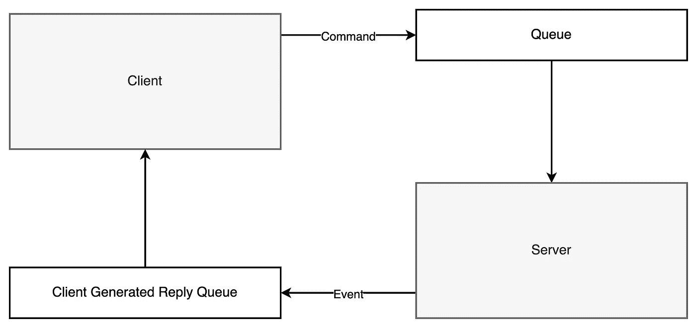
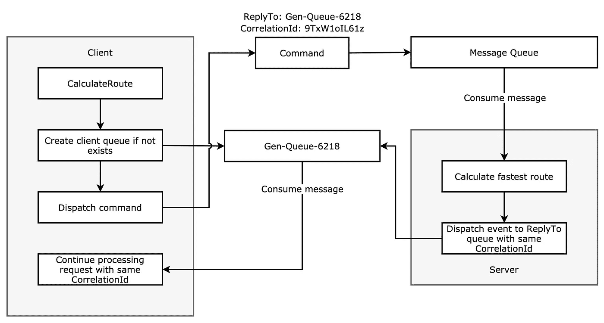
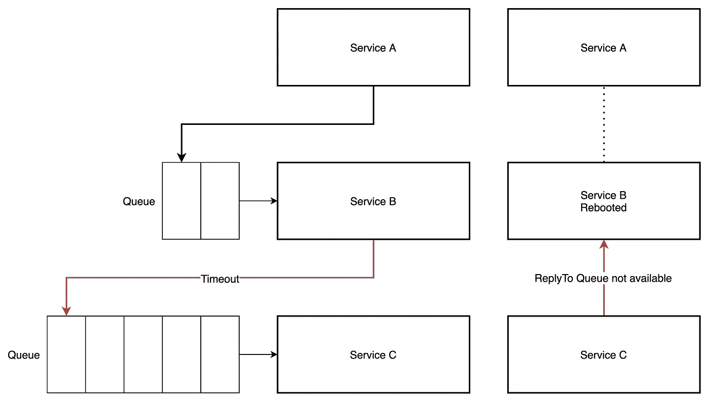

# 带有请求-响应的远程过程调用

> 原文：<https://levelup.gitconnected.com/remote-procedure-calls-with-request-response-249f318b2f90>

## 我从在生产环境中使用 RPC 中学到了什么

作者图片

在过去的两年里，我用[远程过程调用](https://en.wikipedia.org/wiki/Remote_procedure_call) (RPC)做了很多工作。我们使用这种方法在我们的微服务之间进行通信。RPC 在这方面肯定是有用的。然而，它并不总是一个合适的解决方案。

我将演示如何实现 RPC，并回顾我们遇到的一些问题。

# RPC 实现

假设我们有一个预订出租车的应用程序。当用户请求出租车时，我们需要计算最快的路线。计算最快路线是一项繁重的工作。正因为如此，我们将把这个逻辑转移到一个独立的服务中，我们可以在必要时进行扩展。我们可以通过使用 RPC 调用这个服务。

RPC 可以用几种不同的方式实现。一种方法是使用[请求-响应](https://en.wikipedia.org/wiki/Request%E2%80%93response)模式。我们可以用像 [RabbitMQ](https://www.rabbitmq.com/) 这样的消息代理来实现这个模式。

这个想法是，我们从客户端向服务器发送一条消息。服务器将能够使用原始请求中提供的回复队列将消息发送回客户端。

下图展示了这种实现的样子。

使用请求-响应的 RPC 实现示例(图片由作者提供)

要执行远程过程调用，我们首先需要创建一个新队列，用于接收响应。每个客户端都需要自己的回复队列，如果客户端已经生成了回复队列，它将重用它。还可以为每个请求创建一个单独的队列。但是，每个客户端只使用一个队列会更有效。

创建队列后，我们发送一个包含一个`CorrelationId`和一个`ReplyTo`字段的命令。服务器将消费这个消息，处理它，并用相同的`CorrelationId`发送回另一个消息。该消息将被发送到`ReplyTo`字段中提供的回复队列。

当客户机收到回复队列中的一条消息时，它将使用`CorrelationId`将该消息与它的一个未决请求进行匹配。

我们必须做的最后一件事是确保在服务关闭时删除生成的队列。

## 处理故障

现在我们有了 RPC 实现，是时候讨论边缘情况了。

远程过程调用可能永远得不到任何响应。当服务关闭时，可能会发生这种情况。我们将需要实现类似超时的东西来防止客户端被卡住。当用户等待响应时，非常低的超时值是首选。

当超时到达时，我们将向用户返回一个错误。通过这样做，我们给用户重试操作的可能性。因为计算路由没有任何副作用，所以我们不需要担心重试时会出现重复的命令。

也有可能是请求失败。在这种情况下，我们需要发回一条消息让客户端知道。等待超时并不是最好的做法。

有了这些案例，我们就有了一个像样的实现。进行远程过程调用会增加一些延迟，但是，这是值得的，因为计算路由是一项繁重的任务。

这种实现的一些优点是:

*   它是可扩展的。如果计算最快路线需要很长时间，我们可以轻松地扩展该特定服务。
*   计算最快路线的服务可以针对该特定任务进行优化。
*   我们可以等待回应。如果失败了，我们可以给客户重试的机会。

# RPC 并不总是一个好主意

在某些情况下，RPC 可能是一个很好的解决方案。但是，并不总是这样。让我们回顾一下 RPC 可能不是好的解决方案的几个案例。

## 长期运行的任务

当进行远程过程调用时，实例必须等待，直到它得到响应。请求保存在内存中，这意味着如果实例关闭，请求将会丢失。

将新版本部署到生产环境时，可能会出现这种情况。当我们部署一个新版本时，旧的实例将收到一个信号，表明它应该优雅地退出。它将在关闭前尝试完成当前请求。如果服务未能在几秒钟内完成，服务将被强制关闭。

这就是为什么让 RPC 在几秒钟后超时是个好主意。这将确保在部署新版本时，实例可以正常退出。这种短暂的超时使得不可能执行长时间运行的任务。

与第三方沟通也是如此。如果第三方处理请求的速度比预期的慢，您不希望您的调用超时。

处理这些任务的更好方法是分派命令或事件，并将请求状态存储在数据存储中。每当任务完成时，它会发出一个我们可以监听的事件。当事件到达时，我们将从数据存储中获取请求并继续处理它。这种方法不要求消息由同一个实例处理。

## RPC 链接

如果您有多个使用 RPC 相互通信的服务，您可能会遇到这样的情况:其中一个服务被重新启动，或者由于队列太长而导致请求没有得到及时处理。

可能出现的问题示例(图片由作者提供)

这些问题不仅限于链接 RPC。但是，链接多个服务将增加这些问题发生的几率。尤其是如果这些服务在几毫秒内没有响应。在跨多个服务执行 RPC 时，确保使用自动重试来涵盖这些情况。

链接到许多远程过程调用也会使设置适当的超时变得困难，因为您可能无法判断 RPC 链接有多深。

重要的是要注意，如果我们选择了另一种方法，这些行动不一定会失败。类似于前面讨论的基于命令或基于事件的方法可以防止这些请求失败。

然而，只要正确处理了所有的失败案例，用 RPC 链接多个服务是完全可能的。

## 不可重试的操作

对于只应执行一次的操作，使用 RPC 时要小心。当超时到达时，您并不总是能够知道命令是失败还是成功。此外，确保使用 RPC 调用的服务可以优雅地处理重复的命令。

为什么？

因为当我们触发远程过程调用时，一个消息被发送到一个队列。如果消息没有在给定的超时时间内得到处理，客户端将抛出一个错误。但是，只要服务可用，消息仍在队列中等待处理。

消息队列中重复消息的示例(作者图片)

当执行只应执行一次的操作时，这可能是一个问题。比如开发票或者发邮件。

如果您真的想为此使用 RPC，那么您应该实现某种检查，以确保消息以前没有被处理过。您可以散列请求的内容，并将其存储在键值存储中。如果您收到另一个具有相同散列的消息，那么您可以安全地忽略它。

# 最后的想法

只要正确处理所有的失败案例，RPC 可能是一个好主意。我个人非常喜欢[这篇](https://www.rabbitmq.com/tutorials/tutorial-six-python.html) RabbitMQ 教程中的以下语句:

> 如有疑问，请避免 RPC。

如果你有一个有效的案例，你会知道什么时候使用它。只要确保看看其他的可能性。

感谢您的阅读。