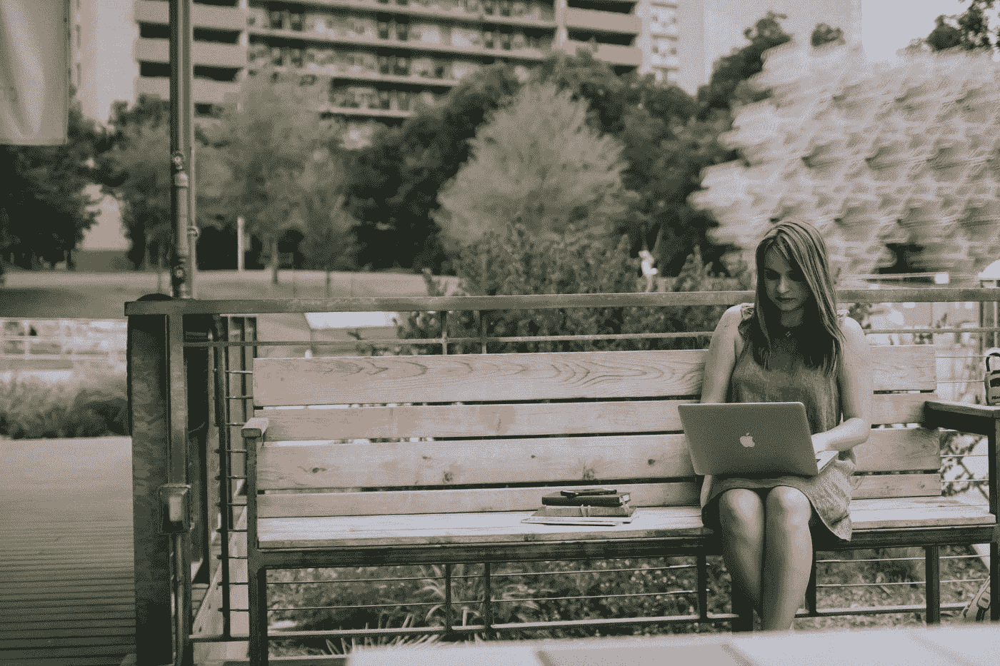
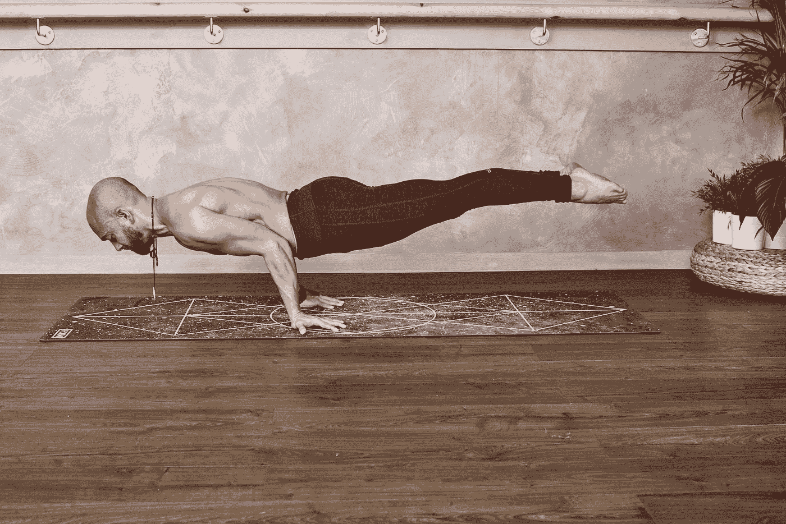

# 远程工作将你变成你最好的版本。

> 原文：<https://levelup.gitconnected.com/remote-work-transformed-you-into-your-best-version-ace6fe9f5941>

## 以及为什么您应该继续远程工作。

克里斯蒂安·斯特克在 [Unsplash](https://unsplash.com?utm_source=medium&utm_medium=referral) 上拍摄的照片

作为一名软件开发人员，远程工作在我的职业决策中是一项有吸引力的额外津贴。它让你有机会在不同的地方工作，也许是不同的国家，帮助你更好地利用你的时间。

暂停。我知道这听起来很神奇。但是我想反思一下现实: ***这会如何改变我的工作质量？***

在去新冠肺炎之前，我从来没有想过这个问题，因为我从来没有在家里连续工作超过一个月。即使在 **Codeworks** 工作期间，我学到了一些成为高效远程工作者的技巧(他们现在正在利用这些技巧，因为[在新冠肺炎期间，他们所有的新兵训练营都是远程的](https://codeworks.me/remote?utm_source=medium.com&utm_medium=referral&utm_campaign=marco_ghiani_remote_working))，我也从未面临过这么长时间的远程工作。它带来了一些有趣的教训，帮助我作为一名专业开发人员继续前进，认识到工作中真正重要的是什么。

## 你的空间有多大？

在你厨房的桌子上，或者在你阳台的阳光下，这是最私人的方面。每个人都有不同的姿势偏好、光线条件和环境声音，这些都会增加(或减少)工作时的注意力，我们有责任进行实验并找到正确的位置。

对我来说，最完美的地方是我的厨房，因为那里有自然光和自然声音的结合，让我感觉专注于我的任务。

照片由[克里斯蒂安·休姆](https://unsplash.com/@christinhumephoto?utm_source=medium&utm_medium=referral)在 [Unsplash](https://unsplash.com?utm_source=medium&utm_medium=referral) 上拍摄

## 找个好时机

上周，我在目前的工作中遇到了一个涉及性能敏感操作的重构挑战。这很难，我花了前半周的时间与它斗争，结果很差。

同样在上周，我彻夜未眠，等待医院的消息，而我的姐姐正在生她的儿子，我发现工作几个小时可以帮助我保持清醒。

荒谬的是，也许是因为深夜时分或者是*我会放轻松的心情，解决那个问题的所有缺失的拼图开始出现，类似于黑夜提供的神奇提示。我对最终的解决方案感到满意，但最让我受益匪浅的是，我意识到在正确的时间和正确的条件下，我是如何获得前所未有的专注。*

> *注意:这并不是建议你通宵工作，这是非常私人的，但我更喜欢白天工作。*

## *照顾好你的身体*

**

*照片由[表格](https://unsplash.com/@theformfitness?utm_source=medium&utm_medium=referral)上[的 Unsplash](https://unsplash.com?utm_source=medium&utm_medium=referral)*

*呆在家里没有机会散步和伸展你的腿可能是具有挑战性的。众所周知，体育锻炼有助于激活大脑，提高效率，还有很多其他好处。但是由于政府强制要求不得离开安全屋，保持健康的日常生活变得很有挑战性。*

*幸运的是，网络上有很多免费的教程和课程可以在家练习，不需要任何类型的设备。*

*我发现在早上建立一个短时间的习惯是有用的，这不是为了提高我的体力，比如在健身房度过一个小时，但至少对我的身体保持活跃是有用的。我的很短，但它确实是个人的，每个人都应该找到一个符合自己习惯的。*

## *多喝酒多睡觉*

*这似乎更像是你父母的典型建议，一些我们在幼年时常常忽视的东西。我不能否认我花了我的大学时光每晚睡 6 个小时，或者比我应该的更少照顾自己。*

*现在我改了。根据在家工作挣来的空闲时间调整我的作息，我开始每天至少睡 8 个小时，每天喝超过 1.5 升的水。*

*结果令人难以置信。我从未感到如此精力充沛。我对复杂问题的注意力增加了，我的压力减少了，因此，我的生产率提高了，让我有机会学得更多更好。*

## *包扎*

*如果你像我一样幸运，有机会在家工作并保住你的工作，你总是可以帮助其他处境更糟的人。每天花 5 分钟阅读因新冠肺炎而失业的人找工作的消息，花时间帮助别人总是值得的。*

*关于这个话题的评论、分享和讨论总是很受欢迎，我很乐意回答你的任何问题！*

> ***随时联系我** [**Linkedin**](https://www.linkedin.com/in/marcoantonioghiani/)*