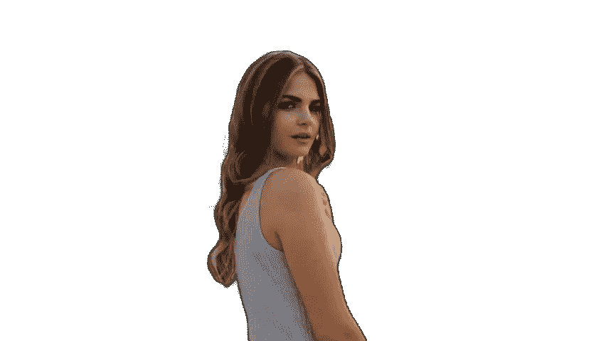

# 使用 Python 和 AI 移除图像背景

> 原文：<https://levelup.gitconnected.com/remove-background-from-images-using-python-and-ai-149a6985e478>

从图像中移除背景，而无需花费数小时在使用人工智能的照片编辑应用上。再见，再见绿屏？


并排输入和输出图像

人工智能(AI)一直在以非常快的速度发展，无论是计算机视觉、NLP(自然语言处理)、语音合成、艺术创作……不胜枚举。但是它能去除图片中的背景吗？

是的，可以。

**介绍 Rembg** ，这是一个 python 库，允许你从图像中移除背景。它非常容易安装和使用。您可以从命令行以及 python 代码中使用它。它是用 python 写的，可以在 https://github.com/danielgatis/rembg
的 GitHub 上获得。它有 CPU 和 gpu 版本，所以如果你没有 GPU，你仍然可以使用这个库。


Rembg 储存库

我将使用 Google Colab 来演示这个库的用法。

*(Google colab 允许我们在浏览器中运行代码，而无需在本地安装任何东西。)*


Google Colab 图像

(如果你不熟悉 colab 或者不想运行整个代码，**在本文**的末尾有一个 web 应用**的链接，你可以在那里直接上传你的图片**并摆弄模型。但是**我强烈建议你尝试一下代码**。)

让我们开始吧。

**进入**[**https://colab.research.google.com/**](https://colab.research.google.com/)**点击“新建笔记本”。**
你会看到一个新的 colab 笔记本打开。单击第一个单元格，输入以下命令并点击 run。这将安装“rembg”库和所有其他需要的库。

```
!pip install rembg
```

您应该会看到类似这样的内容。


图书馆的安装

运行此步骤大约需要一分钟。

下一步是从一个给定的 url 下载图像，这样我们就可以用它作为 rembg 的输入。下面的代码为您完成了这项工作。

```
from google.colab import files as FILE
import os
import requests
url="https://raw.githubusercontent.com/danielgatis/rembg/master/examples/girl-2.jpg"
img_data = requests.get(url).content
with open('input.jpg', 'wb') as handler:
    handler.write(img_data)
```

这会将图像下载到 google colab。现在使用下面的命令行命令调用 **rembg，从 content/input.jpg 中删除背景**，并将输出保存为/content/image1_output_bg.jpg。

```
!rembg i  /content/input.jpg /content/image1_output_bg.jpg
```


这是我们使用的输入图像。


输入图像

这是图像的 rembg 输出


输出图像

瞧啊。！现在你有了它，一个从你的图像中移除背景的 python 库。

这里还有几个例子。


输入图像


输出图像


输入图像


输出图像


输入图像



输出图像

但是我们如何在不运行代码的情况下使用我们自己的图像呢？
这是一个无需运行任何代码就可以拖放的链接。要使用它，只需上传您的图像，然后点击提交。图像在 CPU 上运行时可能需要一些时间来处理。https://huggingface.co/spaces/KenjieDec/RemBG


Huggingface webapp

现在你有了，人工智能从图像中去除背景。

> **你对人工智能和机器学习有热情吗？**您是否希望**了解**该领域的最新进展和见解？
> 
> 然后**订阅媒体是必须的**。只需每月 5 美元，你就可以从该领域的专家那里获得丰富的知识和见解。
> 
> 另外，你的订阅有助于支持独立作家和像我一样的研究人员。随着人工智能世界的快速变化，保持消息灵通至关重要。不要错过——今天就加入 Medium，成为人工智能革命的一份子。这是你做过的最好的决定。
> **订阅今日媒体** **使用本** [**链接**](https://medium.com/@arjungullbadhar/membership) **。**

[](/convert-a-jupyter-notebook-to-a-web-app-with-a-few-lines-of-code-e01fbac4a876) [## 用几行代码将 Jupyter 笔记本转换成 web 应用程序。

### Mercury Library 可以将您的 Jupyter 笔记本转换为一个独立的 web 应用程序，可以在 web 上托管。

levelup.gitconnected.com](/convert-a-jupyter-notebook-to-a-web-app-with-a-few-lines-of-code-e01fbac4a876) [](/deblurring-images-using-ai-and-python-2e4f295c95d1) [## 使用人工智能和 Python 去模糊图像。

### AI 可以对你很想发布但因为最终变得模糊而无法发布的图片/图像进行去模糊吗？

levelup.gitconnected.com](/deblurring-images-using-ai-and-python-2e4f295c95d1) 

*嘿伙计们，*

我是一个在媒体上写作的新手，希望听到你的反馈。如果你喜欢我写的东西，不要犹豫，竖起大拇指或者留下提示。如果您有任何问题或建议，请随时 ***发表评论。*** *我看了每一条留言，尽可能快地回复。*

阿尔琼·古尔巴达尔