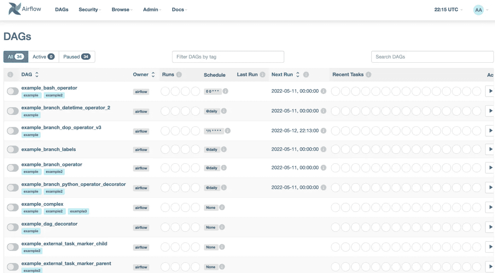

# 如何从气流中移除默认示例 Dag

> 原文：<https://levelup.gitconnected.com/remove-example-dags-airflow-be2db01ccfc2>

## 从 Apache Airflow UI 中删除示例 Dag


在 [Unsplash](https://unsplash.com/s/photos/lego?utm_source=unsplash&utm_medium=referral&utm_content=creditCopyText) 上由[张志勇](https://unsplash.com/@danielkcheung?utm_source=unsplash&utm_medium=referral&utm_content=creditCopyText)拍摄的照片

Airflow 是一个流行的面向批处理的工作流编排器，近年来越来越受欢迎。[设置气流非常简单](https://towardsdatascience.com/run-airflow-docker-1b83a57616fb)。启动 Airflow 时，您可能会注意到在 Airflow 用户界面上可以看到一些示例 Dag。



气流界面上的 DAGs 示例—来源:作者

一旦您熟悉了该工具，您可能希望删除这些示例，并开始创建自己的管道和 Dag。

在本教程中，我们将向您展示如何禁用示例 Dag 在气流中的加载

## 禁用 airflow.cfg 文件中的示例 Dag

`airflow.cfg`文件是用于运行 Airflow 实例的配置的容器。如果您想禁止 Airflow 加载示例 Dag，您只需在文件的`core`部分包含以下配置选项:

```
[core]
load_examples = False
```

## 禁用 docker-compose 中的示例 Dag

如果使用 Docker 运行 Airflow，可以通过设置`AIRFLOW__CORE__LOAD_EXAMPLES`环境变量的值来禁用示例 Dag。在`docker-compose.yml`文件中的`environment`键下:

```
version: '3'
x-airflow-common:
  &airflow-common
  image: apache/airflow:2.3.0
  environment:
    - AIRFLOW__CORE__LOAD_EXAMPLES=False

# Additional configuration goes here ... 
```

## 从气流数据库中删除示例 Dag

[Airflow 需要一个数据库后端](https://towardsdatascience.com/apache-airflow-architecture-496b9cb28288)，由调度程序、执行器和 web 服务器使用，以便存储它们的状态。该数据库包括一个名为`dags`的表，该表包含所有 Dag，包括启动时加载的示例 Dag。

因此，您甚至可以访问数据库并手动删除示例 Dag，以便它们不再由气流加载。

## 最后的想法

在 Airflow 启动时，将加载一些示例有向无环图，旨在让新用户开始使用 orchestrator。如果您不再需要它们，您可以修改当前配置，以禁止气流加载它们。

在本文中，我们展示了几种不同的方法；通过修改`airflow.cfg`文件、设置相应的环境变量或直接从气流数据库中删除它们。

[**成为会员**](https://gmyrianthous.medium.com/membership) **阅读介质上的每一个故事。你的会员费直接支持我和你看的其他作家。你也可以在媒体上看到所有的故事。**

[](https://gmyrianthous.medium.com/membership) [## 通过我的推荐链接加入 Medium-Giorgos Myrianthous

### 作为一个媒体会员，你的会员费的一部分会给你阅读的作家，你可以完全接触到每一个故事…

gmyrianthous.medium.com](https://gmyrianthous.medium.com/membership) 

**相关文章你可能也喜欢**

[](https://towardsdatascience.com/hashicorp-vault-airflow-cfdddab31ea) [## 如何用气流设置 HashiCorp 保险库

### 将 HashiCorp Vault 与 Apache Airflow 集成

towardsdatascience.com](https://towardsdatascience.com/hashicorp-vault-airflow-cfdddab31ea) [](https://towardsdatascience.com/apache-airflow-architecture-496b9cb28288) [## 阿帕奇气流架构

### 深入探讨 Apache Airflow 架构及其如何编排工作流

towardsdatascience.com](https://towardsdatascience.com/apache-airflow-architecture-496b9cb28288) [](https://towardsdatascience.com/airflow-dags-decorators-b5dc03c76f07) [## 使用气流装饰器创作 Dag

### 用 Python decorators 创作 Apache Airflow DAGs 和任务

towardsdatascience.com](https://towardsdatascience.com/airflow-dags-decorators-b5dc03c76f07)