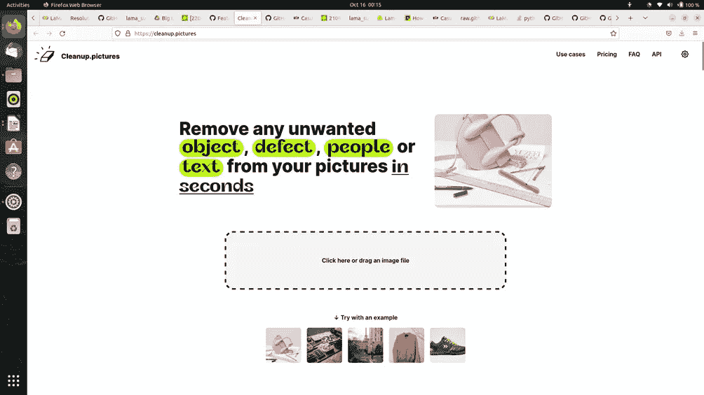

# 基于人工智能的数字图像修复

> 原文：<https://levelup.gitconnected.com/remove-objects-from-images-using-ai-a00876460dd1>

还记得你看到并想要捕捉的令人惊叹的景色吗？但是就在你点击图片的时候，你被某人拍照了。这真的很烦人，你想把它们从图像中移除，但在 photoshop 中这样做将花费太多的时间和精力。

如果有一个简单的方法呢？

人工智能来拯救。

是的，一个叫做 LAMA 修复的人工智能模型可以使用一种叫做**修复**的技术从你的图像中移除物体。


根据维基百科，修复被定义为“**修复**是一种保护过程，其中艺术品受损、退化或缺失的部分被填充，以呈现完整的图像”。

这个过程通常用于图像恢复。它可以应用于物理和数字艺术媒介，如油画或丙烯画、化学照片、雕塑或数字图像和视频。

大多数修复过程是由人类手动完成的，但有一些使用人工智能的现代技术允许我们恢复这些图像。

介绍 LaMa(大遮罩修补的快捷方式)是在莫斯科三星人工智能中心开发的 image 2 图像生成方法。在本文中，我们将看到如何在 google colab 中使用这个模型，并对我们自己的一些图像进行测试。

所以让我们开始吧。

喇嘛的 GitHub 资源库的 URL 是 https://github.com/saic-mdal/lama


转到 GitHub 存储库并点击 open in colab 按钮，这将在 colab 中打开存储库。

您应该会看到类似这样的内容。


单击“显示代码”按钮，该按钮的标题为“运行此至”单元格，以设置所有内容。

变化

```
print(‘\n> Changing the dir to:’)% cd /content/lama
```

到

```
print(‘\n> Changing the dir to:’)%cd /content/lama
```

然后单击运行。

当您运行这个单元时，它将克隆 LAMA 存储库并安装所有必备的库，如 PyTorch 和 OpenCV。此过程可能需要一些时间来运行。当单元格完成后，您应该会看到类似这样的内容。


在第二个单元格中，您应该会看到一个名为“fname”的变量。默认情况下，fname 变量设置为 None。如果您有一个图像想要上传到 colab，那么就让 fname 保持原样。如果您想运行一个示例图像，您可以注释第一行，其中 fname=None，并取消注释第二行，其中有一个图像的 URL。

现在运行第二个单元。它应该立即运行。

现在运行第三个单元格，如果您有 fname=None，它将要求您在单元格的末尾上传一个图像，您可以使用浏览功能上传该图像。下面是我们将在这个例子中使用的图像。


用于演示 LAMA 的示例图像

上传后，您的图像将显示在单元格下方，您需要选择并遮罩要从图像中移除的对象。屏蔽对象后，您可以单击完成按钮。


在要移除的对象上绘制的遮罩。

之后，修复将开始，你会看到你的图像的结果。


图像的掩蔽结果


图像的修复结果

这里还有几个 LAMA 模型的输入和输出的例子。


拆除路灯


移走坐在长凳上的人


使用 LAMA 移除墙上的绘画


从图像中删除一个人。

这里是一个非官方的第三方实现喇嘛[https://cleanup.pictures/](https://cleanup.pictures/)的链接。你可以用它来玩你的图像，而不用设置 colab。超级简单。



在这里，你有它，一个人工智能模型来修复和删除你珍贵的图像中的物体。


喇嘛的几个例子

如果你喜欢我的文章， **s *支持我，通过这个[链接](https://medium.com/@arjungullbadhar/membership)成为*的中级会员。您还可以使用文章末尾的奖励作者功能 ***留下提示*** 。**

[](/convert-a-jupyter-notebook-to-a-web-app-with-a-few-lines-of-code-e01fbac4a876) [## 用几行代码将 Jupyter 笔记本转换成 web 应用程序。

### Mercury Library 可以将您的 Jupyter 笔记本转换为一个独立的 web 应用程序，可以在 web 上托管。

levelup.gitconnected.com](/convert-a-jupyter-notebook-to-a-web-app-with-a-few-lines-of-code-e01fbac4a876) [](/colorize-black-and-white-photos-using-python-and-ai-5b3e5f85df44) [## 使用 Python 和 AI 给黑白照片上色。

### 想知道你以前的黑白照片在现实中是什么样子吗？让我们找出答案。

levelup.gitconnected.com](/colorize-black-and-white-photos-using-python-and-ai-5b3e5f85df44)