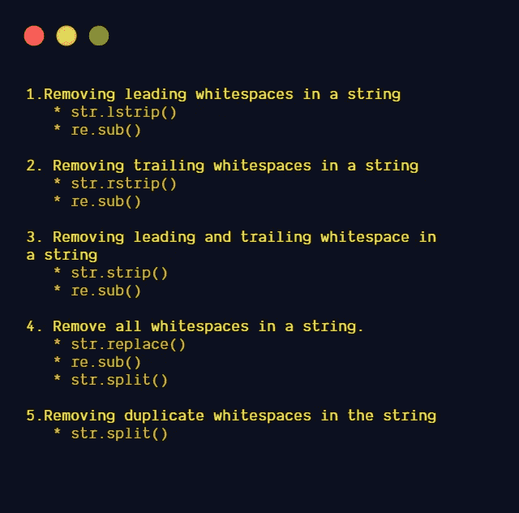
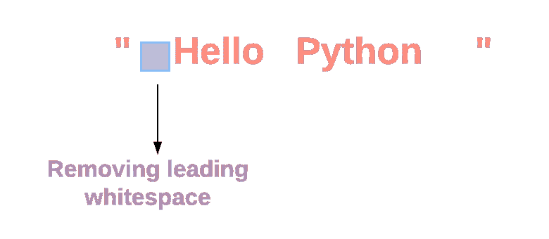
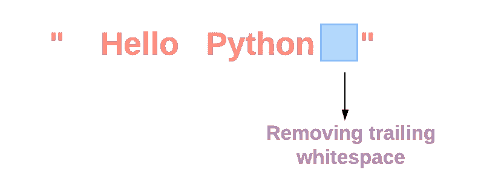
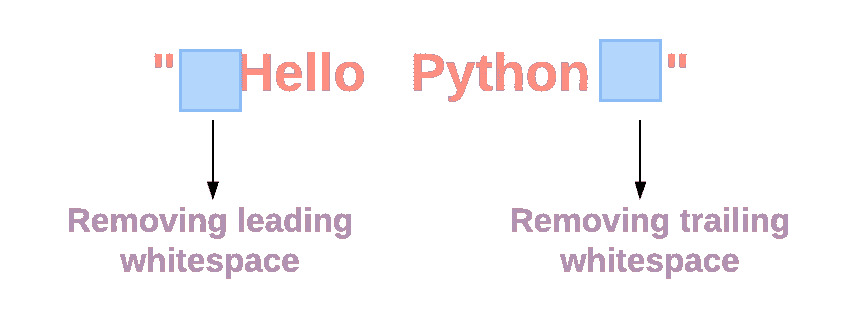
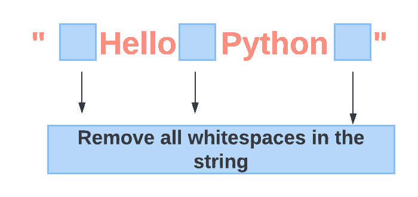
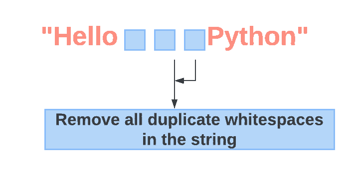

# 在 Python 中移除字符串中的空格

> 原文：<https://levelup.gitconnected.com/remove-whitespaces-from-strings-in-python-c5ee612ee9dc>

## 在 Python 中使用字符串方法和正则表达式


照片来自 [Pexels](https://www.pexels.com/photo/photo-of-person-cutting-paper-using-magazine-3817630/?utm_content=attributionCopyText&utm_medium=referral&utm_source=pexels)

## 如何在 python 中删除字符串中的空格

*   str.lstrip()
*   str.rstrip()
*   str.strip()
*   str.replace()
*   str.split()
*   re.sub()

通过使用上述方法，让我们看看如何删除字符串中的空白。

**本故事涉及的主题**



作者照片

## 1.删除字符串中的前导空格



**1。str.lstrip()**
返回删除了前导空格的字符串的副本。

```
s=**"   Hello   Python  "** print (s.lstrip())
*#Output:Hello   Python*
```

**2。使用 re sub()，我们可以删除前导空格。**

**语法:**

`re.**sub**(*pattern*, *repl*, *string*, *count=0*, *flags=0*)`

**模式** -指定要替换的模式
**repl** -用替换 *repl* 替换*字符串*中*模式*最左边的不重叠出现的。
**计数** -可选参数*计数*是要替换的图案出现的最大数量。如果省略或为零，将替换所有出现的内容。

`pattern= **r”^\s+”**`

`r` Python 的正则表达式的原始字符串符号
`\s`匹配空白字符。
`+`它将匹配一个或多个重复的空白字符。
`^`(插入符号。)匹配字符串的开头

**模式**提到的是字符串开头的空格。
`s1=re.sub(pattern,**””**,s)`

re.sub()会将模式(字符串开头的空格)替换为空字符串。

```
s=**"   Hello   Python  "
import** re
pattern= **r"^\s+"** s1=re.sub(pattern,**""**,s)
print (s1)*#Output:Hello   Python*
```

## 2.删除字符串中的尾随空格



作者照片

**str.rstrip()**

返回删除了尾随空格的字符串的副本。

```
s=**"   Hello   Python  "** print (s.rstrip())
*#Output:   Hello   Python*
```

使用 re sub()，我们可以删除尾随的空白。

```
pattern= **r"\s+$"**
```

`r` -Python 的正则表达式的原始字符串符号
`\s` -匹配空白字符。
`+`它将匹配一个或多个重复的空白字符。
`$`匹配字符串的结尾

**模式**提到的是字符串末尾的空格。
`s1=re.sub(pattern,**””**,s)`

re.sub()会将模式(字符串末尾的空格)替换为空字符串。

```
s=**"   Hello   Python  "
import** re
pattern= **r"\s+$"** s1=re.sub(pattern,**""**,s)
print (s1)*#Output:Hello   Python*
```

## **3。移除字符串中的前导和尾随空格**



作者照片

**str.strip()**

返回删除了前导空格和尾随空格的字符串副本。

```
s=**"   Hello   Python  "** print(s.strip())
*#Output:Hello   Python*
```

**re sub()**

使用 re.sub()，我们可以删除前导空白和尾随空白。
`pattern=**"^\s+|\s+$"**`

`^\s+`匹配字符串开头的一个或多个空格

`\s+$`匹配字符串末尾的一个或多个空格。

`|` x|y 匹配 x 或 y

```
s=**"   Hello   Python  "
import** re
pattern=**"^\s+|\s+$"** s1 = re.sub(pattern, **""**,s)
print(s1)
*#Output:Hello   Python*
```

## 4.删除字符串中的所有空格。



作者照片

**str.replace()** 

**语法:**

`str.replace(old,new,count)`

```
print (s.replace(**" "**,**""**))
```

它会将所有空白字符替换为一个空字符串。

```
s=**"   Hello   Python   "** print (s.replace(**" "**,**""**))
*#Output:HelloPython*
```

使用 re sub()，我们可以删除字符串中的所有空格。

```
pattern=**r"\s+"** s1 = re.sub(pattern, **""**, s)
```

`pattern`匹配字符串中的所有空格。
然后 re()，将模式(空白)替换为空字符串。

```
s=**"   Hello   Python   "
import** re
pattern=**r"\s+"** s1 = re.sub(pattern, **""**, s)
print (s1)
*#Output:HelloPython*
```

**str.split()** 返回使用分隔符字符串分隔的字符串中所有单词的列表。如果没有提到分隔符，默认情况下空格是分隔符。

**join()** — join()方法获取 iterable 中的所有项，并使用分隔符将它们组合成一个字符串

```
s1=**""**.join(s.split())
```

拆分字符串并使用空字符串连接元素

```
s=**"   Hello   Python   "** print (s.split())*#Output:['Hello', 'Python']
#joining the elements in the string using empty string.* s1=**""**.join(s.split())
print (s1)*#Output:HelloPython*
```

## 5.删除字符串中重复的空格



*   **str.split()** 返回使用分隔符字符串分隔的字符串中所有单词的列表。如果没有提到分隔符，默认情况下空格是分隔符。

**join()** — join()方法获取 iterable 中的所有项，并使用分隔符将它们组合成一个字符串

```
s1=**" "**.join(s.split())
```

分割字符串并使用单个空白字符串连接元素

```
s=**"Hello      Python"** print (s.split())*#Output:['Hello', 'Python']
#joining the elements in the string using single whitespace string.* s1=**" "**.join(s.split())
print (s1)*#Output:Hello Python*
```

## 我的其他博客与字符串方法有关

[](https://betterprogramming.pub/split-vs-partition-in-python-strings-9505d070af55) [## Python 字符串中的 split()与 partition()

### 有什么区别？

better 编程. pub](https://betterprogramming.pub/split-vs-partition-in-python-strings-9505d070af55) [](https://betterprogramming.pub/5-ways-to-find-the-index-of-a-substring-in-python-13d5293fc76d) [## 在 Python 中查找子串索引的 5 种方法

### 在 Python 中使用字符串方法和正则表达式

better 编程. pub](https://betterprogramming.pub/5-ways-to-find-the-index-of-a-substring-in-python-13d5293fc76d) [](https://betterprogramming.pub/5-different-ways-to-remove-specific-characters-from-a-string-in-python-b0e081839ab9) [## 在 Python 中从字符串中删除特定字符的 5 种不同方法

### 使用字符串方法、过滤器和正则表达式

better 编程. pub](https://betterprogramming.pub/5-different-ways-to-remove-specific-characters-from-a-string-in-python-b0e081839ab9) [](https://blog.devgenius.io/different-ways-to-replace-occurences-of-a-substring-in-python-strings-2911b1f7bf86) [## 在 Python 字符串中替换子字符串的不同方法

### 在 python 中使用字符串方法和正则表达式

blog.devgenius.io](https://blog.devgenius.io/different-ways-to-replace-occurences-of-a-substring-in-python-strings-2911b1f7bf86) 

## 资源:

[堆栈溢出](https://stackoverflow.com/questions/8270092/remove-all-whitespace-in-a-string)

[lstrip()](https://docs.python.org/3/library/stdtypes.html#str.lstrip)

[替换()](https://docs.python.org/3/library/stdtypes.html#str.replace)

[rstrip()](https://docs.python.org/3/library/stdtypes.html#str.rstrip)

[strip()](https://docs.python.org/3/library/stdtypes.html#str.strip)

[split()](https://docs.python.org/3/library/stdtypes.html#str.split)

[re()](https://docs.python.org/3/library/re.html#re.sub)

*请关注此空间，了解更多关于 Python 和数据科学的文章。如果你喜欢看我的更多教程，就关注我的* [***中***](https://medium.com/@IndhumathyChelliah)[***LinkedIn***](https://www.linkedin.com/in/indhumathy-chelliah/)*[***推特***](https://twitter.com/IndhuChelliah) ***。****

*【https://indhumathychelliah.medium.com/membership】点击此处成为中等会员:[](https://indhumathychelliah.medium.com/membership)*