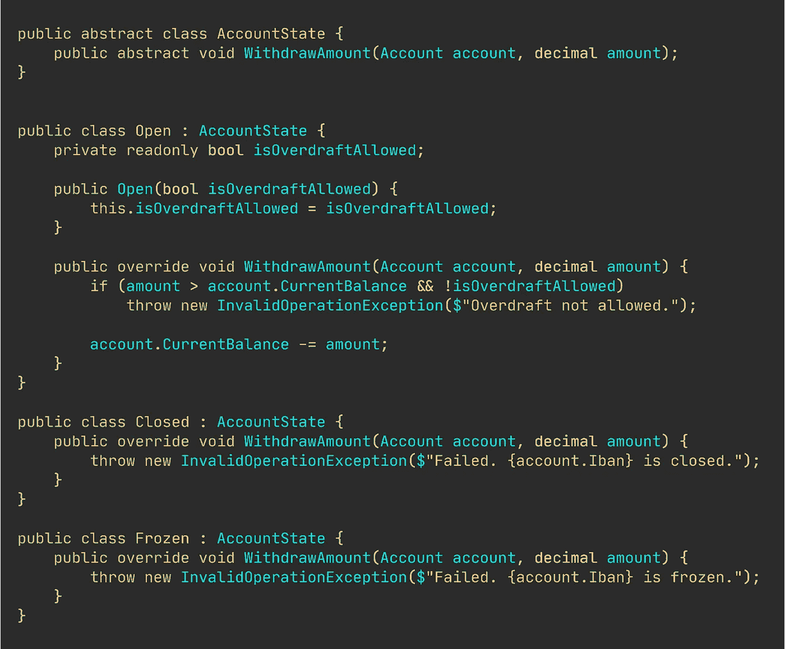

# 移除你的 If-Else 并交换大小写

> 原文：<https://levelup.gitconnected.com/remove-your-if-else-and-switch-cases-1ed2b625b4cf>

## 实用编程建议

## 如何让代码量翻倍变得更好？

尼克拉斯·米勒德拍摄的图片

我知道你在想什么“代码量翻倍？！这个疯子是谁？”和“你是一个时钟应用程序占用 20MB 的原因。”

但是，让我们弄清楚一件事。

> 代码行数从来都不是衡量代码质量的好指标。永远不会。

许多开发人员想提高技能，放弃他们的老方法。扩展您的方法和技术来消除分支是一个快速的方法。[通常，你的代码在这个过程中也会变得更加清晰](/writing-cleaner-code-with-examples-69be2160b4c1)。

像上面例子这样疯狂的代码需要被删除。不可读。它不可维护，也不灵活。只是可怕的代码。可悲的是，这还没那么糟糕。

If-Else 和 Switch 可能是您进行代码分支的实际模式。但其实不必如此。您可以很容易地将“else”关键字从您的编程词汇表中完全删除。

[If-else 常用作穷人的多形性。](/if-else-is-a-poor-mans-polymorphism-ab0b333b7265)

## “传统分支有什么错？”

很多事情。

首先，传统的分支很快变得令人讨厌。每次需要添加新特性时，都必须修改现有的代码。它违反了开闭原则。特性必须用新的类来实现。

理想情况下，您只需要在重构或执行错误修复时修改现有的类。或者如果一个类有合理的理由进行更改，比如更新的业务规则或者我们对自己的领域有了更深入的理解。

此外，传统的分支经常通过屋顶发射[圈和认知复杂性。](/why-cognitive-and-cyclomatic-complexity-matters-in-software-development-5fce1efb56ab)

## “我们有什么选择？”

备选方案太多了，无法在一篇文章中一一介绍。

但是我将分享我从代码中移除传统分支时经常使用的 3 种典型方法。

1.  用类对概念建模
2.  在处理变化的对象状态时使用多态执行
3.  将策略封装在单独的类中

上面列出的 3 种方法可以轻松处理你将遇到的大多数日常情况。

第三点——在策略类中封装分支——是我的最爱。它在最后一节中被涉及。

另一个很好的选择是使用命令对象。这超出了本文的范围，[但是如果您想了解更多，这里有一篇关于这方面的文章。](/replacing-if-else-with-commands-and-handlers-527e0abe2147)

这三种技术都有一些共同点，比如 1)新的功能是用新的类实现的。添加代码通常比修改代码更安全。任何时候修改已经运行的代码，都有把事情搞砸的巨大风险。

2)测试简单的专门化类更容易——这是一个巨大的好处。简单的类和方法更容易推理。一般来说，理解许多小的、内聚的类比理解单一的、神圣的类更容易。

3)在细粒度级别捕获概念比扩展单个类的职责要好。

# 用简单的类建模概念。

任何熟悉领域驱动设计的人都知道[通过在小型专业课堂上获取商业知识和规则来避免原始困扰的重要性](https://betterprogramming.pub/stop-using-primitive-types-in-domain-classes-c45f5973d640)。

假设我们有一个需要用户名的`User`类。用户名是一个字符串，只有两个规则:1)不能为 null 或空字符串，2)不能超过 50 个字符。

简单用户类。

我知道这是一个人为的例子，但请听我说。重要的是我展示的概念，而不是我在塑造什么样的模型。

我认为假设我们在应用程序的其他部分需要用户名是安全的。每当我们收到用户名时，我们都必须执行相同的验证检查。我们将有效地将商业规则分散到各处。

如果我们的规则发生了变化，突然需要防范像“o”这样的特殊字符，我们将需要找到收到用户名的每个地方，并添加新的验证。

一个好得多的方法是捕获用户名概念并创建一个小的专用对象，如下所示。

封装的用户名。

不可否认，上面的代码片段更简洁。现在，任何时候我们需要更新用户名业务规则，我们都可以在一个地方完成。

# 根据对象的状态更改其方法的实现。

有时，您需要一个对象根据其内部状态表现出不同的行为。实现这一点的一个典型的、懒惰的方法是使用传统的分支。

就像下面这个例子，花几秒钟浏览一下。我会在片段之后详细说明。

可怕的分支代码。

因此，有 3 种状态，每当我们需要取钱时，帐户需要检查其内部状态并相应地运行。

传统分支的一个缺陷是嵌套条件逻辑。代码中任何类似圣诞树的形状都是代码味。遵循逻辑和推理并不容易，`if`和`else`分支开始彼此远离，使得阅读和维护更加困难。

状态模式是去除疯狂嵌套的条件逻辑的一种非常棒的方法。

我们希望我们的代码更像下面这样。

使用状态模式的帐户。

你看到这个结构有多平了吗？

每个分支现在都封装在自己的类中。account 类只是将责任委托给专门的`AccountState`。

专用帐户状态类。

双倍代码。两倍的可读性。

你看，每个状态对象都继承了一个基类。

如果我们得到一个新的特性请求来添加一个“RequiresValidation”状态，或者其他什么，在不涉及现有类的情况下实现这个特性是很容易的。

在你说“但是没有状态转换！”，我知道。这些类显然没有完全实现。从一种状态转换到另一种状态超出了本文的范围。

# 将分支重构为单独的策略类。

我最喜欢的，也可能是最常用的消除条件分支的方法:策略对象。

> [请点击这里继续关注 YouTube，本部分开始于 03:00](https://youtu.be/ufeZazqrHjM?t=180)

你会经常看到用程序化的方式实现的策略模式，也就是用`if-elseif`和 switch cases。

假设我们想要将任何类型转换为 CSV 格式，并且我们想要指定该类型的每个属性是如何转换的，但是，该类型不应该自己定义它。

我们想出了一些类似下面的代码。`[CsvInfo]`是一个属性，本质上是关于类型的元信息。然后使用`ToCsv()`方法中的一点反射来读取这个元信息。

属性附带元信息的用户类。

下面是 CsvInfoAttribute 类的一个片段。这个设计不完全是垃圾。但是，它不太具有可扩展性、灵活性或可维护性。

每次你需要添加一个新的转换选项时，你都必须添加一个额外的枚举，然后在`Format()`方法中实现这个枚举的转换。也就是说，您需要修改现有的代码。

其次，假设这个类存在于某个共享库中，组织中的许多项目都依赖这个库。如果一个团队需要一个新的转换选项，他们将不得不联系包含该代码的项目的维护人员——维护人员然后添加功能，构建新版本，并发布它。

csv 转换的元信息。

更合适的方法是允许每个团队在他们自己的项目中扩展格式选项。

我们可以通过将每个 switch case 分支分离到专门的类中来做到这一点，从而不必使用 enum。

每个策略都需要实现一个公共接口，并且，`CsvInfoAttribute`不再有自己的`Format()`方法。相反，它将把格式化的责任委托给专门化的对象。

花点时间浏览下面的代码。

现在，任何时候你想要一个新的格式化程序类型，只需要创建一个新的类。不再修改多个现有的类。

为了实现这一点，您需要定义一些约束。我设置了两个约束。任何格式化程序必须 1)实现`IValueFormatter`，2)必须有一个默认的构造函数。

想象一下现在测试和修复错误是多么容易。你总是确切地知道要测试什么和在哪里寻找。不再遵循疯狂的开关逻辑。

# 你的主要收获。

使用传统分支被广泛(错误)使用。许多开发人员坚持他们的分支代码的可靠方法，只是意识到维护和添加特性已经变成了一场噩梦。

使用 if-else 和 switch cases 就是放弃伟大的面向对象实践。

如果你真的想成为一名开发人员，那么开始寻找消除传统分支的方法。

# 让我们保持联系！

[通过在这里](https://nmillard.medium.com/subscribe)注册时事通讯获得类似文章的通知，并查看新的 YouTube 频道[*(@ Nicklas Millard)*](https://www.youtube.com/channel/UCaUy83EAkVdXsZjF3xGSvMw)

*连接上*[*LinkedIn*](https://www.linkedin.com/in/nicklasmillard/)

# 好奇者的资源

*   [尼可拉斯·米勒德](https://github.com/NMillard/AvoidTraditionalBranching)的 GitHub 回购
*   [没有原始类型的干净类——如何避免原始困扰](https://youtu.be/DGHH4m5squo)
*   [“If-else and Switch”——无代码](https://youtu.be/ufeZazqrHjM)
*   [停止使用 If-Else 语句](https://medium.com/swlh/stop-using-if-else-statements-f4d2323e6e4)

# 分级编码

感谢您成为我们社区的一员！[订阅我们的 YouTube 频道](https://www.youtube.com/channel/UC3v9kBR_ab4UHXXdknz8Fbg?sub_confirmation=1)或者加入 [**Skilled.dev 编码面试课程**](https://skilled.dev/) 。