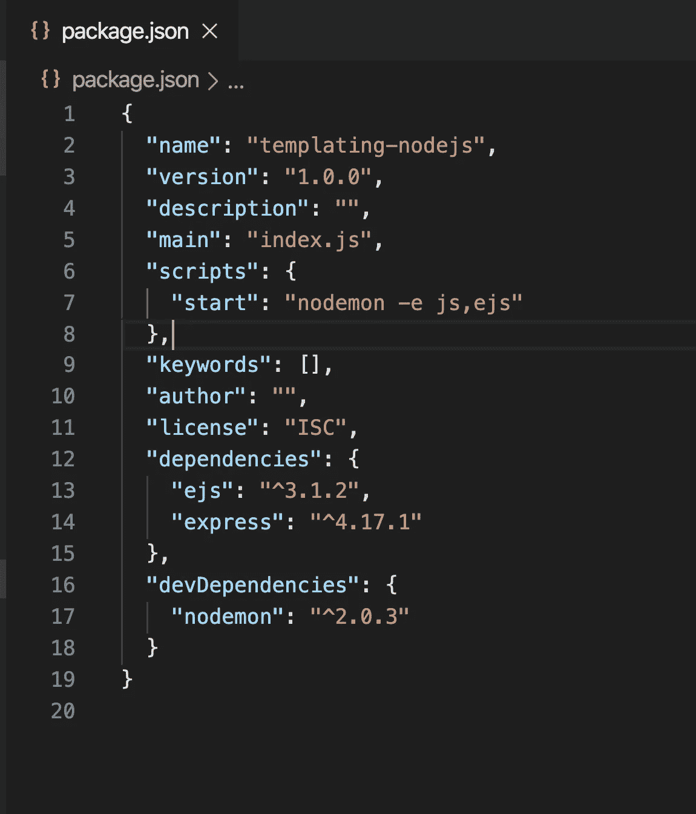

# 使用模板在 Node.js 中呈现动态内容

> 原文：<https://levelup.gitconnected.com/render-dynamic-content-in-nodejs-using-templates-a58cae681148>

## 了解如何通过构建真实的应用程序从 Node.js 呈现 UI


照片由[戈兰·艾沃斯](https://unsplash.com/@goran_ivos?utm_source=medium&utm_medium=referral)在 [Unsplash](https://unsplash.com?utm_source=medium&utm_medium=referral) 拍摄

在本文中，我们将看到如何使用 Node.js 呈现前端，这对于显示静态或动态内容非常有帮助。

什么是模板？

> 模板允许我们在 html 中呈现动态内容，使我们能够使用循环、if 条件和其他功能。它允许我们在运行时注入动态数据。

我们可以只使用 Node.js 中的模板构建一个完整的前端，而不使用前端库。

我们可以生成动态 html 并将动态生成的内容保存在一个文件中。有各种各样的模板库。一些流行的选项有`handlebars`、`pug/jade`、`EJS`等。

我们将使用`express.js`来处理路由和`EJS`(嵌入式 JavaScript 模板)，这是一个非常受欢迎的库，每周下载约 600 万次。


`EJS`如此受欢迎的原因之一是因为它允许直接在模板中编写 JavaScript 代码，所以我们可以使用`loops`、`if conditions`和 JavaScript 提供的所有东西。其他模板库使用自己的语法，不直接写 JavaScript。

创建一个名为`templating-nodejs`的新文件夹，从终端导航到该文件夹，并通过运行以下命令初始化`package.json`:

```
npm init -y
```

运转安装`express`和`ejs`:

```
npm install express@4.17.1 ejs@3.1.2
```

通过运行以下命令将`nodemon`安装为开发依赖项:

```
npm install nodemon@2.0.3  --save-dev
```

创建一个新文件`index.js`，并在其中添加以下代码:

在`package.json`中添加一个启动脚本

```
"start": "nodemon index.js"
```


现在通过从命令行执行`npm start`命令来启动 express 服务器:


您现在可以通过导航到 [http://localhost:3000/](http://localhost:3000/) 来访问该应用程序


现在让我们将 ejs 功能添加到应用程序中。

新建一个`views`文件夹，并在其中添加一个`index.ejs`文件，内容如下:

索引. ejs

为了渲染这个文件，我们需要在我们的 express 应用程序中添加一些代码。

通过在`index.js`文件中添加以下代码来指定渲染引擎

```
app.set("view engine", "ejs");
```

为了呈现`index.ejs`，我们需要使用`res`对象的`render`方法，并传递 ejs 文件的名称，而不提供。ejs 扩展。

Express 将使用自动搜索文件。默认的`views`目录中的 ejs 扩展名

```
app.get("/", (req, res) => {
 res.render("index"); // index refers to index.ejs
});
```


因此，现在如果您导航到 [http://localhost:3000/](http://localhost:3000/) ，您将看到来自`index.ejs`的内容正在呈现


## **添加 CSS 和 JavaScript 支持**

现在，我们将看看如何将`css`和`JavaScript`添加到我们的模板中。

创建一个名为`public`的新文件夹，并在其中添加一个`css`文件夹

在其中添加`styles.css`，内容如下

现在，您的文件夹结构将如下所示


文件夹结构

在`views/index.ejs`文件中添加到`css`文件的链接

```
<link rel="stylesheet" href="/css/styles.css" />
```


索引. ejs

还在`index.js`中添加以下代码，以便我们可以从`public`文件夹中加载所有的`html`、`css`和`javacript`文件。

```
app.use(express.static(path.join(__dirname, "public")));
```


如果您现在检查应用程序，您将看到 CSS 正在被应用


要添加 JavaScript 文件，在`public`文件夹中创建一个新的`js`文件夹，并使用一个简单的`console.log`语句在其中添加`script.js`

```
console.log("This is coming from script.js");
```

在主体结束标记前的`views/index.ejs`文件中包含`script.js`


如果您保存文件，您将会看到`nodemon`没有自动重启，因此我们的更改没有反映在应用程序中。

这是因为我们在`package.json`中指定只观看`index.js`到`nodemon`。

要解决这个问题，打开`package.json`并将启动脚本从

```
"start": "nodemon index.js"
```

到

```
"start": "nodemon -e js,ejs"
```



这里，我们通过传递一个`-e`标志来通知`nodemon`如果`.js`或`.ejs`文件中有任何更改，就重新加载更改。

现在，通过从终端重新运行`npm start`命令来重启`nodemon`脚本，现在如果您保存`views/index.ejs`文件，您将看到`nodemon`在保存时自动重启。

现在，导航到 [http://localhost:3000/](http://localhost:3000/) 并刷新页面。你会在控制台上看到来自`script.js`的日志:


## **更好地组织文件**

EJS 还允许我们将单个文件分割成单独的文件，这样我们就可以在所有页面上显示共同的页眉和页脚。

要将一个文件包含在另一个文件中，我们使用以下语法

```
<%- include('header.ejs') %>
```

这里，`<%`和`minus`符号用于包含文件。

现在我们将把我们的`index.js`代码分割成`header.ejs`、`footer.ejs`和`content.ejs`，并将它们包含到我们的`index.ejs`中

内容. ejs

header.ejs

页脚. ejs

索引. ejs

请注意，我们在`header.ejs`中没有结束`body`和`html`标记，因为我们已经在`footer.ejs`中添加了它们

如果您在 VS 代码中安装了一些格式化程序，并且它会在保存时自动添加缺少的标签，那么您可以删除该结束标签并保存文件，而不进行格式化，如下所示

按`Control + Shift + P`或`Command + Shift + P (Mac)`打开命令面板，输入`save`然后选择`File: Save without Formatting`选项


禁用自动格式化

现在，我们将使用 ejs 模板创建一个简单的登录应用程序，其中我们将显示登录时的成功消息和登录失败时的失败消息。

打开`content.ejs`并在其中添加以下代码

内容. ejs

这里，我们允许用户输入姓名和`password`，一旦用户提交表单，我们就调用表单标签中指定的`index.js`中添加的`/login`路线

```
<form action="/login" method="post">
```

在`views`文件夹下新建一个文件`success.ejs`并添加以下内容

成功. ejs

这里，我们显示登录用户的用户名和成功消息。

为了显示`ejs`文件中的任何值，我们在`<%=`和`%>`之间使用变量名

`<%=`用于通过将任何值转换成字符串来显示它。

在`views`文件夹下新建一个文件`failure.ejs`，添加以下内容

失败. ejs

更新的 styles.css

为了解析表单的输入，从终端运行下面的命令来安装`body-parser` npm 包

```
npm install body-parser@1.19.0
```

并通知 express 将输入解析为 JSON 对象导入到`index.js`中

```
const bodyParser = require("body-parser");const app = express();app.use(bodyParser.urlencoded({ extended: false }));
```

现在，表单数据将在`/login`路径内的`req.body`对象中可用

index.js 中的登录路径

在这里，我们检查登录数据。如果`name`和`password`匹配，则显示`success.ejb`模板，否则显示`failure.ejb`。

注意，为了将数据传递给`success.ejb`模板，我们在第二个参数中将它作为一个对象传递给 render 方法，因此它将在该模板中可用。

更新的 index.js

现在，您的应用程序将如下所示工作


登录应用程序

## **使用 EJS 模板构建 Github 存储库列表应用**

现在，我们将构建一个应用程序，显示作为 URL 中的查询字符串传递的任何用户的存储库。

通过运行以下命令从命令行安装`axios`

```
npm install axios@0.19.2
```

在`index.js`内添加以下路线

在这里，我们从查询字符串中获取`username`,因此 URL 将是这样的[http://localhost:3000/repos？用户名= your _ github _ 用户名](http://localhost:3000/repos?username=your_github_username)

如果没有指定`username`,将采用路线中提供的默认值。

然后我们获取存储库数据并将其发送到`repos.ejb`模板，我们循环遍历它并显示结果。

更新的 index.js

用下面的代码在`views`文件夹中创建一个新的`repos.ejs`文件

repos.ejs

正如你在这里看到的，我们在`<%`和`%>`之间写了 JavaScript 代码。在本例中，我们添加了一个 JavaScript `forEach`循环来遍历从`index.js`传递来的 repos 对象。

现在你可以看到 GitHub 用户提供的资源库:


存储库列表应用程序

## **自定义默认模板目录**

默认情况下，EJS 会在项目的`views`文件夹中寻找`.ejs`文件，如果没有找到，它会抛出一个错误。我们还可以为`views`目录提供自定义路径。

因此，如果我们想在`templates`文件夹中存储一个`views`文件夹，我们可以通过将其设置为 express app 来指定路径。

```
const path = require("path");const viewsDirPath = path.join(__dirname, "templates", "views");app.set("views", viewsDirPath);
```

你可以在这里找到这个应用程序的完整源代码[和现场演示](https://github.com/myogeshchavan97/templating-nodejs)[这里](https://templating-nodejs.herokuapp.com/)

看看我最近出版的[掌握 Redux](https://master-redux.yogeshchavan.dev/) 课程。

在本课程中，您将构建 3 个应用程序以及一个点餐应用程序，您将了解:

*   基本和高级冗余
*   如何管理数组和对象的复杂状态
*   如何使用多个减速器管理复杂的冗余状态
*   如何调试 Redux 应用程序
*   如何在 React 中使用 Redux 使用 react-redux 库让你的 app 反应性。
*   如何使用 redux-thunk 库处理异步 API 调用等等

最后，我们将从头开始构建一个完整的[订餐应用](https://www.youtube.com/watch?v=2zaPDfCKAvM)，集成 stripe 以接受支付，并将其部署到生产中。

**别忘了订阅我的每周简讯，里面有惊人的技巧、诀窍和文章，直接在这里的收件箱** [**订阅。**](https://yogeshchavan.dev/)