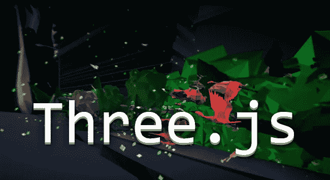
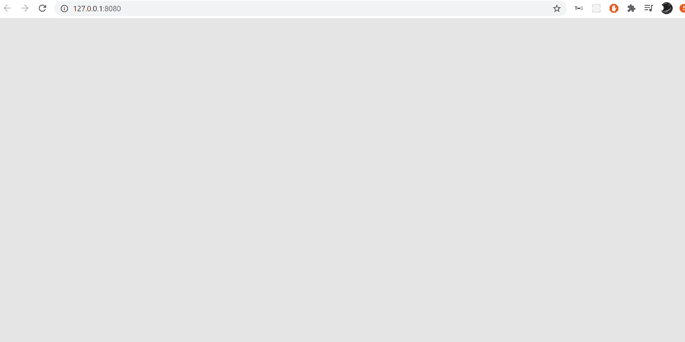
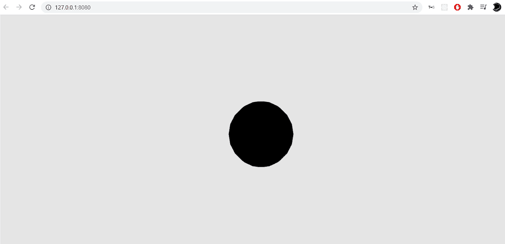
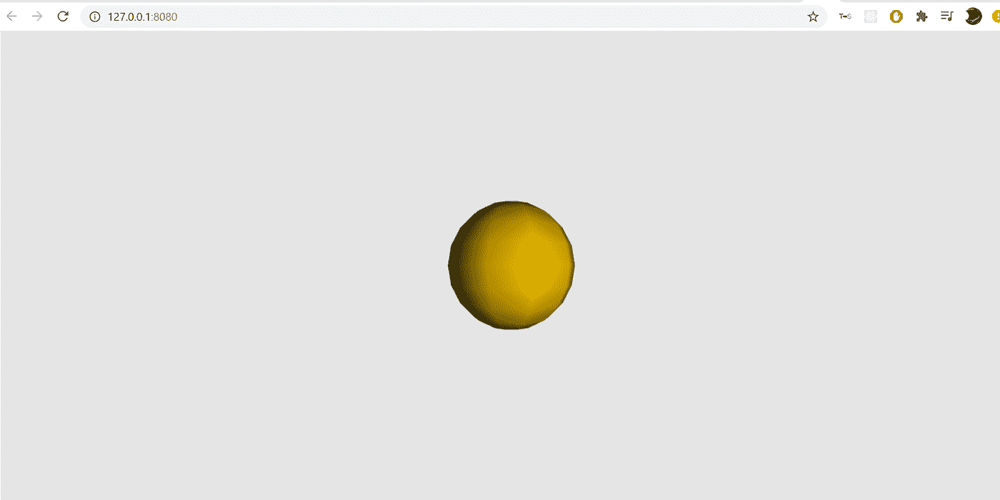

# 使用 ThreeJS 渲染 3D 模型和动画

> 原文：<https://levelup.gitconnected.com/rendering-3d-models-and-animation-using-threejs-ded9088b40a0>

ThreeJS 是一个 javascript 库，它使用 **WebGL 的**增强行为来渲染网络上的 3D 模型，以及 **Tweenmax** 来更好地增强动画质量。今天我将深入三个 j 的基础，并讨论我已经合并的**演示**，它更好地教会了我如何从整体上理解这个库。让我们开始吧。

# 什么是三个 j？

**ThreeJS** 是一个**跨平台 Javascript 库**，用于在网络环境中创建和显示 **3D 图形**和**动画**。这一壮举是通过利用 **WebGL** 实现的，这是一种 JavaScript API，用于在任何兼容的网络浏览器中呈现交互式 **2D** 和 **3D** 图形。也有额外的插件可以添加到 ThreeJS 环境中——例如 **Tweenmax** 用于更平滑的动画渲染，或者 **PhysiJS** 用于整合 3D 环境的物理引擎。

# 三个 JS 基础:

现在我们已经知道了一些什么是三个 j，让我们从基础开始:

## **设置场景:**

因此，让我们说，我们想创建一个快速的应用程序，将渲染和显示一个**三维对象**与一些基本的动画补间。首先，我们需要创建一个**index.html**文件来在网络环境中显示我们的应用程序。

一旦我们创建了我们的 html 文件，在文件本身的内部，我们想要插入两个 web 脚本，它们将被用作我们的模块。ThreeJS 将是我们将要使用的库， **TweenMax** 是一个可选的包，用于更容易地增强 3D 对象的动画过程*(它与 ThreeJS 融合得非常好)*。

现在我们已经有了 html 文件，让我们开始研究应用程序的功能。出于这个博客的目的，我将单独在这个 html 文件的内容中添加所有内容，以展示这个库可以提供的灵活性。接下来我们要做的是创建一个脚本标签并生成场景。我们可以调用**三。场景**类，它将允许我们为 3D 模型生成一个要渲染的场景。接下来，该上镜了。我们可以发行三个。透视摄像机允许我们设置特定的摄像机角度，通过用户的镜头显示我们的环境。该摄像机可以通过分别更新其 **x/y/z** 值来进一步调整。

最后，我们希望创建一个渲染器实例，用于渲染我们的环境。我们可以称之为三。WebGLRenderer 有效地完成这项任务，这要感谢 WebGL 的软件包贡献。将**抗锯齿**设置为**真**也很重要，否则渲染环境将会变得起伏不定、参差不齐。

现在，如果我们进入控制台**实时服务器**来启动我们的应用程序，我们会在网页上看到这个空白的画布。

## **形状、网格和材料:**

接下来，让我们继续渲染网页上的一些形状。首先，我们需要做的是定义一个要使用的特定形状。通过发布类**三。球形测量法**我们可以生成一个 3D 物体，它的形状是一个**球体**。这几乎适用于文档中存在的任何形状。现在我们有了一个形状，让我们定义一个**纹理**，因为如果没有纹理，我们的形状会看起来非常光秃秃的，毫无生气。

添加一个纹理，使用类**三。MeshLambertMaterial** 将会做到这一点*(阅读更多文档以查看材料列表)*。为了这个博客的目的，我将颜色设置为十六进制代码**“黄色”**，给我们的形状一个定义好的颜色。完成所有这些步骤后，我们可以通过发出 **THREE 命令最终创建网格模型。网格**并使用**场景添加网格到我们的场景中。**

现在我们的网页将显示一个黑色的球体，不完全是我们想要的…

为了解决这个问题，我们可以在我们的应用程序中添加照明，给我们的形状带来一些光亮。我们可以通过调用**三来实现这一点。使用 **light.position.set** 创建一个灯光实例并设置灯光的位置，最后我们可以添加灯光，就像我们之前添加形状一样。**

现在，如果我们再看一次网页，你会注意到我们的形状显示有灯光闪烁，并定义了我们给它的颜色。太棒了。

# 结论:

在这篇文章中，我们已经介绍了 ThreeJS 的基本知识，首先介绍了这个库是什么，以及如何使用这个库在场景中渲染完美的几何 3D 对象。希望你离开这篇文章时对三个 j 的了解比进入时更多。