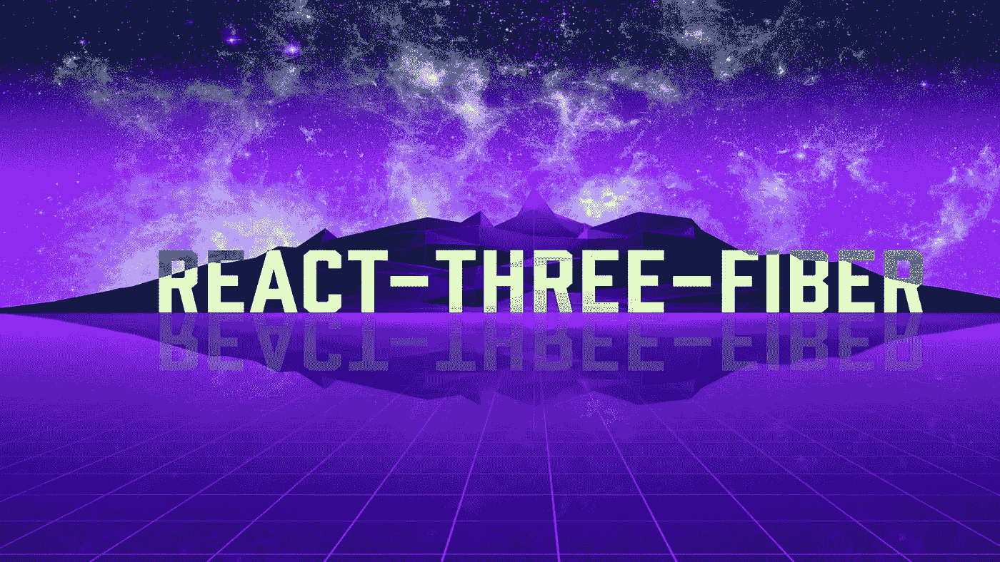
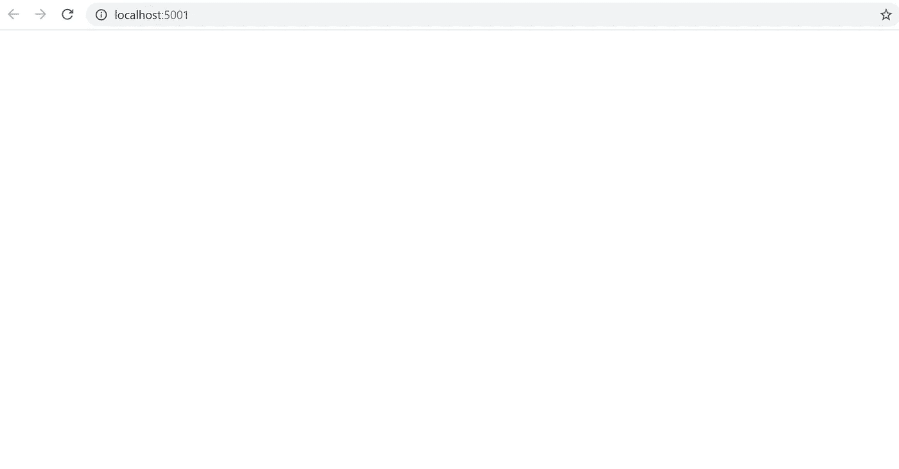
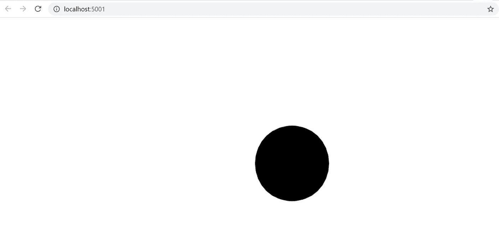
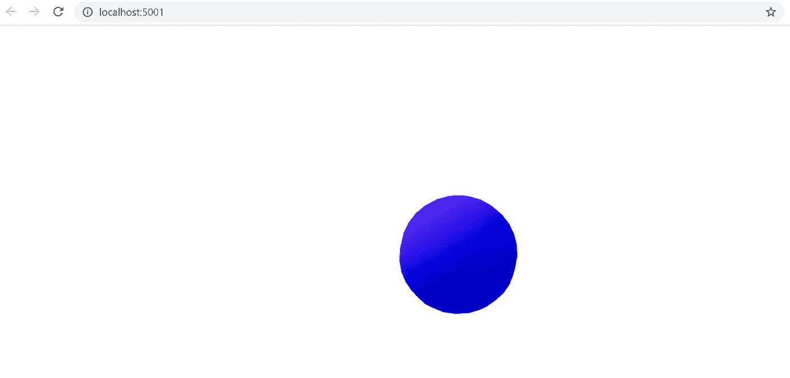
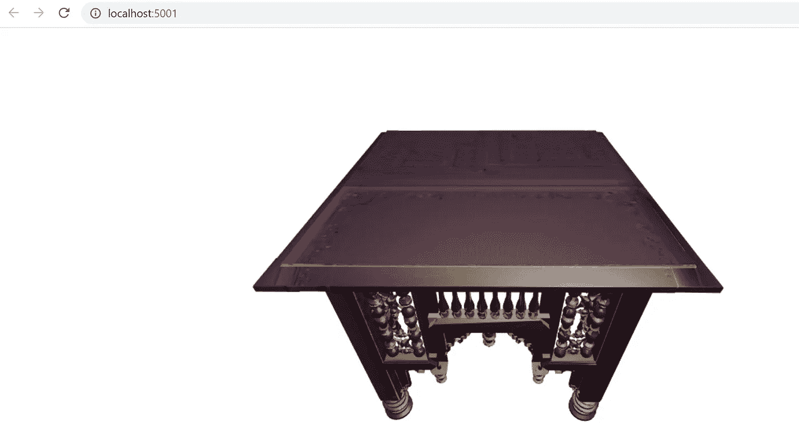

# 使用三根纤维在 React 中渲染 3D 对象/动画

> 原文：<https://levelup.gitconnected.com/rendering-3d-objects-and-animation-in-react-using-three-fiber-bf0255e642be>



Three.js 是一个 **3D 渲染/动画**库，它整合了 **WebGL** 来在画布上显示模型。如果您有兴趣深入了解 Three.js 可以为 JavaScript 环境提供的实用工具，请参考我就此主题撰写的前一篇文章[。然而，在这篇博客中，我们将介绍一个库，它进一步简化了环境中 Three.js 的使用。](https://medium.com/nerd-for-tech/rendering-3d-models-and-animation-using-threejs-ded9088b40a0)

今天，我将提供一个快速演示，展示可用于通过 **React 三纤维组件**渲染 3D 模型的简化功能。让我们开始吧。

# 设置场景:

在我们继续这篇博客之前，首先需要安装下面列出的核心依赖项:

```
npm i react react-dom react-three-fiber three drei
```

当涉及到在 web 环境中渲染 3D 模型时，首先必须有一个为模型渲染设置的场景。让我们从创建一个基本的 react 组件开始，它将存储我们在这个博客中的工作。

在上面代码片段的内容中，我们首先想要创建一个场景。但这如何实现呢？网站上的 3D 模型实际上是从画布上投影出来的，所以我们应该从那里开始。这可以通过调用 React 三纤维库提供的 **<画布/ >** 组件来完成。就是这样！现在，如果我们看一下我们的应用程序，我们会看到一个白色的窗口。



这可能看起来好像场景没有在我们的网页上渲染，但这是由于白色背景。

# **渲染 3D 形状**

现在场景已经成功地在网页上渲染了，让我们在那里添加一个基本的形状。为了呈现一个形状，我们首先必须创建一个新的函数来保存我们的形状的属性。

在上面的代码中，我们返回了创建基本形状所需的 HTML。三个 j 中的形状被称为网格，网格在被称为几何图形的计算数据中保存 3D 对象的所有属性。现在，我们可以通过声明刚刚在画布场景范围内创建的 **< Mesh / >** 函数来渲染我们的 3D 模型。

现在我们的网页看起来会像这样:



不完全是我们想要的，但这并不意味着我们的形状没有正确渲染。我们只是没有添加任何照明，所以形状被完全黑暗包围。让我们通过在 HTML 中添加灯光和聚光灯来改变这一点:

让我们来分析一下上面的代码片段:

在上面的代码中，我们声明 **ambientLight** 在周围的场景中创建一个光源，并使用这个**方向光**使环境光照在一个特定的方向上。最后一个组件，**聚光灯**，将在环境中渲染一个聚光灯，以特定的位置/角度照射物体。最后，我们添加了**轨道控制**来允许光标在 3D 环境中移动/旋转。

现在让我们来看看我们的对象:



好多了。物体现在被我们产生的光照亮了。现在，如果我们愿意，我们可以将网格的形状更改为 [Three.js 文档](https://threejs.org/docs/#api/en/objects/Mesh)中提供的众多网格之一，以及对象的材质。

# 导入预制网格:

之前，我们刚刚创建了一个场景实例，并使用适当的光照在该场景中渲染了一个 3D 模型。然而，如果我们更进一步，将一个模型从网上导入到我们的本地环境中，会怎么样呢？为了实现这一点，我们需要将新的依赖项导入到我们的组件中，但是不要担心，不需要安装任何新的包。

假设我们想将这张桌子导入到场景中:



为了将这个表导入到我们的环境中，我们首先必须创建一个新函数。在新函数的范围内，应该包含作为变量的导入的 3D 对象的纹理覆盖，以及用于持久保存 3D 对象的组。此外，您还会注意到对 **GLTFLoader** 的调用，这是一个链接到 Three.js 的导入包，允许从 GLTF 文件中检索数据。

在上面的代码片段中，网格组件还接受了一个新选项， **geometry** 。该选项将呈现传递到范围中的任何模型的几何图形。此外，**网格材质**标签还包含一个纹理选项，该选项可将任何纹理图像应用于特定网格的表面。

最后，如果网格**异步**渲染，我们希望有一个备份模型来代替我们试图导入的 3D 对象。这可以通过创建一个新的网格函数作为占位符，并用一个悬念方法包围导入的网格来实现。如果组件的**范围**中的网格在调用时不执行，暂停方法将调用备份网格*(回退选项中的网格)*。

# 结论:

通过本博客的课程，我们已经介绍了什么是 Three.js 库，Three Fiber 如何在 react 环境中渲染 3D 模型，以及如何将 3D 模型从外部源导入到场景中。希望这个博客被认为是一个有用的资源，任何未来的开发者碰巧对以最有效的方式为他们的网站整合 3D 模型/动画感到好奇。