# 使用 CSS 重复图像库布局

> 原文：<https://levelup.gitconnected.com/repeating-gallery-layout-for-infinite-images-with-css-9de6ba6e37cf>

## n-child 魔术生成无限的 CSS 布局🎩

**TLDR:** 下面是最终的解决方案，它基于这篇 [A List Apart](https://alistapart.com/article/quantity-queries-for-css/) 的文章，并使用 n:child 伪选择器的组合来为任意数量的图像生成重复布局。因为我们不能使用 CSS 网格，因为还必须支持 IE。

## 崩溃

我最近参与的一个项目需要一个用户可以上传的图片库。这意味着未知的图像数量。然而，布局需要保持不变。

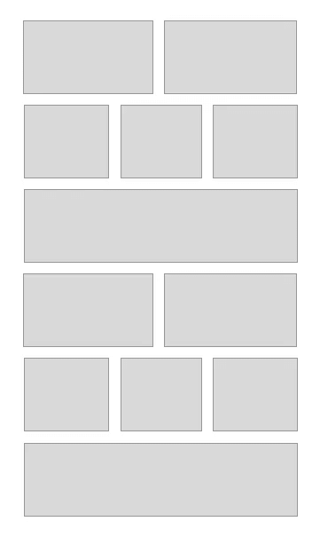

重复库布局

以前我使用砖石库来动态生成布局。然而，它们可能会很慢，感觉有点笨拙，并且还需要运行许多样板代码。

事实证明，你可以用一点时髦的 CSS n-child 逻辑来做到这一点。[这篇文章](https://alistapart.com/article/quantity-queries-for-css/)从一个单独的列表中详细解释了这个概念，并且真正推动了我所认为的 CSS 可能性的边界。

最终解决方案，一开始可能看起来有点奇怪，但是一旦分解一点，逻辑就很简单了。

## **工作原理**

设计的布局是一个 3 行的重复模式，总共有 6 个图像。

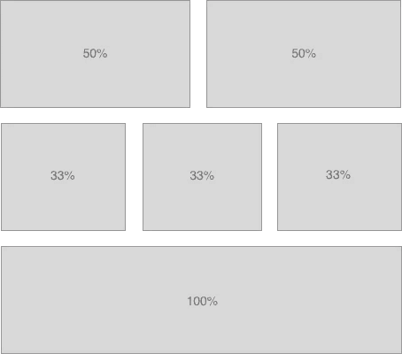

因此，开始时，所有图像的默认宽度都是 100%。这是较小屏幕的后备，也是第三行的图像。

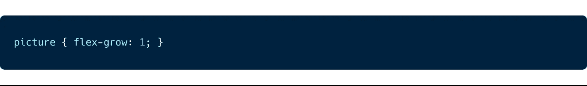

对于布局的第一行，我们需要应用 50%。对于每六个图像重复的这种模式，这可以通过从第一个(+1)和第二个(+2)孩子开始选择每第六个孩子(6n)来完成。

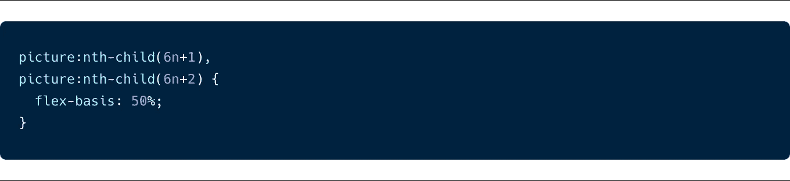

该选择器将无限期地继续下去，每六幅图像选择第一个和第二个孩子。

对于第二行，我们需要将第三个、第四个和第五个孩子作为目标，为他们提供 33.33%的宽度。

这以相同的方式完成，并使用第 n 个子元素从第三、第四和第五个子元素开始选择每第六个元素。

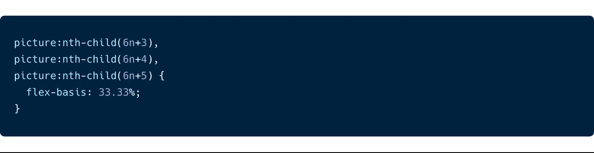

最后一行只有一个 100%宽度的图像，它将从我们在开始时声明的回退中继承。

哇哦。🙌一个不错的重复库布局。

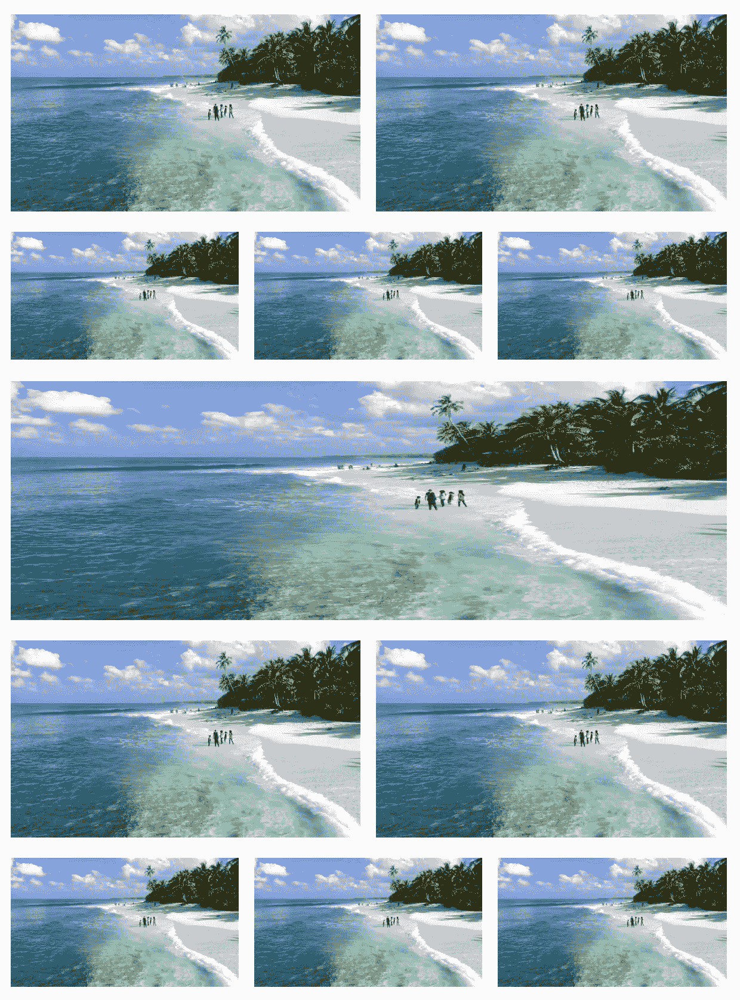

嗯，差不多…有一些小的改进会让这个布局看起来更好。

## 奇数个图像

奇数个图像导致最后两行变成全幅，因为它们都被我们在开始定义的默认`flex-grow`选中。

这是因为倒数第二个图像将是我们的模式中的第六个，我们的默认目标是让它按照设计的 100%宽度。奇数组图像中的最后一个图像将是我们的模式中的第一个图像，即 50%。然而，全局`flex-grow`将导致它也是全幅的。

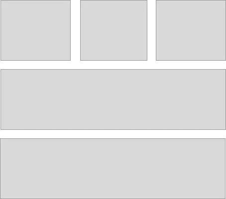

为了解决这个问题，我们需要检测是否有奇数个图像。我们可以通过检查最后一个元素是否是奇数`:last-child:nth-child(odd)`以及之前的子元素是否是偶数`picture:nth-last-child(2):nth-child(even)`来做到这一点，然后如果适用，给这两个元素添加 50%的宽度。

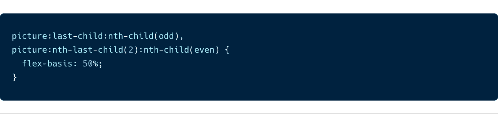

## 只有 3 张图片

当只有 3 个图像时，最后一个图像是全幅的。虽然这在技术上是正确的(因为第一行是前两个 50%宽度的图片)，但是如果我们把它们都放在一行，宽度为 33%，看起来会更好。

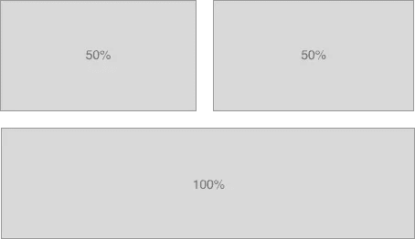

所以我们需要创建一个选择器，如果它只有三个子元素，那么它只针对元素。我们可以使用`nth-last-of-type(3)`来做到这一点。当给定一个数字时，它将从最后一个孩子开始倒计数。然后我们可以通过使用`nth-child(1)`来检查倒数第三个元素是否也是第一个子元素。如果两个选择器都匹配，我们就知道这个元素是第三个子元素。然后我们只需要做第二个和第一个

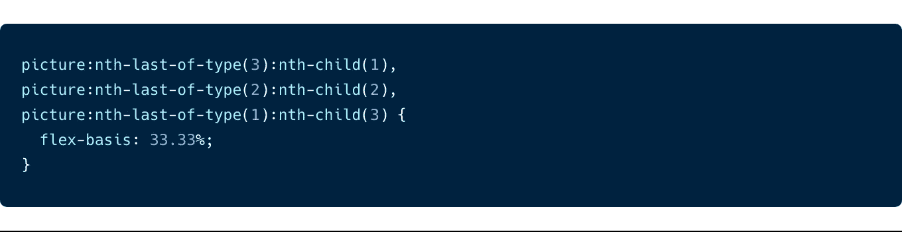

## 5 张图片

这只是一种边缘情况，只有五个图像会导致最后两个图像被我们用于奇数图像的选择器以及一行三个图像的选择器作为目标(如上)。但是我们可以用同样的方法解决这个问题，就像我们处理只有三个图像的集合一样。

该规则检查最后一个元素是否也是从开始算起的第五个元素`nth-last-of-type(1):nth-child(5)`，我们对第三个和第四个孩子也是这样做的。一旦我们选择了最后三张图片，我们给它们 33%的空间，把它们放在一行。

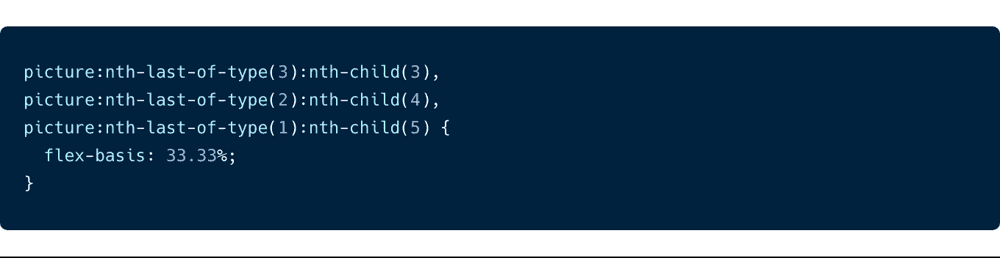

而且，就是这样…🙌

## 包装它

这确实花了我一段时间来理解它，但是我发现让它“点击”的最好方法就是反复试验。

虽然这并不是每个图库布局的最佳解决方案，但它完全符合我们的项目需求，并且很好地尝试了 CSS 选择器，超越了我认为可能的范围。因为解决方案是纯 CSS，所以它也是高性能的。

我希望这有助于作为参考，解决方案或作为一个有趣的阅读✌️

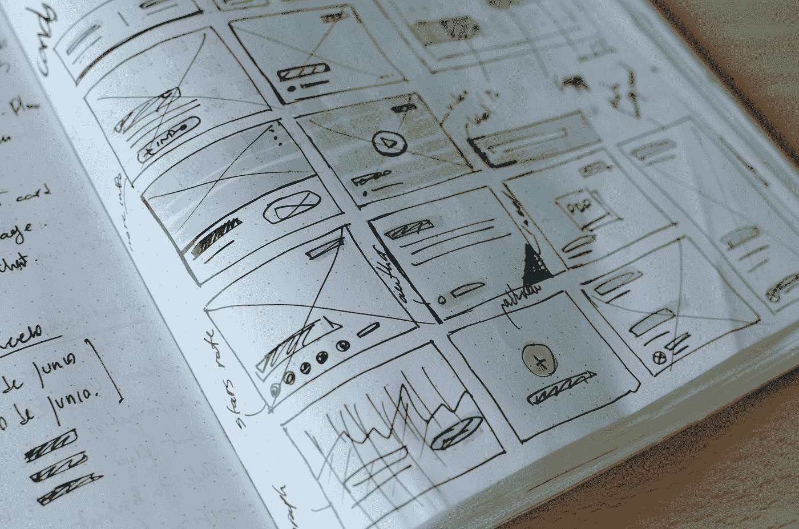

José Alejandro Cuffia 在 [Unsplash](https://unsplash.com?utm_source=medium&utm_medium=referral) 上的照片