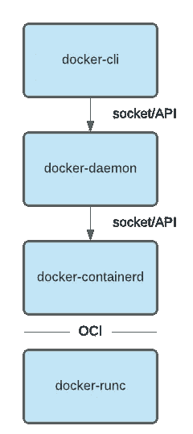
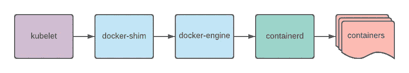
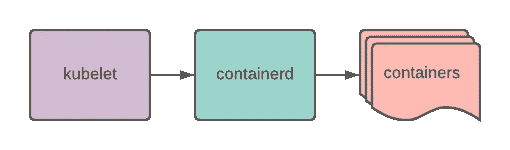

# 如何用 Containerd 替换你的树莓派上的 Docker

> 原文：<https://levelup.gitconnected.com/replace-docker-on-your-raspberry-pi-with-containerd-df5d025f497e>

## 使用 containerd 迈出第一步，像往常一样运行 docker 映像


由 [ines mills](https://unsplash.com/@inesmills?utm_source=medium&utm_medium=referral) 在 [Unsplash](https://unsplash.com?utm_source=medium&utm_medium=referral) 上拍摄的照片

2020 年 12 月， [Kubernetes 项目已经弃用 docker](https://kubernetes.io/blog/2020/12/02/dont-panic-kubernetes-and-docker/) 。通过这堂课，我们将先回顾一下历史，以理解这种贬值的原因。这将使我们下一步发现`containerd`并找出它的优势。

我们将把`containerd`安装在树莓派上来练习。这个目标平台是深入研究使用`containerd`所需的不同组件的好场景。没有可用的二进制文件，所以我们将从源代码中构建它们。一旦安装完毕，我们将会看到如何使用`ctr`命令与它交互，以及可以做些什么。

# Docker 软件历史

Docker 软件创建于 2013 年，为集装箱化的出名和普及做出了贡献。然而，人们经常混淆`docker`和集装箱化。

## 码头工≠集装箱

有了这两个 Linux 内核特性，Linux 中的容器化成为可能:

*   **Linux 内核命名空间**定义了一个进程的边界，它知道周围还有什么在运行。
*   **控制组(cgroups)** 是管理和隔离受进程影响的资源(CPU、内存)的内核特性。

Linux 容器( [*LXC*](https://linuxcontainers.org/lxc/introduction/) )于 2008 年发布，依赖于之前的两个内核特性。它提供了一个 API 来轻松创建和管理容器应用系统。

最初，`docker`使用 LXC 堆栈来隔离应用程序资源。强大之处在于创建了一个标准的软件单元，用户可以在其中定义图像并在容器中轻松启动它们。

## 软件体系结构演变

`docker`立足于 LXC，真正依赖于它的发展。为了补救这一点，`docker`开始实现[*lib containers*](https://github.com/docker-archive/libcontainer)来发布没有 LXC 的容器。

与此同时，对包含 CLI 和守护进程的整体架构`docker`有许多批评。考虑到这些反馈，`docker`开始在`docker`中删除守护进程和命令行界面。

2015 年，开放容器计划( [*OCI*](https://opencontainers.org/) )成立，旨在创建应用容器标准。Docker 公司是其定义中的一个主要参与者。这一举措产生了两个标准，构成了 OCI 模式:

*   [*runtime-spec*](https://github.com/opencontainers/runtime-spec) 定义如何运行容器:

[](https://github.com/opencontainers/runtime-spec) [## open containers/运行时规范

### 开放容器倡议制定了操作系统过程和应用标准的规范…

github.com](https://github.com/opencontainers/runtime-spec) 

*   [*图像规格*](https://github.com/opencontainers/image-spec) 定义图像创建:

[](https://github.com/opencontainers/image-spec) [## open containers/图像规格

### OCI 图像格式项目创建并维护软件海运集装箱图像格式规范(OCI 图像…

github.com](https://github.com/opencontainers/image-spec) 

Docker 公司向 OCI 捐赠了`libcontainers`。它现在是 OCI 运行时的 [*runc*](https://github.com/opencontainers/runc) 项目的一部分。如今，`docker`不再是过去的铁板一块。它使用`containerd`和`runc`来管理容器的运行:



实际的 docker 架构

## 集装箱 d

`containerd`脱胎于`docker`，从 1.11 版本开始包含:

[](https://www.docker.com/blog/docker-engine-1-11-runc/) [## Docker 1.11:第一个基于 containerd 和 OCI 技术的运行时

### 我们很高兴推出 Docker Engine 1.11，这是我们基于 runC 和 containerd 的第一个版本。在此版本中…

www.docker.com](https://www.docker.com/blog/docker-engine-1-11-runc/) 

它是一个实现容器运行时接口(CRI)的运行时，为托管系统提供了有趣的资产:

> “containerd 是一个行业标准的容器运行时，强调简单性、健壮性和可移植性。它作为 Linux 和 Windows 的守护程序提供，可以管理其主机系统的完整容器生命周期:映像传输和存储、容器执行和监督、底层存储和网络附件等。”来自[https://github.com/containerd/containerd](https://github.com/containerd/containerd)

## Docker 和 Kubernetes

在 1.20 版本之前，`kubernetes`使用`docker`与容器通信。`docker`本身调用 containerd 来管理容器:



与 Docker 的 Kubernetes

从 v1.20 开始，`kubernetes`弃用`docker`，转而使用容器运行时接口(CRI)，如`containerd`和`cri-o`。如果您在这个版本中仍然使用`docker`，您将会收到警告。这一更改将在 1.22 版中生效。之前的图表现在看起来是这样的:



没有码头工人的 Kubernetes

尽管有这个`kubernetes`变化，你可以继续在你的 CI/CD 中使用 Docker 或者用于开发目的。`docker`带来了许多用户体验功能，使交互更加简单。然而，像`kubernetes`这样的容器编排器只需要一个容器运行时来管理容器。处理一个额外的层会带来更多的复杂性，但不会创造更多的价值。

# **装在树莓皮上**

## 装置

我用的是一个 Raspberry Pi，armv6l 处理器架构，Raspbian OS。您应该使用`uname`检查您的处理器架构，并根据您的架构调整源代码。

我们确保系统是最新的:

```
$ sudo apt update
$ sudo apt full-upgrade
$ sudo rpi-update
```

我们需要一些编译工具来编译源代码:

```
$ sudo apt install autoconf automake libtool curl unzip gcc make
```

我们还需要安装一个最新的`golang`版本:

```
$ wget [https://golang.org/dl/go1.15.8.linux-armv6l.tar.gz](https://golang.org/dl/go1.15.8.linux-armv6l.tar.gz)
$ sudo tar -C /usr/local -xzf [go1.15.8.linux-armv6l.tar.gz](https://golang.org/dl/go1.15.8.linux-armv6l.tar.gz)
$ echo 'PATH="$PATH:/usr/local/go/bin"' | tee -a $HOME/.profile
$ echo "export GOPATH=$(go env GOPATH)" | tee -a $HOME/.profile
$ source $HOME/.profile
$ go version
# version should be 1.15.8
```

为 seccomp 支持安装`libseccomp`包:

```
$ sudo apt install libseccomp2 libseccomp-dev
```

安装`runc`:

```
$ go get -v github.com/opencontainers/runc
$ cd $GOPATH/src/github.com/opencontainers/runc
$ make -j`nproc`
$ sudo env PATH="$PATH" make install
```

我们需要`btrfs`包来准备`protobuf`安装:

```
sudo apt install btrfs-progs libbtrfs-dev
```

我们下载`protobuf`源代码并构建它们:

```
$ wget [https://github.com/protocolbuffers/protobuf/archive/v3.14.0.tar.gz](https://github.com/protocolbuffers/protobuf/archive/v3.14.0.tar.gz) -O protobuf_v3.14.0.tar.gz
$ tar xzf protobuf_v3.14.0.tar.gz
$ cd protobuf-3.14.0/
$ ./autogen.sh
$ ./configure
$ make -j`nproc`
$ make -l2 -j`nproc` check
$ sudo make install
```

我们下载`containerd`源代码并构建它们:

```
$ go get -v github.com/containerd/containerd
$ cd $GOPATH/src/github.com/containerd/containerd
$ make -j`nproc`
$ sudo env PATH="$PATH" make install
```

构建完成后，我们可以检查二进制文件:

```
$ containerd --version
containerd github.com/containerd/containerd v1.5.0-beta.1 cfa842c278694860a7e32917066f4a24978f80d0
```

我们部署提供的`systemd`服务文件，将`containerd`作为守护进程运行:

```
cd $GOPATH/src/github.com/containerd/containerd
sudo cp containerd.service /etc/systemd/system/
sudo systemctl daemon-reload
sudo systemctl enable containerd.service
sudo systemctl start containerd.service
```

## 与 containerd 交互

我们将使用`ctr`命令与`containerd`进行交互。它包含在`containerd`安装中:

```
NAME:
   ctr -
        __
  _____/ /______
 / ___/ __/ ___/
/ /__/ /_/ /
\___/\__/_/containerd CLIUSAGE:
   ctr [global options] command [command options] [arguments...]VERSION:
   v1.5.0-beta.1DESCRIPTION:ctr is an unsupported debug and administrative client for interacting
with the containerd daemon. Because it is unsupported, the commands,
options, and operations are not guaranteed to be backward compatible or
stable from release to release of the containerd project.COMMANDS:
   plugins, plugin            provides information about containerd plugins
   version                    print the client and server versions
   containers, c, container   manage containers
   content                    manage content
   events, event              display containerd events
   images, image, i           manage images
   leases                     manage leases
   namespaces, namespace, ns  manage namespaces
   pprof                      provide golang pprof outputs for containerd
   run                        run a container
   snapshots, snapshot        manage snapshots
   tasks, t, task             manage tasks
   install                    install a new package
   oci                        OCI tools
   shim                       interact with a shim directly
   help, h                    Shows a list of commands or help for one commandGLOBAL OPTIONS:
   --debug                      enable debug output in logs
   --address value, -a value    address for containerd's GRPC server (default: "/run/containerd/containerd.sock") [$CONTAINERD_ADDRESS]
   --timeout value              total timeout for ctr commands (default: 0s)
   --connect-timeout value      timeout for connecting to containerd (default: 0s)
   --namespace value, -n value  namespace to use with commands (default: "default") [$CONTAINERD_NAMESPACE]
   --help, -h                   show help
   --version, -v                print the version
```

`containerd`可以从一个容器注册表中拉图片，它支持标签。我们使用`ctr`来拉动`nginx`图像:

```
$ sudo ctr image pull docker.io/library/nginx:latest
```

使用`ctr`我们可以得到图像列表。我们可以确保已经提取了`nginx`图像:

```
$ sudo ctr image ls
$ sudo ctr image ls -q
docker.io/library/nginx:latest
```

我们有了`nginx`图像，现在我们可以使用它运行一个容器:

```
$ sudo ctr container create docker.io/library/nginx:latest webdemo
```

容器在运行吗？让我们通过列出容器来确认:

```
$ sudo ctr container list
CONTAINER    IMAGE                             RUNTIME
webdemo      docker.io/library/nginx:latest    io.containerd.runc.v2
```

如果我们删除映像，容器仍在运行:

```
$ sudo ctr image remove docker.io/library/nginx:latest
docker.io/library/nginx:latest
$ sudo ctr image ls -q
$ sudo ctr container list
CONTAINER    IMAGE                             RUNTIME
webdemo      docker.io/library/nginx:latest    io.containerd.runc.v2
```

现在我们可以移除容器了:

```
sudo ctr container delete webdemo
```

# 结论

我们对`docker`的历史进行了概述。我们已经看到它是一个整体软件。Docker 为定义 OCI 的集装箱标准做出了贡献。结果，`docker`的建筑发生了变化。

最初，`kubernetes`使用的是`docker`，但在 1.20 版本中决定弃用它。我们已经看到`docker`与`containerd`和`runc`通信来运行容器。它的附加价值是为开发人员管理图像和资源提供良好的用户体验。

像`kubernetes`这样的分布式系统，可以直接调用容器运行时。额外的一层是不需要的，并且会产生复杂性和跨软件层的更多调用。

最后，我们通过在 Raspberry Pi 上安装和配置它来练习`containerd`。这是一个测试`containerd`的好目标，因为它的资源有限，而且大多数时候你不会在它上面构建映像。您只想提取图像并将其放入容器中。我们发现我们可以像往常一样用`containerd`提取`docker`图像和启动容器。

感谢阅读！

# 资源

[](https://kubernetes.io/blog/2020/12/02/dont-panic-kubernetes-and-docker/) [## 不要惊慌:Kubernetes 和 Docker

### 作者:豪尔赫卡斯特罗，达菲库利，凯特科斯格罗维，贾斯汀加里森，诺亚坎特罗威茨，鲍勃基伦，雷伊莱亚诺，丹“流行”…

kubernetes.io](https://kubernetes.io/blog/2020/12/02/dont-panic-kubernetes-and-docker/) [](https://github.com/containerd/containerd) [## 集装箱/集装箱

### containerd 是一个行业标准的容器运行时，强调简单性、健壮性和可移植性。这是…

github.com](https://github.com/containerd/containerd) [](https://www.docker.com/blog/what-is-containerd-runtime/) [## 什么是 containerd？- Docker 博客

### 我们在过去已经谈过几次 containerd 的不同特性，它是如何设计的，以及一些问题…

www.docker.com](https://www.docker.com/blog/what-is-containerd-runtime/) [](https://opencontainers.org/) [## 开放集装箱倡议

### 尽管世界在 2020 年面临挑战，但 OCI 社区齐心协力，取得了一些令人兴奋的新进展…

opencontainers.org](https://opencontainers.org/)