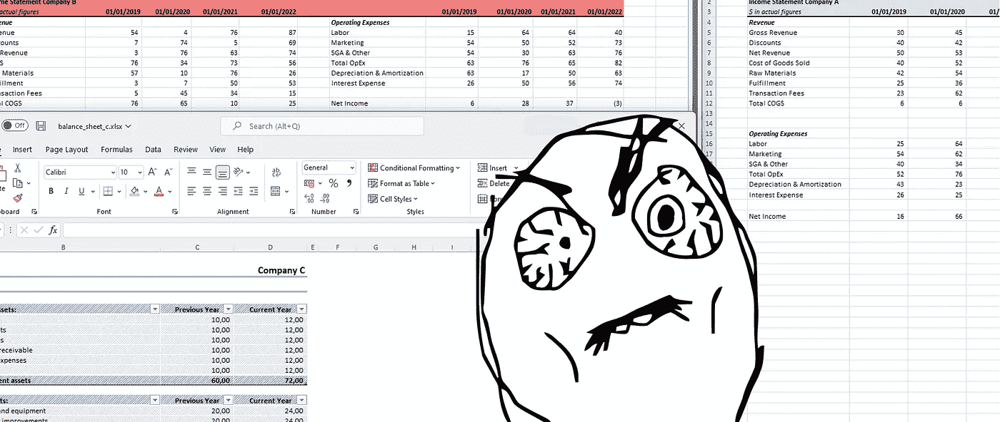

# 用 Python 替代 Excel 进行财务报表分析

> 原文：<https://levelup.gitconnected.com/replace-excel-with-python-for-financial-statement-analysis-855f6cc7305a>

## fibooks 的初学者友好概述



作者创造的形象

当 Excel 在 1985 年推出时，它很快成为世界上使用最多的软件程序之一。事实上，其多样化的现实世界应用(从华尔街财务报表到高中时间表)使其成为全球公司的数字基石。

然而，对于今天的大多数数据科学家来说，Excel 可能只不过是众多工具中的一个。事实上，即使是商界也在慢慢淘汰 Excel，部分原因是它的数据分析选项比 Python 少。

然而，[在金融领域，这种向 Python 的转变还没有发生](https://www.cfo.com/technology/spreadsheets/2022/04/excel-survive-finance-departments/)。因此，很大一部分财务报表分析(这对投资者很有用)是手工完成的。

那么他们为什么不使用 Python 呢？两个原因。首先，因为 Python 不支持财务报表(即资产负债表、损益表和现金流量表)作为数据对象。其次，因为 Python 无法读取存储这些财务报表的大部分混乱的电子表格。

令人欣慰的是，这些问题通过一个名为 *fibooks 的新库得到了解决。*本文将通过一些基本的例子对这个库做一个简短的概述。

## 加载电子表格


本文的 Excel 电子表格

在 fibooks 中加载 Excel 电子表格(见上文)首先需要创建一个对象来存放财务报表。在这种情况下，我们希望加载现金流量表。因此，我们导入了`statement_of_cashflows`类。

```
**from** fibooks **import** statement_of_cashflows
```

接下来，我们可以导入 Excel 电子表格。这是通过`load_excel` 功能完成的。这个函数有几个可选参数，可以帮助加载极其混乱的电子表格(将来会写一篇关于这个问题的文章)，但是对于这个电子表格，我们可以保留所有的默认值。(注意，fibooks 也可以加载 csv 文件和 pandas 数据帧。)

```
company_d = statement_of_cashflows('company d')
company_d.load_excel('statement_of_cashflows.xlsx')
```

从 Excel 加载数据后，我们可以使用`statement_of_cashflows`类中的函数来处理它。该函数返回来自运营的*现金流的总值。(注意 fibooks 中的值与前面显示的电子表格中的值是如何对应的。)*

```
>>> company_d.get_total('operations')*[61450]*
```

既然电子表格中的数据已经加载，我们几乎可以用它做任何事情。比如我们可以用来估值，这是财务报表分析的很大一部分。在引入 fibooks 之前，这必须在 Excel 中手动完成。

## 估价

财务报表分析的很大一部分围绕着对公司的估值。Fibooks 通过将估价方法作为标准函数来支持这一点。

下面的例子通过*基于收入的估值*证明了这一点，该估值(对于金融狂热分子而言)采用所有未来自由现金流的贴现总和。

```
>>> **from** fibooks **import** income_based_valuation
>>> income_based_valuation(company_d, r=0.05)*58523.80952380952 <- company value according to this method*
```

注意，在这个例子中，贴现率(r)等于 5%，但是它不是很相关，因为只有一年的数据。通常这种类型的评估是通过多年的数据来完成的，fibooks 也支持这一点。事实上，fibooks 支持组合多个电子表格/数据集，即使它们有不同的帐户名。

## 熊猫集成

Pandas 是使用最多的 Python 库之一。尤其是在数据分析领域，熊猫是必不可少的。因此，fibooks 支持与熊猫的全面集成。要利用这一点，只需使用`.content`属性。

```
>>> company_d.content*This outputs a pandas dataframe with the values from the spreadsheet*
```

现在可以使用 pandas 语法选择财务报表的一个帐户(或列)。

```
>>> company_d.content['customers']0    123 
Name: customers, dtype: int64
```

## 最后

这篇文章非常简短地介绍了财务分析和 fibooks。不用说，还有比这更多的可能性。有兴趣的请访问 fibooks 的[文档](https://timokats.github.io/fibooksdocs/)或完成[演示](https://github.com/TimoKats/fibooks/blob/977e71dcdbe87e68162cc415f59ee720af4bc0fe/demo/demo.ipynb) (python 笔记本)。

最后，这个库是开源的，并且总是对新的贡献者开放。因此，如果您有任何想法*或*如果您想接一个副业项目，请随时联系 GitHub 上的开发团队。

[](https://github.com/TimoKats/fibooks) [## GitHub - TimoKats/fibooks:用于财务报表分析的 Python 库。

### Fibooks 是一个用于财务报表分析的 python 库。该库支持所有 3 种主要财务报表…

github.com](https://github.com/TimoKats/fibooks)