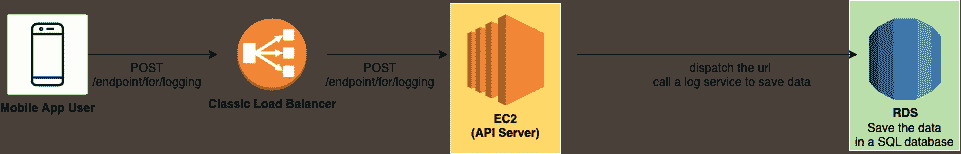
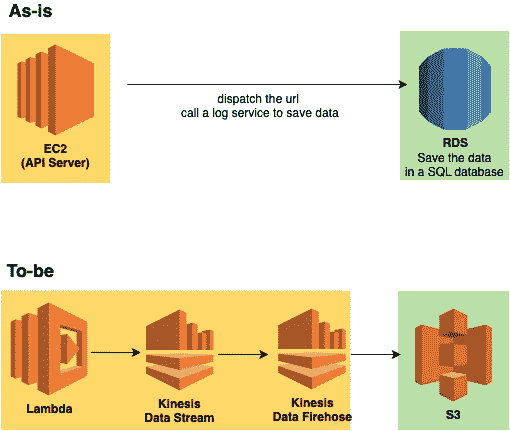
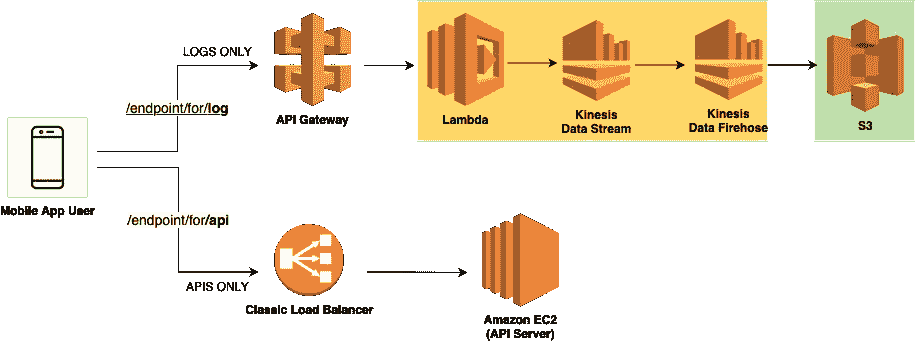
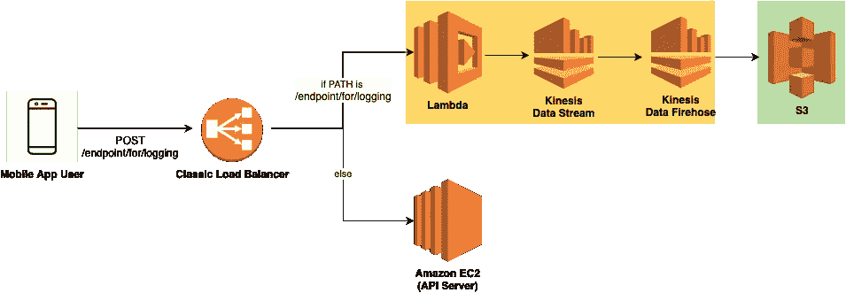
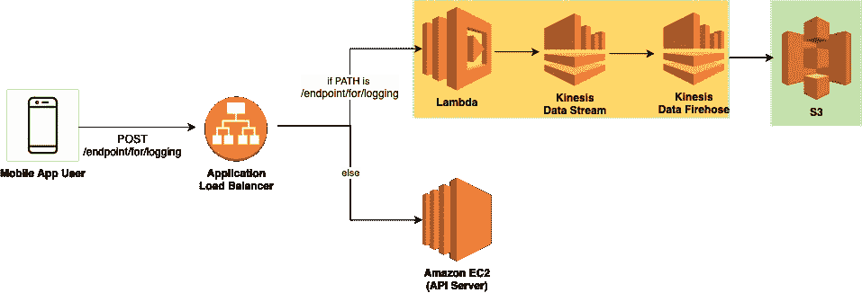
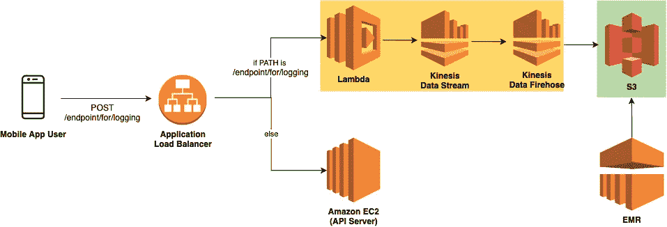
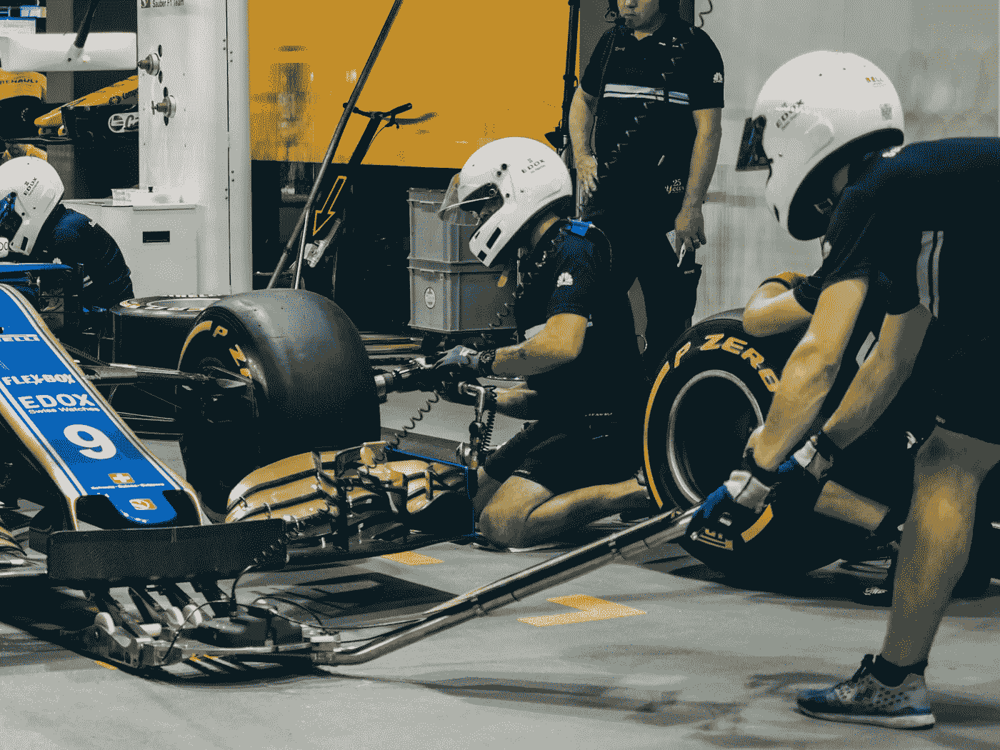

# 我如何在 AWS 上用无服务器管道替换 MySQL 日志数据库

> 原文：<https://levelup.gitconnected.com/replacing-a-mysql-log-database-with-a-serverless-piepeline-on-aws-2083de09062a>

这篇文章是关于一个项目，在这个项目中，我替换了一个正在运行的服务的基于 MySQL 的日志系统。

# 为什么我们需要自己的日志系统？

因为 Google Analytics 或者 Firebase 是不够的。尽管它支持各种各样的数据分析工具，但您仍然需要一个定制的日志系统来进行详细的分析。对用户操作的详细实验需要在自定义日志流中收集精确设计的日志。

# MySQL，你对我很好

旧的日志系统是基于 MySQL RDS 的。日志请求通过负载平衡器到达 API 服务器，就像与应用服务相关的其他请求一样。API 服务器将区分与日志相关的 URL 并调用日志服务，这将触发 SQL 事务将它们保存在 MySQL 数据库中。

旧数据流

感谢信:MySQL 做得很好。流量峰值通过分片、配置优化和实例升级得到了很好的处理。它没有丢失任何数据，并返回正确的结果。直到读事务要花好几分钟，我才注意到效率低下。

MySQL 对于日志来说太重了。在没有任何删除的情况下堆积数据后，查询变得越来越慢。索引不仅对正在运行的系统有风险，而且毫无意义，因为分析查询是非标准化的。

另外，log sysetm 没有珍惜 MySQL 的复杂特性。简单的文本存储可以很好地完成这项工作。日志数据库主要是面向写的。在此期间，唯一读取的事务是对周报的几个查询。

所以，我决定建立一个新的日志管道。

# 是突破的时候了

# 从 RDS 到 S3

为了替换 MySQL RDS，我创建了一个 S3 桶，并在其中创建了与旧数据库中的表相对应的文件夹。为了每 15 分钟将请求中的 JSON 主体转换成文本文件，Lambda 和 Kinesis 的结合是一个完美的选择。

Lambda 解析 JSON 主体，并根据端点将数据传递给相应的 Kinesis 数据流。Kinesis 数据流定期将堆叠的数据刷新到 Kinesis Firehose。Kinesis Firehose 将数据编码成指定的数据格式，如 parquet 或 Apache ORC，最后将它们保存在 S3 文件夹中。

将 RDS 替换为 S3，将 EC2 替换为 Lambda 和 Kinesis

## 用负载平衡器连接日志流

> *TL；博士:转到* ***三审***

*现在是时候将日志流的入口 Lambda 连接到 API 了。*

***第一次试验:添加 API 网关将请求重定向到 Lambda***

*我最初的想法是使用 API 网关。API Gateway 接受请求并将它们传递给 Lambda 函数。这是第一个挑战。API Gateway 确实允许你为一个点使用自定义域，只要它属于你；但是，您不能完全自定义 URL。API Gateway 以这样的格式分配它:[****【API _ Gateway _ ID }***。*](https://yourdomain.com/custom/path/{API_GATEWAY_ID}.)*

****

**第一次尝试——为 API Gateway 上的日志收集创建新的 URL，并将数据交付给 Lambda**

**web 服务很可能采用这种设计，因为更改端点相对容易。然而，在应用服务的情况下，保留旧的端点是很重要的，因为是旧的版本。即使我们更新了移动应用程序以在新的端点上运行日志记录，大多数人仍会使用旧版本。我们承担不起丢失数据的后果。**

****第二次尝试:让传统负载平衡器将请求重定向到 Lambda****

**第二个设计稍微走了一点弯路，让负载平衡器将日志相关的请求重定向到 Lambda 函数。**

****

**第二种设计——只将与日志相关的请求重定向到 Lambda**

**另一个挑战就在这里。我们在经典的负载平衡器(CLB)上运行，它不提供基于请求端点路径的重定向。**

****第三次试验:将经典负载平衡器更新为应用负载平衡器****

****

**第三种设计—将传统负载平衡器更新为应用程序负载平衡器**

**对第二个设计稍加修改就成功了。我将经典负载平衡器升级为应用程序负载平衡器，它提供基于端点路径的重定向。**

# **如何访问数据**

**虽然该设计被证明可以成功地堆叠数据，但我们需要一种方法来访问文本文件并运行一些查询。因为到目前为止团队是用 SQL 查询分析数据的，所以支持 SQL 查询是一个至关重要的需求。快速交易是一个优势。**

**亚马逊电子病历是最好的选择。虽然有点贵，但很值得。它支持流行的数据分析产品，如 Spark、Hive、Flink、Zeppelin 等。云大数据平台易于扩展，仅按运行时间收费。只要你不忘记关闭实例，账单就不会让你吃惊。**

****

**EMR 作为数据分析工具访问 S3**

# **我能说转变是成功的吗？**

**对于新的体系结构，一些问题是意料之中的。**

## **复杂结构**

**以前，一个 EC2 实例处理所有事情。它接收、解析、保存数据。新设计被分解成 4 个 AWS 产品:ALB、Lambda、Kinesis Datastream 和 Kinesis Firehose。与旧的简单设计相比，新设计需要额外的关注来理解日志流。**

## **昂贵的电子病历**

**EMR 价格由 EMR 本身和计算能力(EC2)两部分组成。截至 2021 年 1 月，EMR 实例的价格从 0.193 美元开始。与旧日志系统中的 RDS 相比，它的成本相当高。**

**尽管如此，我还是要说利大于弊。**

## **运营成本更低**

**MySQL RDS 实例的成本预计是 Lambda、Kinesis Datastream、Kinesis Firehose、S3 和 EMR 的总成本的两倍。甚至旧系统的部分成本也隐藏在主 API 服务器的成本之下，因为它们处理日志流量。**

## **易于维护**

**新的无服务器架构需要更少的维护。Lambda 和 Kinesis 都提供自动缩放功能；所以，没有必要让一个开发者一直看着流量。**

**另外，创建和删除日志流也很方便。尤其是一个经常进行特性测试的团队会充分享受到这种好处。您不必再修改服务器中的代码并部署它们。Lambda 中的几行代码和 Kinesis 上的几个点击就可以了。**

## **更强大的数据分析工具**

**虽然以前的系统只提供 MySQL 查询进行数据分析，但 EMR 中包含了各种大数据分析框架。如果您想最大限度地提高速度，您可以轻松地扩大实例。**

# **给行驶中的汽车换轮子**

****

**照片由 [Goh Rhy Yan](https://unsplash.com/@gohrhyyan?utm_source=unsplash&utm_medium=referral&utm_content=creditCopyText) 在 [Unsplash](https://unsplash.com/s/photos/tire-change?utm_source=unsplash&utm_medium=referral&utm_content=creditCopyText) 上拍摄**

**这个过程特别复杂，因为它是对正在运行的服务的日志流的替换。**

## **为以前发布的应用程序保留旧的端点**

**不是每个用户都在同一个页面上。一些用户会永远保留第一次下载的版本。由于这些旧的应用程序将它们的数据传送到旧的端点，因此使用新端点进行日志记录的设计是不可行的。**

## **无缝管理转换**

**缺少值会破坏数据的完整性。以日志流替换为代价的数据泄漏是不可接受的。这个转换必须经过周密的计划，这样我们就不会同时丢失一个请求。**

**这个项目是去年设计并实施的。虽然我查阅了 AWS 的更新说明以了解最新情况，但是任何评论都是非常受欢迎的！感谢阅读。**