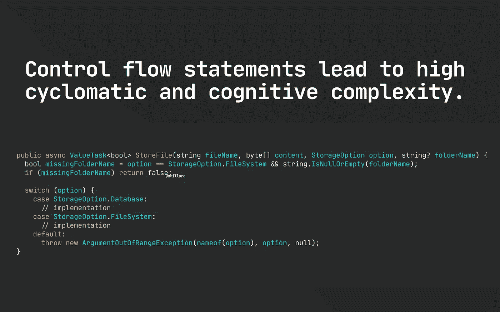
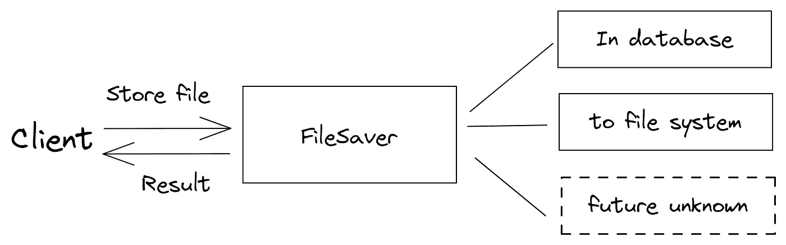
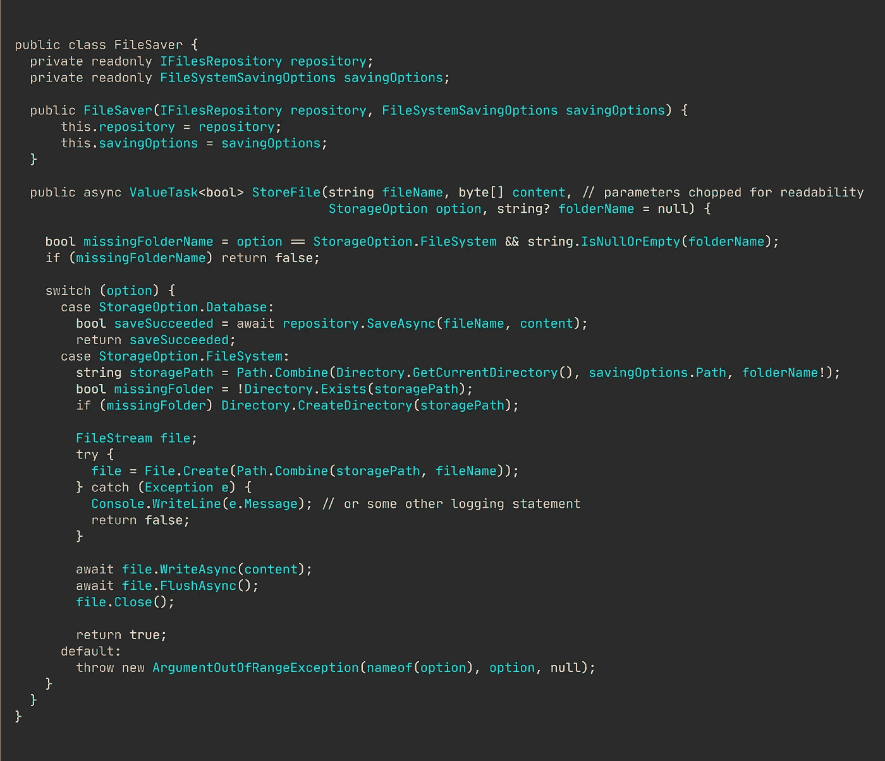
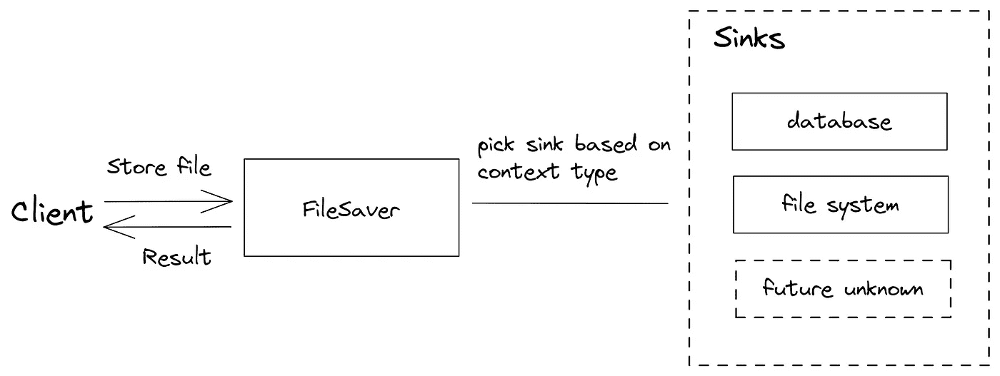
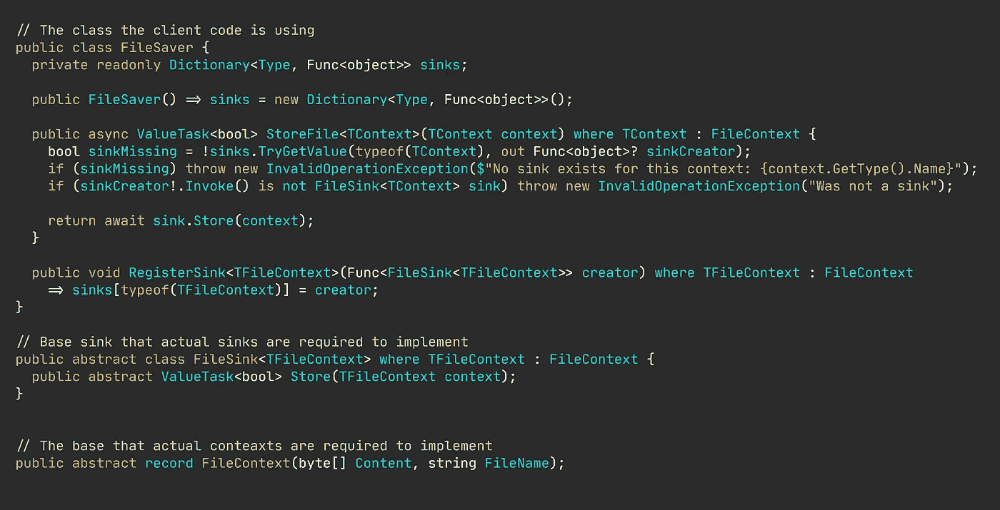
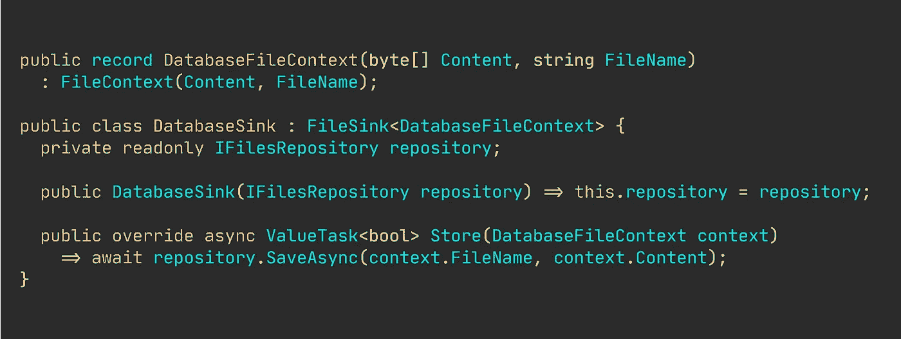
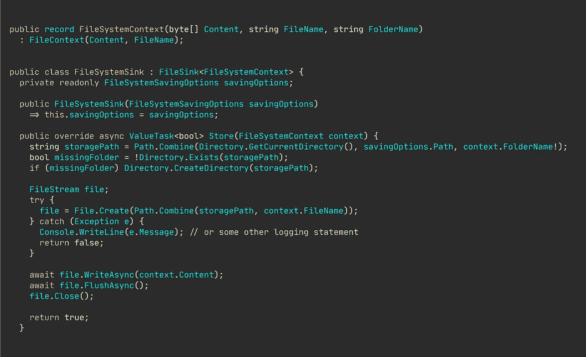

# 用参数多态替换 If-Else 和 Switch

> 原文：<https://levelup.gitconnected.com/replacing-if-else-and-switch-with-parametric-polymorphism-278899e2b16f>

## 实用编程建议

## 拥有更多的类并不意味着更高的复杂度。

图片由[尼克拉斯·米勒德](https://medium.com/u/7c7a43b3d9de?source=post_page-----278899e2b16f--------------------------------)

所以，很有可能你已经使用了参数多态——它基本上就是泛型。但是，您知道泛型如何帮助您减少分支语句的使用吗，比如`if-else`和其他控制流语句？

`if-else`通常不是一个好的选择，特别是如果你想遵循开放-封闭原则，使你的应用程序易于扩展。我们将在下一节探讨这是为什么。(我也有一份关于这个主题的文章列表

作为初级开发人员，我经常求助于传统的分支技术，到处粘贴`if-else`和`switch`语句。

我也明白你为什么会这么做。这是很容易做到的事情。它不需要你努力思考设计和交互。所有可能的路径对您来说都是直接可见的，因此您不必挖掘抽象层并跟踪实现。

但是…

> 控制流语句简单得令人难以置信，但你后来为此付出了高昂的代价。

任何时候你添加一个`else`或者另一个`case`，就像抵押你的代码质量。你可能会欠下未来自己必须偿还的技术债务，或者更糟的是，你的团队必须偿还。

🔔[想要更多这样的文章？在这里签名。](https://nmillard.medium.com/subscribe)

## “那么，我们要建造什么？”

假设您的任务是构建一些功能来存储用户提供的文件。

我想每个人都会有同感——或者，至少对这意味着什么有一个很好的想法。但是，基本上，您会收到一些字节、一个文件名和所需存储介质的指示。

## 这是我们使用分支语句的初始实现。

我们最初的、天真的、“现状”的、分支杂乱的解决方案可能看起来像下面这样，其中我们简单地分支一个离散的值。

简单的文件保护程序实现。

> 📚[GitHub @ nmillard](https://github.com/NMillard/SimpleWebApps/blob/master/src/GeneralPractices/RemovingTraditionalBranching/FileSaver.cs)上提供的代码。

现在这个实现各方面都不可怕。

我们有一些好的实践，比如显式依赖、依赖接口而不是实现、强类型配置、早期回报、防御性编码、命名条件和蜉蝣变量。

整体代码质量还不错(尽管看起来很疯狂)，但是，这种最初的方法有一些主要的缺点。

让我们首先从[认知和圈复杂度开始，这是决定代码质量的常用客观指标](/why-cognitive-and-cyclomatic-complexity-matters-in-software-development-5fce1efb56ab)。

只有两个分支，我们仍然设法达到 9 的圈复杂度和 7 的认知复杂度。根据 ISO 26262[和](https://www.exida.com/Blog/software-metrics-iso-26262-iec-61508)的说法，我们正好处在推荐的 10 的界限上。

另外，请注意我们是如何拥有分支耦合依赖的。`FileSystemSavingOptions`仅在持久化到文件系统时使用，而`IFileRepository`仅在使用数据库时使用。事情变得很快。

当在一个更大的软件组织中工作时，您可能需要与其他团队管理的许多其他项目共享这个模块。维护地狱是这种实现的自然结果。假设一个团队想要在 azure blob 存储中持久化文件，另一个团队想要使用 MongoDB。

我们天真的实现打破了开放/封闭的原则，规定现有的类应该关闭以进行修改，新的功能用新的类来实现。

你看，这很快就失控了，添加新的分支不是解决方案，更不用说测试工作如何随着每一个额外的分支而飞速发展。

## "仿制药如何帮助我们克服这种疯狂？"

从长远来看，传统的分支技术经常带来可维护性的噩梦。

我想这就是为什么你很少在业务线、企业应用中看到`if-else`、`goto`和`switch`。

坦率地说，另一种更容易维护的解决方案是从组件和交互的角度来考虑问题，而不是简单的过程指令。

您可以构建一个 [seedworks 解决方案](https://docs.microsoft.com/en-us/dotnet/architecture/microservices/microservice-ddd-cqrs-patterns/seedwork-domain-model-base-classes-interfaces)，为其他人的构建奠定基础。

通过这种方法，我们将注意力转移到理解一个系统，而不是一个不断增长的、难以维护的方法。这也让我们能够独立于其他部分阅读和理解每一部分。

我在这里提出的另一种方法要求我们有三个主要组件，一个文件保存器、上下文和一个接收器。

所以，我们的种子工程看起来像这样。我将在代码片段之后详细介绍。

Seedworks 的文件保存功能。

`FileSaver`是我们保存文件的唯一入口。它将根据传递给`StoreFile(T)`的上下文类型选择一个接收器。但是，在它实际选择一个水槽之前，它需要有预先注册的水槽。因此，我们提供了一个方法来注册一个与`FileContext`类型相关联的接收器。

接收器通过从`FileSink<T>`基类继承来实现，它在`FileContext`子类型上操作。

在这一点上，我们的基础已经打好了。它易于维护，更重要的是，我们其他团队的同事现在可以定义他们自己的接收器，不再依赖您来实现新的功能。

但是，我相信你已经注意到了，还没有真正的功能。到目前为止都只是“管道”代码。这是别人不应该看到的，不应该处理的，甚至不应该去想的东西。

有了这个基础，让我们来看看实现“保存到文件系统”和“在数据库中”功能有多容易。

然后我们有我们的文件系统功能。

实现类似于我们以前的，不可扩展的，基于分支的设计。

那么，我们从中获得了什么？

1.  首先，我们不再有分支耦合依赖。现在，每项功能都只需要执行其工作所需的依赖关系。
2.  由于认知和圈复杂度低得多，测试变得轻而易举，数据库接收器从 9 降到 1，文件系统接收器从 4 降到 4。
3.  你坚持开放/封闭原则。其他人现在可以轻松地实现他们自己的功能，并用 FileSaver 类注册接收器。

我知道许多花括号应用程序的编码人员不太欣赏管道系统，也不太欣赏为实现一个其他人可以轻松实现的直观、优雅的设计所付出的努力。

# “但是，这个解决方案太过于复杂了！”

当然可以。对某些人来说可能是这样的。

如果你是一个单独的开发者，在个人项目中轻而易举，那么这可能不是你想要的。

我敢肯定，甚至有少数资深开发人员或被误导的架构师宣称，你应该[只编写初级人员能够理解的代码，这显然是个糟糕的建议](/if-you-want-senior-developers-then-expose-juniors-to-senior-code-446d04e28def)。

尽管如此，管道代码还是能让你更快地构建你的应用程序，所以你也可以获得一些自己编写这类代码的经验，除非你只想依赖 NuGet、npm、packagist 等上的可用代码。

# 离别词。

当您需要实现额外的功能时，试着花几秒钟思考一下如何在不修改现有代码的情况下向系统添加功能。添加新代码通常比修改现有代码更安全。

想出一个优雅的、可扩展的解决方案肯定会有初始的前期成本，但这绝对是值得的。

> 请随意留下您的回复，让我听听您对硬编码分支与灵活的开放/封闭设计的看法。

# 让我们保持联系！

[在这里注册我的简讯](https://nmillard.medium.com/subscribe)并查看新的 YouTube 频道[*(@ Nicklas Millard)*](https://www.youtube.com/channel/UCaUy83EAkVdXsZjF3xGSvMw)

*连接上* [*LinkedIn*](https://www.linkedin.com/in/nicklasmillard/)

# 好奇者的资源

*   [泛型的设计和实现。NET 公共语言运行时](https://www.microsoft.com/en-us/research/wp-content/uploads/2001/01/designandimplementationofgenerics.pdf)由 A. Kennedy 和 D. Syme(微软研究院)开发
*   [Seedwork(您的领域模型的可重用基类和接口)](https://docs.microsoft.com/en-us/dotnet/architecture/microservices/microservice-ddd-cqrs-patterns/seedwork-domain-model-base-classes-interfaces)在微软文档中
*   [为什么圈复杂度和认知复杂度在软件开发中很重要](/why-cognitive-and-cyclomatic-complexity-matters-in-software-development-5fce1efb56ab)作者 [Nicklas Millard](https://medium.com/u/7c7a43b3d9de?source=post_page-----278899e2b16f--------------------------------)
*   [拿掉你的 If-Else，把箱子](/remove-your-if-else-and-switch-cases-1ed2b625b4cf)换成[尼克拉斯·米勒德](https://medium.com/u/7c7a43b3d9de?source=post_page-----278899e2b16f--------------------------------)
*   📚[GitHub @ nmillard 上的源代码](https://github.com/NMillard/SimpleWebApps/blob/master/src/GeneralPractices/RemovingTraditionalBranching/FileSaver.cs)。