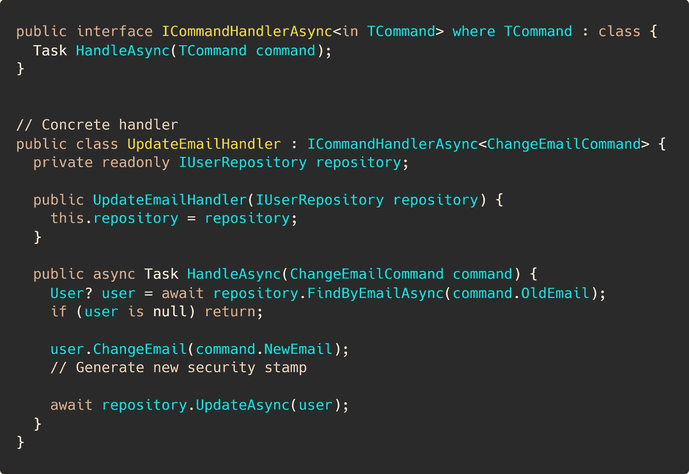

# 用命令和处理程序替换 If-Else

> 原文：<https://levelup.gitconnected.com/replacing-if-else-with-commands-and-handlers-527e0abe2147>

## 更好的软件设计

## 如何轻松替换 if-else 语句？不，开关不是合适的替代品。


如果你想了解我如何使用命令和处理程序来保持代码整洁，请继续阅读。不是说*避开* `if-elseif-else`。而是找到更合适的方法。

请记住，没有一种方法能够摆脱传统的基于分支的编程。你需要建立一个可供借鉴的技术库。

我们现在要介绍的方法只是众多方法中的一种。

从本质上来说，T1 还不错。这仅仅是我们正在进行的一场激烈的斗争。在编程 101 中，你将学习条件语句，除此之外，许多开发人员从未使他们的实践成熟。

但是，`if-else`和`switch`往往不理想。更好的方法，比如多态执行和字典，通常会被忽略。

## 我们希望避免传统的、有条件的分支。

我写过一篇文章，提出了一种用多态执行取代条件分支的方法[。为了获得一些背景信息，在我们深入研究命令和处理程序之前，我将简单地重复一些以前的文章示例。](/if-else-is-a-poor-mans-polymorphism-ab0b333b7265)

下面是我们想要避免的例子:讨厌的、难以扩展的、离散值上的分支。


复杂、令人头痛的分支

除了奇怪地使用`if-elseif-else`，主要问题是你需要为每个新的更新原因添加一个分支。明显违反了开放/封闭和单一责任原则。

每个分支基本上都可以转换成自己的命令和相应的处理程序。

让我们来看看这是如何实现的。

🔔想要更多这样的文章？在这里签名。

# 使用命令和处理程序来简化应用程序。

[📝GitHub 回购](https://github.com/NMillard/replace-if-else)

我不会宣扬什么是命令、查询和处理程序的理论。关于这个主题有很多资源。相反，我列出了一个简短的清单，列出了可能的优势。

1.  测试变得非常容易。
    你不需要更新现有的测试来解释新的特性。如果一个命令需要额外的处理，您可以创建另一个处理程序，并单独进行测试。
2.  多个处理程序可以处理一个命令。
    正如您可能已经注意到的，分派一个命令可能会调用一个或多个处理程序。通过这种方式，您可以在不影响现有代码的情况下添加新功能。
3.  愚蠢，简单的类。
    命令是一包没有设置器的属性。这里不会出什么差错。同样，对于一个处理程序，它是一个只有一个公共方法的类。
4.  控制器动作遵循请求-委托-响应模式。
    它们不包含任何业务或持久性逻辑。

如果你正在练习[事件风暴](https://www.eventstorming.com/)，我确信你已经完全理解了为什么命令和处理程序如此棒。

我结束了之前提到的文章中的[，暗示了如何使用](/if-else-is-a-poor-mans-polymorphism-ab0b333b7265)[动态命令分派](https://medium.com/swlh/dynamic-command-dispatching-in-c-d3abe21b3d1b)来消除不必要的分支。现在，您将看到一种实现命令和处理程序的方法。

# 最后，一些代码！

为了遵循这一准则，让我很快地向你们概括一下，从一般意义上来说，我们想要实现什么。

我们想说，“好吧，需要有所行动。以下是这些值。我不在乎谁来处理，只要让我知道什么时候完成就行了”。

我们需要满足三个验收标准:

1.  可以在调用者不知道具体处理程序的情况下分派命令。
2.  需要执行与命令匹配的每个处理程序。
3.  新命令或处理步骤不需要您修改现有代码。

## 我们将从最外层开始，一步步深入。

从控制器的角度出发，了解具体的处理程序甚至接口是不相关的。该操作应该只关注数据。

为此，我们希望控制器动作就像下面这样简单。


更新电子邮件端点

即使这是 C# aspnetcore，你也应该明白它的要点。简单地说，这是一个控制器动作——端点及其实现。

我知道您在想什么:“错误处理在哪里？!"。别担心。你说得对。应该在那里。但是为了简洁起见，我省略了这一部分，这样我们可以专注于调度命令的概念。

控制器依赖于一个`CommandDispatcher`。我们等会儿再去上课。dispatcher 类只有一个方法`DispatchAsync(command)`。现在你只需要知道这些。

这允许我们的控制器只关心验证它接收的数据的正确性和发送命令。*调度后如何处理*数据与控制器完全无关。

每个“更新原因”都需要有自己的端点，有自己的数据形状，即要发送的命令。

此时，实现诸如“更新用户名”之类的新特性就像创建一个新端点并发送命令一样简单。


更新用户名端点

使用这种方法时，创建端点变得非常简单。这是件好事。

我们的目标现在基本上完成了。
那么，我们继续吧。

## 命令和处理程序是所有业务逻辑所在的地方。

对于命令，您本质上只想关心两件事:不变性和数据正确性。

它们只是普通的、古老的普通班级。一点也不花哨。看看这个`ChangeEmailCommand`。


普通的老式指挥班

显然，这个命令类做的不多。这才是重点。它的目的是传递给一个处理程序。

这就把我们带到了负责人那里。花几个通读下面的代码。我试着描述一下之后的情况。



简单、可测试的命令处理程序。

首先，我们有一个所有命令处理程序都需要实现的接口。当您需要动态类型发现时，接口很重要。我们一会儿就会谈到这一点。

第二，我创建了一个简单的处理程序，它知道如何处理`ChangeEmailCommand`。ICommandHandlerAsync 的泛型参数告诉我们，“每当发送‘更改电子邮件命令’时，都需要调用这个处理程序。”

你感觉到这个类的可测试性了吗？这才是重点。这应该很容易测试。上课很专注。一种方法，一种依赖。

如果你习惯于“服务”类，你就会知道构造函数有时有多疯狂。这种方法完全消除了构造函数膨胀。

## 调度员本身。难以置信的简单和强大。

您已经看到了 dispatcher 界面。干净简单。但是让我们再一次唤起你的记忆。


指挥调度程序的公共接口

在被实现分散注意力之前，让我重申一下我们需要用`CommandDispatcher`实现什么。

我们想说，“这里有一个命令，去获取所有匹配的处理程序，并将命令传递给每个处理程序。”

这意味着，对于每个命令类，我们需要一个匹配命令处理程序的列表。在代码中，我们可以用字典来表达这种意图，其中关键是命令的类型，值是处理程序的列表。

花点时间来通读这篇文章。面向对象的人可能会发现这非常容易，而其他人不会。我会在代码下面描述我们的进展。


带字典查找的命令调度程序

不要太花哨。只是一点反思。这可能会吓跑一些非 OOP 的人。不要担心，在函数式语言中，您很可能很容易找到实现这一点的方法。

描述实际代码无关紧要。只是普通的 C#。重要的是意图。

最重要的部分是要有一个将命令和处理程序联系起来的机制。为此，我使用字典。

每个键都是一种命令类型。对应的值是实现`ICommandHandlerAsync<commandType>`的处理程序列表。

当您调用例如`DispatchAsync(ChangeEmailCommand)`时，调度程序试图在字典中找到“Type: CommandHandler”的键，并返回已注册的处理程序的列表。

然后调用每个处理程序。

仅此而已。很简单的东西。

## 用动态类型发现将它们连接起来。

在这一点上，没有什么是真正起作用的。

您需要将字典提供给某个地方的命令调度程序。

理想情况下，在应用程序启动时创建命令调度程序及其字典，并将其注册到依赖注入框架中。

你还记得我们的第三个验收标准吗？也就是说，新的特性/需求不应该要求我们修改现有的代码？

如果手动向字典注册新的命令和处理程序，实际上是在修改现有的代码。可能完全没问题。大多数时候是这样的。

但是，如果您想要推动自己并提高，那么您应该尝试给动态类型发现一个旋转。

同样，我们得到了一堆与描述完全不相关的 C#代码，但有些人可能会感兴趣。

只需知道这段代码将找到所有的命令处理程序，将它们注册到依赖容器中，构建一个字典，并在每次控制器需要一个`CommandDispatcher`时将该字典传递给命令调度程序的一个新实例。


应用程序启动时的动态类型发现

有了这个，就不需要动你现有的代码了。即使创建新的命令或处理程序也不行。在应用程序启动时，一切都已连接好。

当然，它看起来很乱，你最初的想法可能是这将成为维护的噩梦。

我故意这样写代码。很自然，你会想做一些方法提取重构来使它不那么令人讨厌。出于演示目的，完全没问题。

关键是，你只需写一次，所有的准备工作就完成了。写一些单元测试，你就会一切顺利。

```
**Resources for the curious**
-------------------------[GitHub repository](https://github.com/NMillard/replace-if-else) by the author
```


**Nicklas Millard** 是一名软件开发工程师，供职于一家发展最快的银行，负责构建任务关键型金融服务基础设施。

此前，他是 Big4 的高级技术顾问，为商业客户和政府机构开发软件。

> [新的 YouTube 频道(@Nicklas Millard)](https://www.youtube.com/channel/UCaUy83EAkVdXsZjF3xGSvMw)
> 
> *连接上* [*LinkedIn*](https://www.linkedin.com/in/nicklasmillard/)

# 分级编码

感谢您成为我们社区的一员！ [**订阅我们的 YouTube 频道**](https://www.youtube.com/channel/UC3v9kBR_ab4UHXXdknz8Fbg?sub_confirmation=1) 或者加入 [**Skilled.dev 编码面试课程**](https://skilled.dev/) 。

[](https://skilled.dev) [## 编写面试问题

### 掌握编码面试的过程

技术开发](https://skilled.dev)