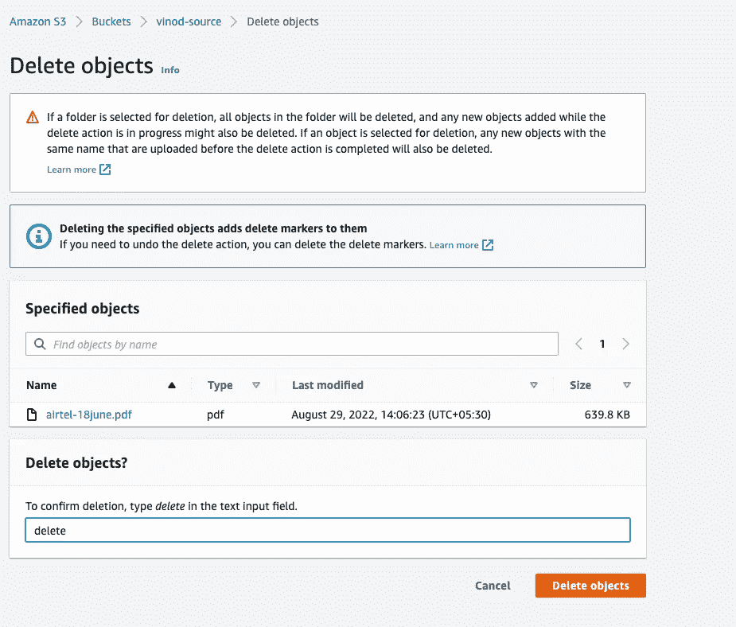

# 将加密的 S3 对象复制到另一个 AWS 帐户

> 原文：<https://levelup.gitconnected.com/replicate-encrypted-s3-objects-to-another-aws-account-8a3065d83cf6>

*您是否希望将 AWS S3(简单存储服务)中的对象安全地备份到不同的 AWS S3 存储桶中，以用于合规、审计或灾难恢复目的？*

在本文中，我们将看到如何将所有加密的对象从一个 S3 桶(我们称之为*源桶*)复制到不同 AWS 帐户中的另一个 S3 桶(作为*目的桶*)。

AWS S3 复制支持相同或不同 AWS 帐户中对象的跨区域、同区域复制。它还支持除 AWS S3 SSE-C(服务器端加密—客户提供)之外的加密对象的复制。

## 以下是加密对象的 S3 交叉帐户/相同区域复制的架构:-


AWS S3 将加密对象复制到不同 AWS 帐户中的另一个存储桶

**关于 S3 复制的几件事:-**

1.  复制不可追溯-这意味着默认情况下，S3 对象中的现有对象不会复制到其目标存储桶(在不同的 AWS 帐户中)
2.  复制仅是单向的—这意味着它始终遵循从源到目标存储区的复制更改效果，而不是相反。例如，如果您删除目标存储桶中的任何复制对象，则该更改不会反映到源存储桶中。
3.  除了在 S3 使用客户提供的密钥进行服务器端加密之外，加密对象可以被复制
4.  支持 RTC(复制时间控制), SLA 为 15 分钟，用于目标存储区中的复制
5.  还支持复制已删除的对象

## 步骤:-

1.  在 AWS 帐户 1 中创建 KMS 键

转到 KMS 服务，点击创建按钮，并提供以下输入

```
Key Type — Symmetric
Key Usage — Encrypt and Decrypt
Key Material Origin - KMS
Regionality - Single Region Key
Alias - <provide alias name>
Description (optional) - <provide relevant description of the key>
Tags (optional) - <provide relevant tags>
```


KMS 对称密钥

在此选择相关的**密钥管理员**和**密钥用法**。KMS 支持单独的角色策略(资源策略)。**密钥管理员**告知所有人(IAM 用户/角色)可以管理该 KMS 密钥，包括其轮换，而**密钥使用**告知所有人(IAM 用户/角色)可以使用这些密钥执行实际的加密操作(加密/解密)。


KMS 密钥—对称

2.在两个 AWS 帐户中创建 S3 时段(源和目标),并在两个帐户中启用版本控制。创建时，选择默认加密，并将加密密钥类型选择为“ **AWS 密钥管理服务密钥(SSE-KMS)** ”，然后选择 KMS 密钥(在上述步骤 1 中创建)。


S3 KMS 加密

这将确保在默认情况下，所有上传的对象将由您创建的 KMS 密钥加密。

3.使用以下内联策略在帐户 1 中创建 IAM 角色

```
{
 “Version”: “2012–10–17”,
 “Statement”: [
 {
 “Effect”: “Allow”,
 “Action”: [
 “s3:GetObjectVersionForReplication”,
 “s3:GetObjectVersionAcl”
 ],
 “Resource”: [
 “arn:aws:s3:::<source bucket name>/*”
 ]
 },
 {
 “Effect”: “Allow”,
 “Action”: [
 “s3:ListBucket”,
 “s3:GetReplicationConfiguration”
 ],
 “Resource”: [
 “arn:aws:s3:::<source bucket name>”
 ]
 },
 {
 “Effect”: “Allow”,
 “Action”: [
 “s3:ReplicateObject”,
 “s3:ReplicateDelete”,
 “s3:ReplicateTags”,
 “s3:GetObjectVersionTagging”,
 “s3:ObjectOwnerOverrideToBucketOwner”
 ],
 “Resource”: “arn:aws:s3:::<destination bucket name>/*”
 }
 ]
}
```

(*请注意，您需要在给定的占位符*中使用您的来源和目标 S3 存储桶的实际名称来更新上述内联策略)

4.在 AWS 帐户 2 的目标 S3 时段中添加以下时段策略

```
{
 “Version”: “2008–10–17”,
 “Id”: “”,
 “Statement”: [
 {
 “Sid”: “1”,
 “Effect”: “Allow”,
 “Principal”: {
 “AWS”: “arn:aws:iam::<Number of aws account 1>:role/<source IAM role name>”
 },
 “Action”: [
 “s3:ReplicateObject”,
 “s3:ReplicateDelete”
 ],
 “Resource”: “arn:aws:s3:::<destionation bucket>/*”
 },
 {
 “Sid”: “2”,
 “Effect”: “Allow”,
 “Principal”: {
 “AWS”: “arn:aws:iam::<Number of aws account 1>:root”
 },
 “Action”: “s3:ObjectOwnerOverrideToBucketOwner”,
 “Resource”: “arn:aws:s3:::<destionation bucket>/*”
 },
 {
 “Sid”: “3”,
 “Effect”: “Allow”,
 “Principal”: {
 “AWS”: “arn:aws:iam::<Number of aws account 1>:role/<source IAM role name>”
 },
 “Action”: [
 “s3:GetBucketVersioning”,
 “s3:PutBucketVersioning”
 ],
 “Resource”: “arn:aws:s3:::<destionation bucket>”
 }
 ]
}
```

注意， ***默认情况下，复制的对象只拥有源桶标识*** 的所有权，但这可以通过在上述策略中添加动作***objectowneroverridepocketowner***来修改为目标桶标识。

5.在源存储桶中创建复制配置规则—给定复制名称、启用状态、规则(如果需要使用前缀在所有或特定对象集中完成复制)，提供目标帐户 id、目标存储桶名称、IAM 角色(在上述步骤 3 中创建)，选择使用 KMS 密钥 ARN 加密(在上述步骤 1 中创建)，选择 RTC(复制时间控制)和删除标记复制(也将删除的对象复制到目标存储桶)。


S3–复制配置规则

瞧啊。！！都搞定了:-)

在源桶中添加一些使用我们创建的 KMS 密钥加密的对象，并在检入目标桶之前等待一段时间。您将看到加密的对象被复制到目标存储桶中。

a)在帐户 1 的源存储桶中上传了对象，该对象被复制到帐户 2 的目标存储桶中


AWS S3-来源时段


AWS S3-目的地时段

b)删除了在目标存储桶中复制的源存储桶中的现有对象



S3-源存储桶中的对象删除


S3-源存储桶中的对象删除


S3 —在目标存储桶中被删除

# 摘要:-

在本文中，我们看到了如何使用 S3 复制配置将对象(包括已删除的对象)复制到同一地区不同 AWS 帐户中的目标 bucket。在遵循法规遵从性方面，复制起着至关重要的作用，即在任何灾难恢复或审计目的的情况下保持数据备份的安全性和持久性。