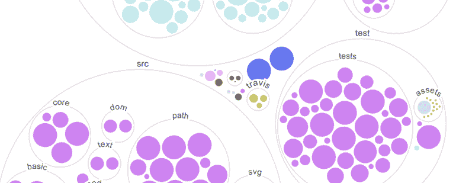
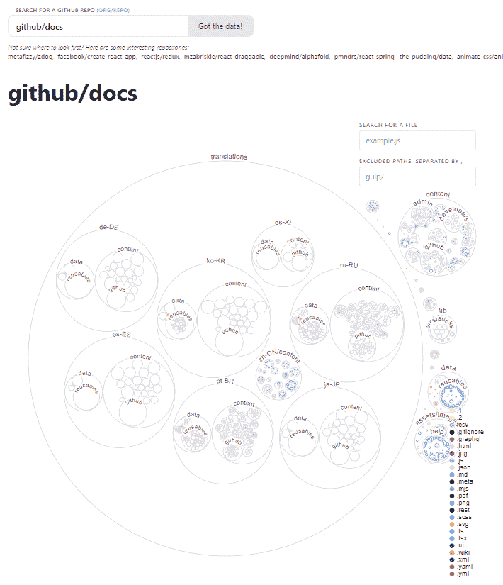
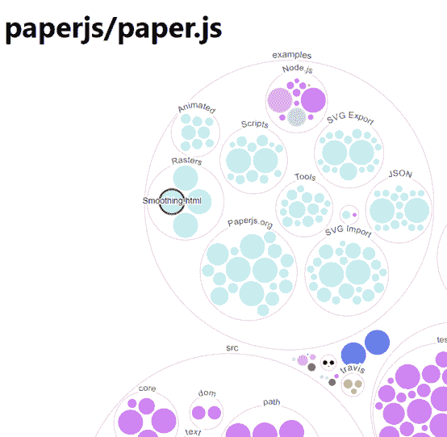
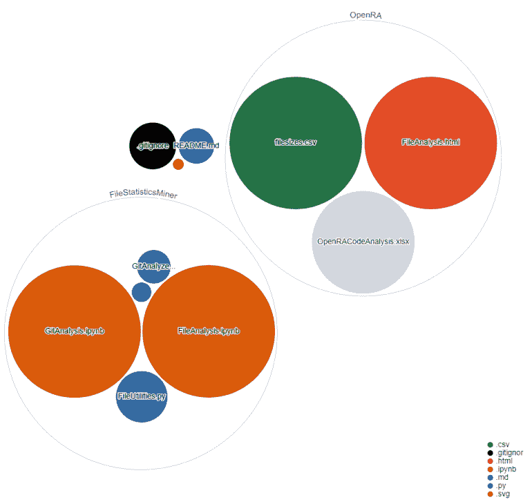
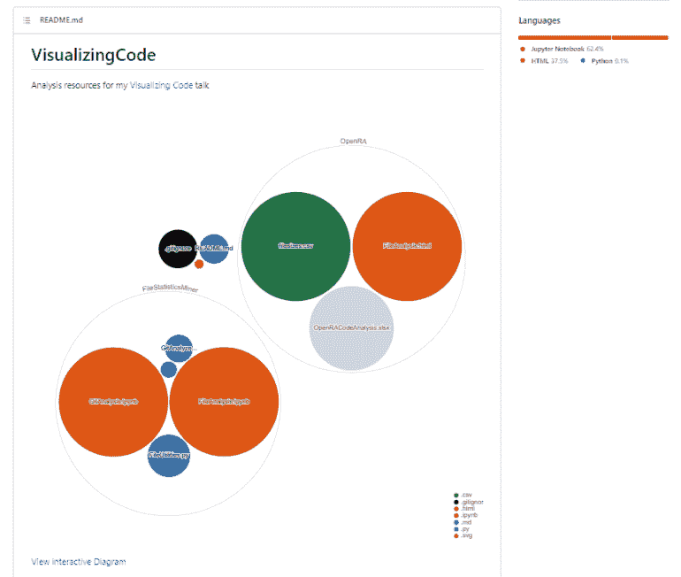

# 使用 GitHub Next 实现存储库可视化

> 原文：<https://levelup.gitconnected.com/repository-visualization-with-github-next-kill-all-defects-a554a4fe9832>



在这个简短的教程中，我将向您介绍 GitHub Next 的 Repo 可视化项目，并向您展示如何使用它来可视化您的存储库，甚至在每次向 GitHub 推送新代码时生成 git 存储库的图像。

# 什么是回购可视化项目，能做什么？

GitHub 的 repo-visualization 项目是由 [Amelia Wattenberger](https://twitter.com/Wattenberger) 进行的一个实验项目，旨在构建高级的存储库可视化工具，有朝一日可能会加入 GitHub 的主要产品。repo-visualization 项目目前是 [GitHub Next](https://next.github.com/) 的一部分，其中包含许多其他实验项目。



repo visualizer 项目显示 github/docs 项目的交互式 D3.js 可视化

您目前可以使用存储库可视化项目来查看 GitHub 上的任何公共存储库，无论该存储库是否是您的。例如，您可以使用它来可视化[微软的云采用框架](https://octo-repo-visualization.vercel.app/?repo=MicrosoftDocs%2Fcloud-adoption-framework)、 [Vue.js](https://octo-repo-visualization.vercel.app/?repo=vuejs%2Fvue) ，甚至 [PowerShell](https://octo-repo-visualization.vercel.app/?repo=PowerShell%2FPowerShell) ，并使用由 [D3.js](https://d3js.org/) 支持的可视化与这些存储库进行交互。

虽然交互式可视化很难呈现较大存储库的图形，但一旦它呈现出来，就可以让您一目了然地查看项目的结构，突出显示文件大小、类型和文件夹结构。您还可以将鼠标悬停在您特别感兴趣的文件上。



repo-visualizer 突出显示 paperjs/paper.js 存储库中的特定文件

除了这种实时可视化技术之外，repo visualization 项目还提供了一个构建操作，每当代码被检入到该操作被配置为监视的分支上时，该操作就会自动生成一个架构图的 SVG 图像文件。然后，该操作将添加一个新的 commit 来添加或更新存储库中的 SVG 文件，确保图表保持最新，而无需生成它或等待它完成呈现。

由 build 操作生成的 SVG 文件是一个矢量图像，不需要在每次访问页面时都在浏览器中生成，这有助于提高大型存储库的性能，尽管它不提供与交互式版本相同的极简主义水平，因为所有标签都不能在图像中动态显示或隐藏。

# 使用构建操作自动创建图表

生成 GitHub Octo 图相当简单。您需要用一些基本的配置步骤在存储库内部创建一个`.yml`文件。

首先，确保您的项目在其根目录中有一个`.github`目录(这里的`.`很重要)。在该目录中，如果还没有一个`workflows`目录，您需要创建一个。

一旦`.github/workflows`目录存在，添加一个`create-diagram.yml`文件到您的存储库中，并设置其内容如下:

```
name: Create diagram
on:
  workflow_dispatch: {}
  push:
    branches:
      - main
jobs:
  get_data:
    runs-on: ubuntu-latest
    steps:
      - name: Checkout code
        uses: actions/checkout@master
      - name: Update diagram
        uses: githubocto/repo-visualizer@main
        with:
          excluded_paths: "ignore,.github,.idea"
```

这个文件是一个 [YAML 文件](https://en.wikipedia.org/wiki/YAML)，包含关于要采取的动作、其依赖项以及任何可选参数的信息。上面代码片段的`on: / push: / branches:`配置假设操作监视`main`分支，但是您可以根据需要修改它以匹配您的存储库或者监视其他分支。

如果您想从生成的图中排除某些目录，您可能还想调整`excluded_paths`值。

一旦您将这个变更添加、提交并推送到 GitHub，就会触发一个动作，在您的存储库的根目录下生成一个`diagram.svg`文件。根据存储库的内容，它看起来会像这样:



英特尔/可视化代码库的预渲染图像

对被监视分支的任何后续提交都将导致映像被更新。

如果你对更多细节感兴趣，可以在 GitHub 上找到 [repo-visualizer](https://github.com/githubocto/repo-visualizer) 的完整源代码，它的 readme 列出了所有可用的配置选项。配置选项通常添加在`with:`步骤下面。

# 将图表添加到自述文件中

如果您想在项目的 GitHub 页面上展示您的存储库图像，您可以通过向您的`readme.md`文件或任何其他 markdown 文件添加一些图像和链接标签来实现。

这里有一个来自我的[可视化代码库](https://github.com/IntegerMan/VisualizingCode)中的`README.md`文件的例子:

```
[](https://octo-repo-visualization.vercel.app/?repo=integerman%2FVisualizingCode) [View interactive Diagram](https://octo-repo-visualization.vercel.app/?repo=integerman%2FVisualizingCode)
```

第一行包含图像的路径，在您的存储库中将是相同的，除非您以不同的方式配置操作。两行中的 URL 都指向交互式存储库可视化工具，该工具使用一个查询字符串参数来设置在交互式可视化中浏览的存储库。

在 GitHub 上查看时，像这样的`README.md`文件会生成类似下图的内容:



IntegerMan/VisualizingCode 的 README.md 文件提供了一个自动生成的 SVG 图

# 下一步是什么？

我对 GitHub 的新方向感到兴奋，以及 [GitHub Next](https://next.github.com/) 如何开始向我们提供早期迹象，表明 GitHub 如何通过像 [repo visualizer](https://next.github.com/projects/repo-visualization) 、[平面数据](https://copilot.github.com/)和 [Copilot](https://next.github.com/projects/flat-data) 这样的项目来扩展我们作为开源软件开发者的能力。感觉越来越多的这些功能进入 GitHub 功能的常规套件只是时间问题，我已经等不及了。

如果你对更多与代码可视化相关的东西感兴趣，请在这里或在 [Twitter](https://twitter.com/IntegerMan) 上关注我。我正在为一个关于[可视化代码](https://sessionize.com/s/matt-eland/visualizing_code/43084)的演讲做准备，并将在接下来的几个月和几年里探索关于这个主题以及数据科学问题的许多相关话题。

*最初发表于 2021 年 10 月 9 日*[*https://killalldefects.com*](https://killalldefects.com/2021/10/08/github-next-repo-visualization/)T22。