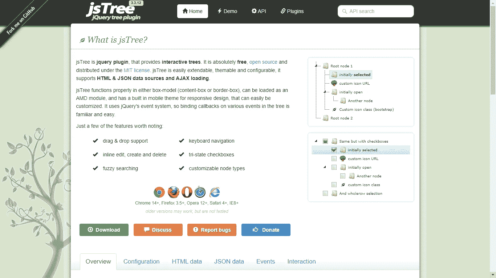
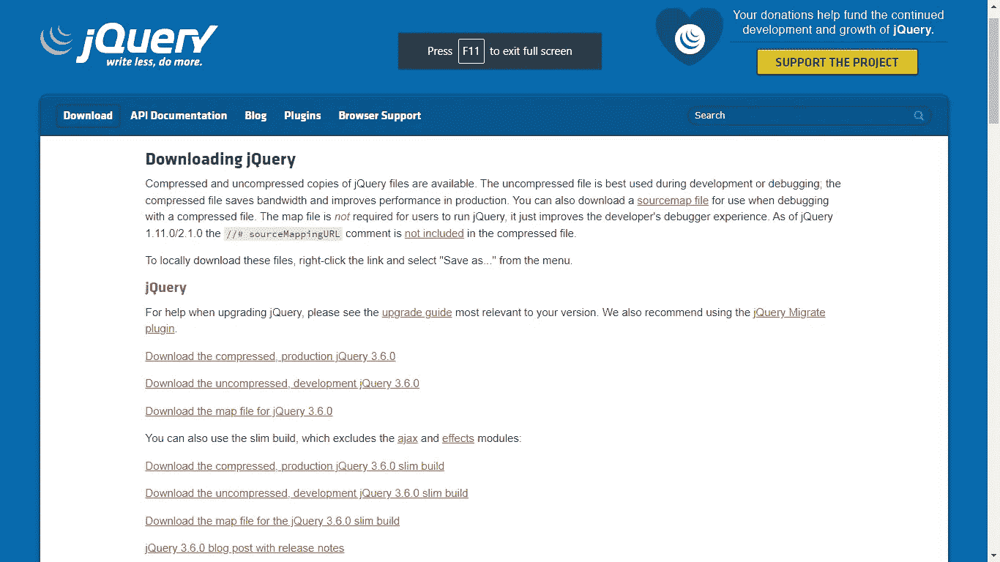
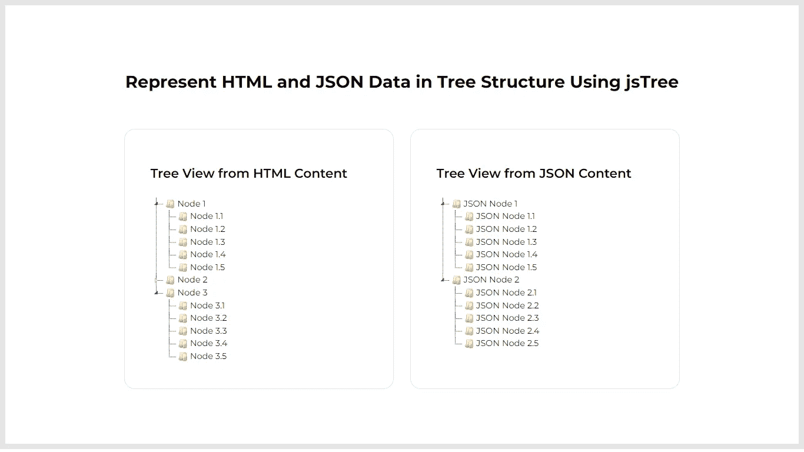

# 使用 jsTree 以树形结构表示 HTML 和 JSON 数据

> 原文：<https://levelup.gitconnected.com/represent-html-and-json-data-in-tree-structure-using-jstree-af562e611a8>

## 学习集成 jsTree——一个 jQuery 插件，用 HTML 和 JSON 创建交互式树。

树结构是一种用于大型分层数据集的数据可视化技术。jsTree 使创建漂亮的交互式树变得很容易。它是完全免费和开源的。它是在麻省理工学院的许可下发布的。它可以很容易地扩展，有多种主题和配置。

在本文中，我将逐步向您介绍如何将 jsTree 集成到您的 web 应用程序中。您将学习如何在树结构中表示您的数据，无论是 HTML 还是 JSON，这将促进数据可视化并增强用户体验。

# 通过 4 个简单的步骤生成交互式树

1.  下载 jsTree 并链接资产文件。
2.  下载 jQuery 并链接资产文件
3.  使用 HTML 创建部分以显示交互式树。
4.  从 HTML 和 JSON 生成树视图。

# 步骤 1:下载 jsTree 并链接资产文件

打开 jsTree 官网，滚动到页面中间定位**下载**按钮。点击它开始下载插件的压缩文件。提取 ZIP 存档文件的内容，并将它们存储在项目文件夹中。然后，打开您的头文件，在`head`元素中，添加以下代码行以包含 jsTree 插件的资产文件(根据您的项目更改文件路径)。

jsTree 官网:

 [## jsTree

### jsTree 是一个 jQuery 插件，提供交互式树。它是绝对免费的，开源的，并在…

www.jstree.com](https://www.jstree.com) 

# 步骤 2:下载 jQuery 并链接资产文件

打开 jQuery 的官方下载页面，滚动到页面中间找到一个名为**的链接，下载压缩后的，量产版 jQuery 3.6.0** 。单击它开始下载库。复制文件并将其存储在项目文件夹中。然后，打开头文件，在 head 元素中添加以下代码行以包含 jQuery 库(根据您的项目更改文件路径)。

jQuery 官方下载页面:

 [## 下载 jQuery | jQuery

### jQuery 文件的压缩和未压缩副本都是可用的。未压缩文件最好在开发过程中使用…

jquery.com](https://jquery.com/download/) 

# 步骤 3:使用 HTML 创建显示交互式树的部分

接下来，我们需要创建一个 HTML 布局来显示从 HTML 和 JSON 内容创建的树视图。创建一个 id 为`tree-view-from-html`的 DIV 元素，并以`ul`和`li`格式构建数据。在`ul`元素内部，添加多个`li`元素。这些元素将充当根节点。在每个`li`元素内部，可以进一步添加`ul`和多个`li`元素。这些将作为父节点的子项。并且在膨胀时将是可见的。要用 JSON 生成树视图，只需创建一个 id 为`tree-view-from-json`的 DIV 元素，并在 jsTree 实例中定义 JSON。

将下面的代码片段添加到要将数据显示为树视图的部分。

# 步骤 4:从 HTML 和 JSON 生成树视图

当 DOM 完全加载后，我们就可以开始创建 jsTree 插件的实例了。选择 id 为`tree-view-from-html`的 DIV 元素，它以`ul`和`li`格式保存 HTML 内容。然后在上面调用`jstree()`函数来渲染一个树形视图。

为了用 JSON 生成树视图，选择 id 为`tree-view-from-json`的 DIV 元素。然后，将 JSON 数据传递给`jstree()`函数中的`data`属性。

将下面的代码片段添加到一个`script`标签中，并将其放在您想要呈现树视图的页面上。

# 结果

太棒了。您已经学习了如何为 HTML 和 JSON 内容集成 jsTree 并创建漂亮的交互式树。

> 如果你喜欢阅读这篇文章，并发现它对你有用，那么请鼓掌，与你的朋友分享，并关注我以获得我即将发布的文章的更新。你可以在 [LinkedIn](https://www.linkedin.com/in/tararoutray/) 上联系我。