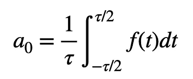

# 用傅里叶级数和 Python 表示方波

> 原文：<https://levelup.gitconnected.com/representing-a-square-wave-with-a-fourier-series-and-python-6d43beb19442>

假设你想做一个周期波——可能是为了音乐合成器什么的。无论你需要波做什么，事实证明最容易产生的波是正弦(或余弦)波。只取以恒定角速度旋转的圆上一点的垂直分量，就可以得到正弦波。像这样。

动画:瑞德·阿兰

是的，我用 Glowscript 制作了这个动画— [这里是代码，以防你需要。](https://trinket.io/glowscript/5f0003503c)但是如果你想做一个不同的周期函数呢。假设你想产生一个方波。看起来是这样的。

好吧，这是很酷的事情。你可以用一堆正弦和余弦函数来产生这个方波。没错。这就是傅立叶级数背后的全部思想。

如果我有一个周期函数 f(t)，那么下面是真的。

这是不同频率和不同振幅的正弦和余弦的无穷和。频率很简单，只是ω的整数倍。对于振幅，它们可以计算为:

这里τ是周期函数的周期，其中:

哦，还有一件事。如果周期函数没有平均值为零(比如它没有绕 t 轴振荡)，那么你需要移动它。这是 a0/2 项，其中 a0 是一个周期的平均值。

我们开始吧。让我们用正弦和余弦建立一个方波模型。当然，我们不能添加无限数量的波，但我们可以做 10 个左右。这就是我要告诉你怎么做。首先，我要得到两个系数(a_n 和 b_n)的表达式。第二，我要把 n 项加起来，然后画出来，看看它看起来是不是方波。对于这第二部分，我将使用 python ( [这里是我的 python 绘图教程](https://medium.com/swlh/heres-how-to-make-a-graph-in-python-glowscript-actually-a7e06c8a3e26))。

**求系数**

我需要从方波的数学表达式 f(t)开始。因为函数重复，我可以只定义一个周期。

让我继续给出 A 和τ的值。

我现在不需要这些值，但是稍后 python 绘图需要它们。好了，应该清楚了，A0 等于零。我需要那样做吗？不——我们应该很乖，对吧？

让我们从 a_n 开始(我用下划线表示下标，以防你没有注意到)。我要对函数 f(t)积分，但是因为它有两个部分，我要得到两个积分。同样，我不是从-τ/2 到τ/2，而是从 0 到τ积分。我希望那没问题。如果不行，我以后会补偿你的。于是积分变成:

整合起来并不困难。只是余弦的积分。

分解出一些东西并在极限下评估:

零的正弦值是零——就是这样。此外，我可以输入ω的表达式(如上),得到:

如果你回想一下三角课上的单位圆，并记住 *n* 是一个整数(1，2，3，…)。所以 *n* π的正弦将为零(它总是在单位圆的 x 轴上)。这个表达式中的每一项都是零。我希望你不会失望。

但这意味着所有的“a_n”项都是零。不过，真的很好。回头看看傅立叶级数。a_n 项是余弦项的系数。然而，余弦是一个偶数函数，我们的方波是一个奇数函数。使用奇函数来构建一个奇函数是有意义的，所以我们不需要任何余弦项。

我们可能可以跳过计算 a_n 项的这一步，因为我们知道我们的函数是奇数——但它仍然是有用的。哦，记住不是每个函数都是奇数或偶数。有些傅里叶级数既需要 a_n 项又需要 b_n 项。

说到 b_n，我们需要计算那些。这基本上和求解 a_n 的过程是一样的，我先把我们的方波函数放到 b_n 系数的定义中。

正弦的积分是负余弦。在极限下积分和评估，我得到:

同样，所有值都在单位圆的 x 轴上(在 0、π或 2π处，或其倍数处)。在 0 处，余弦为 1，但在π处，余弦为-1。这意味着这些项要么是 1，要么是-1。让我简化一下，因为我可以组合一些术语。还有，我要用前面的项代替ω。

好吧，让我们想想这个。cos(2nπ)项始终为 1。不管 n 的值是多少，它都会在 x 轴的正方向上余弦值为+1 的位置。这里有两个+1 项。让我重写。

当 n = 1 时会发生什么？在这种情况下，cos(π) = -1，所以括号中的值是 1-(-1)=2。n = 2 的时候呢，那么 cos(2π) = 1，东西就为零了。当 n 是奇数时，括号将是 2。当 n 是偶数时，它将是零。你可以就此打住——但是有一个技巧。你可以这样写:

或者你可以这样写:

但不管怎样，我们都有自己的系数。

**用 Python 绘制傅立叶级数**

让我给你们看一下，n = 5 时傅里叶级数的曲线图。这就是了。这里是代码——但是别担心，我会解释的。

除了你正常的制图材料之外，还有两个关键部分。第一个是计算 b_n 系数的函数。看起来是这样的。

python 中的函数是什么？哦，[我有这方面的教程——给你。](https://rjallain.medium.com/a-physicists-guide-to-functions-in-python-9aec73cc4dcb)但基本上，这只是返回某个值为 n 的系数的数值，是的，这取决于 A 的值，但那是上面列出的。请注意，我将(-1)提升到 n 次方——就像我们讨论过的那样。

但是你如何策划整件事呢？这是代码的一部分。别担心，我会检查重要的细节。

现在来听一些评论:

*   第 43 行:`ft`是 f(t)在某点的值。因为傅立叶级数是一个和，这个值从零开始，然后我可以把东西加进去。
*   第 44 行:`nn`是一个计数器变量。它用于计算傅立叶级数的最大值(N)。是的，这里还有一个“n”——那只是以前尝试做一些很酷的事情时留下的(但我放弃了)。
*   第 45 行:这是一个遍历 n (n = 1，2，3，…)所有值的循环。对于 n 的每个值(我称之为 nn)，我只需加上傅立叶项(bn*sin(stuff))。
*   第 49 行:画出傅立叶级数和特定值。
*   对下一个时间值重复上述步骤。

看看这个。下面是 n = 20 时的样子(只是为了好玩)。

我在这里的工作已经完成了。接下来我想做一个锯齿波——为了好玩。