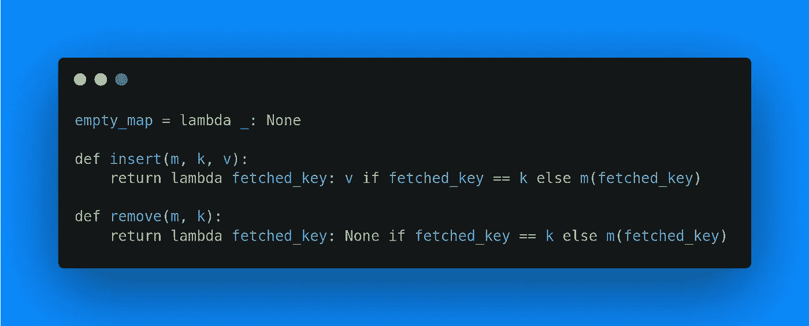

# 用一级函数表示数据结构

> 原文：<https://levelup.gitconnected.com/representing-data-structures-with-first-class-functions-bbf6d6bb3165>



有一天，我和我的室友谈论如何通过函数组合来模拟所有的数据结构，所以我想我应该证明一下。

最通用的数据结构之一是地图，地图实际上已经是一个函数了。有时，当我们谈论函数时，我们谈论它们如何将定义域映射到值域。

下面是一个简单的函数地图:

```
map = {'a': 1, 'b': 2, 'c': 3}
f('a') = 1
f('b') = 2
f('c') = 3
```

这在数学符号中非常简单，但显然这不是真正的代码。

我先从 Python 说起。空地图很容易表示为 Python 函数:

```
empty_map = lambda _: None
```

它只是一个函数，接受任何值，不返回任何值。

将一元地图创建为 Python 函数也很容易:

```
simple_map = lambda x: 1 if x == 'a' else None
```

但是我们如何着手在这张地图上添加变量呢？很简单，只需添加一个 if 语句:

```
new_map = lambda x: 2 if x == 'b' else simple_map(x)
```

如果我们取`new_map('b')`，它的值就是 2。如果我们取`new_map('a')`，它计算`simple_map('a')`，正好是 1。

现在我们可以画出猫头鹰的其余部分:

```
empty_map = lambda _: None

def insert(m, k, v):
    return lambda fetched_key: v if fetched_key == k else m(fetched_key)

def remove(m, k):
    return lambda fetched_key: None if fetched_key == k else m(fetched_key)
```

要在现有的 map 函数中插入一个键，我们只需在递归堆栈中添加一个新的 if 语句。我觉得是通过代码比英语更容易理解的东西。图表可能会有帮助，但我不擅长画画。

使用这段代码非常简单:

```
m = empty_map
m = insert(m, 1, "a")
print(m(1)) # a

m = insert(m, 2, "b")
m = insert(m, 3, "a")
m = insert(m, 1, "c")
print(m(1), m(2), m(3)) # c b a

m = remove(m, 2)
print(m(1), m(2), m(3)) # c None a
```

如果 Python 有管道操作符，这看起来会好很多。

仅仅用函数来制作地图是相当容易的。我认为很明显，除了性能特征之外，任何其他数据结构都可以用映射来模拟。当然，性能是选择数据结构的最大因素之一(人机工程学/概念模型更重要*有时*)，否则我们只会编写花哨的接口而不是数组。然而，虽然这不是直接有用的，但它有一些很酷的含义。

本质上，这是使用调用堆栈来存储数据，这在递归算法中并不罕见，尽管这是它的一个极端版本。如果你只是不断地添加和删除相同的元素，你可能会有一个“空”的地图，使用这种方法会占用很多空间。

一个有趣的想法是，虽然“调用栈”的概念是一个计算机科学术语，但它也“存在”于任何标准的代数符号中，只是我们不这样称呼它。

另一个重要的含义是，函数的使用有时可以被不同的数据结构所代替。例如，递归算法通常可以通过使用堆栈在没有尾调用优化的语言中进行优化。

如果你学到了什么，考虑雇用我。我是普渡大学的大二学生，想找一份 2022 年夏/秋季的实习。我通常对函数式编程、编程语言、编译器、系统开发、图形和模拟器感兴趣。在 https://mikail-khan.com[](https://mikail-khan.com)**找到我的简历和作品集。在*[*mikail-khan.com/signup*](http://mikail-khan.com/signup)订阅我的邮件列表*

**原载于 2021 年 10 月 11 日*[*https://mkhan 45 . github . io*](https://mkhan45.github.io/2021/10/11/fmap.html)*。**