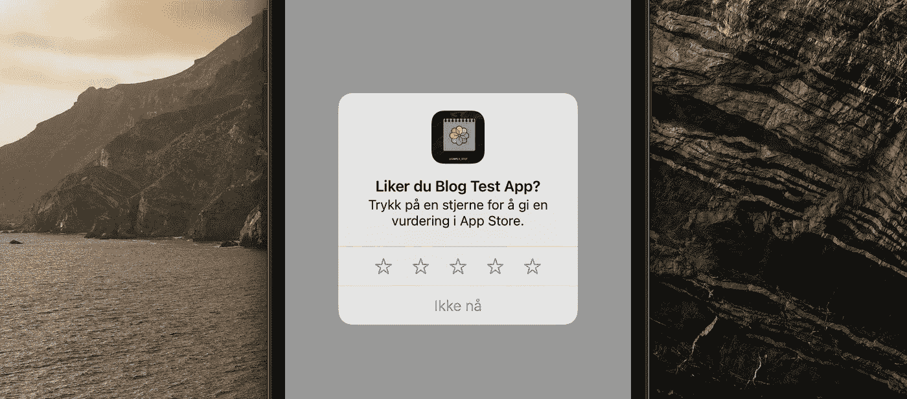
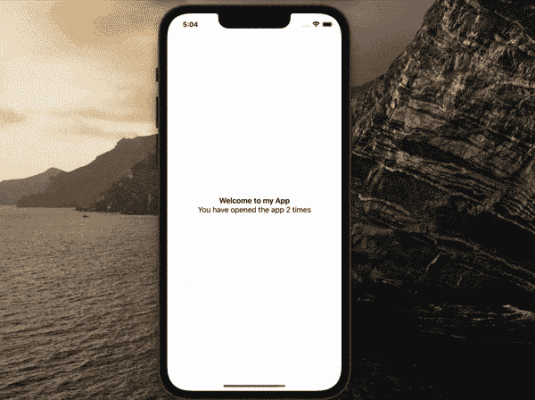

# 使用 SwiftUI 请求 App Store 评级

> 原文：<https://levelup.gitconnected.com/requesting-app-store-ratings-with-swiftui-481ea4e62be>

## 如何让用户在 App Store 中评价和评论你的应用



评级和审查屏幕

当推出一款新应用时，获得用户评论和反馈非常重要。一个有多个(正面)评价的应用会让你从竞争中脱颖而出，向人们展示你的应用值得一试。在理想世界中，所有喜欢你的应用程序的用户都会留下评论，然而，不幸的是，通常情况并非如此。提醒人们离开评论是建立反馈基础的好方法。这篇文章将带你完成这些步骤。

# 初始实施

创建评级和评论警报实际上是 Apple store kit 框架的内置部分，因此我们首先使用视图顶部的“import StoreKit ”,我们希望警报出现在那里。下一步是访问必要的环境密钥——称为 requestReview。最后，调用 requestReview()属性，这将提示用户离开评论。

下面的代码片段将这些步骤付诸实施。在这个具体的例子中，有一个“离开评论”按钮，当点击它时，将出现提示窗口，要求评级/评论。

```
import StoreKit
import SwiftUI

struct RatingAlertCode: View {

    @Environment(\.requestReview) var requestReview

    var body: some View {

        Button("Leave a review") {
            requestReview()
        }

    }
}
```

# 微调

虽然那种方法可行，但不太实用。通常你希望你的用户在被提示离开评论之前已经使用了一段时间。此提示的正确时间可能会因您的应用程序而异，应进行相应调整。

在这篇文章中，我们将举一个例子，我们希望用户在第三次看到欢迎屏幕时被要求评论。

为此，首先创建一个保存在 AppStorage 内存中的名为“openCount”的变量。虽然应该谨慎使用 AppStorage 变量，但它非常适合这种情况，因为它是一个只使用少量内存的属性。

每次显示视图时，变量增加 1。这可以通过在视图的主 VStack 上使用 onAppear 修改器来完成。然后在同一个修饰符中添加一个‘if’语句，当这个变量达到 3 时，它将触发审查警报。

该警告将只显示一次，以免过多的弹出窗口打扰任何用户。

```
struct ReviewAppCode: View {

    @Environment(\.requestReview) var requestReview
    @AppStorage("openCount") private var openCount = 0

    var body: some View {
        VStack{
            Text("Welcome to my App")
                .font(.headline)
            Text("You have opened the app \(openCount) times")
        }.onAppear(perform: {
            openCount += 1
            if openCount == 3 {
                requestReview()
            }
        })
    }
}
```

# 摘要

添加评论提醒是鼓励用户评价你的应用程序的好方法，也增加了更多人发现你努力制作的产品的机会。尽管实施起来很简单，但应该花时间来考虑提示审查的最佳时间范围。不要等太久，以便尽可能多地吸引用户，但也要让人们有足够的时间使用应用程序，以免留下过早的评级。

希望这是有帮助的...如果有什么可以解释得更好，或者你打算如何在你自己的项目中实现，请在评论中告诉我！



> *感谢阅读！如果你喜欢这个帖子并想阅读更多，请务必查看我的个人资料或* [*订阅*](/subscribe/@simply_stef) *的类似帖子。*
> 
> *订阅 Medium，无限获取所有可用的内容和想法。如果你通过这个链接加入 Medium，我会从你的费用中收取一点点——而且不会花你任何额外的钱！*

# 分级编码

感谢您成为我们社区的一员！在你离开之前:

*   👏为故事鼓掌，跟着作者走👉
*   📰查看[升级编码出版物](https://levelup.gitconnected.com/?utm_source=pub&utm_medium=post)中的更多内容
*   🔔关注我们:[Twitter](https://twitter.com/gitconnected)|[LinkedIn](https://www.linkedin.com/company/gitconnected)|[时事通讯](https://newsletter.levelup.dev)

🚀👉 [**加入升级人才集体，找到一份惊艳的工作**](https://jobs.levelup.dev/talent/welcome?referral=true)