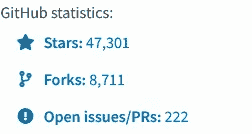

# Python 中的请求库

> 原文：<https://levelup.gitconnected.com/requests-library-in-python-32cfb7da0a30>

## 了解如何使用 Python 中的请求库与 API 进行通信。


Python 中的请求库

作为程序员，我们每天都要和 API 打交道。不管你的立场如何，总会有不得不使用 API 的时候。如果你正在使用 Python 语言，并且想学习如何在 Python 中使用 API，那么这个博客就是为你准备的。

这个博客将向您展示如何使用[请求](https://docs.python-requests.org/en/latest/)库进行不同的 API 操作。我们将讨论 API 的 GET、POST、PATCH 和 DELETE 方法。为了演示所有操作，我将使用 [JSON 占位符](https://jsonplaceholder.typicode.com/) API。JSON Placeholder 是一个免费的伪 API，用于测试和原型开发。

# Python 中请求库的用途

为了通过互联网获取任何类型的数据，我们需要使用 HTTP 协议。无论是获取网页还是调用 API，任何通过互联网传输的数据都必须遵循 HTTP 协议。**请求**库允许我们在浏览器之外使用这个 HTTP 协议。

> 你可能会问，既然有很多其他选择，为什么还要使用请求呢？🤔

如果你看看这个项目的统计数据，你会相信我。不仅仅是统计数据，我知道很多人更喜欢 Requests 库而不是其他 HTTP 模块。根据 Requests python 库的[官方页面](https://docs.python-requests.org/en/latest/)，
“*请求让你极其轻松的发送 HTTP/1.1 请求。没有必要手动添加查询字符串到你的 URL，或者对你的文章数据进行格式编码。Keep-alive 和 HTTP 连接池是 100%自动的，感谢*[*urllib 3*](https://github.com/urllib3/urllib3)*。*



对 [GitHub](https://github.com/psf/requests) 的请求

# 用 Python 安装请求

在我们可以使用任何第三方库之前，我们必须安装它。要安装请求，请在终端中运行以下命令。

```
pip install requests
```

在基于 Mac 和 Linux 的操作系统上，该命令可能会显示一个错误，提示 pip 不可用。如果有，那就试试

```
pip3 install requests
```

如果您仍然得到一个错误，那么您可能需要先安装 pip。要在您的系统上安装 pip，请查看这个[文档](https://pip.pypa.io/en/stable/installation/)。

要验证安装，您可以在 python shell 中尝试**导入请求**。

# 请求中不同的 HTTP 方法

# 请求库中的 GET 方法

顾名思义，get 请求用于获取数据。那么，我们该怎么做呢？要使用 GET 方法，首先我们需要导入它。您可以使用以下任何方法从 requests 模块导入 GET。

```
from requests import get
response = get('https://jsonplaceholder.typicode.com/posts/1')
```

运筹学

```
import requests
response = requests.get('https://jsonplaceholder.typicode.com/posts/1')
```

这里，我们使用了 JSONPLaceholder API。如果该调用成功，API 将返回以下数据。

```
{
  "userId": 1,
  "id": 1,
  "title": "sunt aut facere repellat provident occaecati excepturi optio reprehenderit",
  "body": "quia et suscipit\nsuscipit recusandae consequuntur expedita et cum\nreprehenderit molestiae ut ut quas totam\nnostrum rerum est autem sunt rem eveniet architecto"
}
```

> *所以，问题是我们如何知道 API 调用成功了，并且我们得到了数据。*

检查我们是否可以使用`response.ok`、`response.status_code`或`response.raise_for_status()`。让我向您展示这三个属性和对象基于 API 调用的成功而返回的内容。

```
from requests import getresponse = get('https://jsonplaceholder.typicode.com/posts/1')
print(f"OK: {response.ok}")
print(f"Status Code: {response.status_code}")
print(f"Error: {response.raise_for_status()}")"""
OUTPUT:
-------
OK: True
Status Code: 200
Error: None
"""
```

对于上面的代码，我们可以看到，如果 API 调用成功，那么`response.ok`将返回 True，`response.status_code`将返回 200 系列的状态代码。但是这里要注意的一点是`response.raise_for_status()`没有返回任何东西。 ***为什么？*** 因为我们没有收到任何来自后端或 API 调用的错误。

为了更好地理解这一切，现在让我们来看看当 API 调用不成功时会发生什么。

```
from requests import getresponse = get('https://jsonplaceholder.typicode.com/garbage')
print(f"OK: {response.ok}")
print(f"Status Code: {response.status_code}")
print(f"Error: {response.raise_for_status()}")"""
OUTPUT:
-------
OK: False
Status Code: 404
Traceback (most recent call last):
  File "C:\Users\Sahil\Documents\pCloud\Blog\Python\Code\API.py", line 6, in <module>
    print(f"Error: {response.raise_for_status()}")
  File "C:\Users\Sahil\AppData\Local\Programs\Python\Python310\lib\site-packages\requests\models.py", line 960, in raise_for_status
    raise HTTPError(http_error_msg, response=self)
requests.exceptions.HTTPError: 404 Client Error: Not Found for url: https://jsonplaceholder.typicode.com/garbag
"""
```

你可能已经注意到了，但是让我来解释一下。不成功的 API 调用为`response.ok`属性返回 False，为`response.status_code`属性返回 404。但是，与成功的调用不同，我们从`response.raise_for_status()`方法收到了一个错误。顾名思义，从请求模块的官方文档来看， **raise_for_status** 方法将引发 HTTPError，如果它发生的话。一般来说，除了 200 系列以外的任何东西都被认为是错误的。

所以像许多人一样，我更喜欢使用 **status_code** 属性，这样我就可以手动处理错误，并且当我得到一个错误时，我的代码如何表现就在我的手中。毫无疑问，如果你喜欢使用 **raise_for_status()** ，你可以使用一般的错误处理。

> *我们的请求成功了，现在怎么办？*

为了从**响应**中提取数据，我们需要将其转换成 JSON 格式。在这篇博客中，我将重点讨论文本数据。如果你想让我写其他类型的数据，可以在推特上联系我，或者在 LinkedIn 上联系我👇‍

要在 JSON 中转换响应，我们可以使用 **json()** 方法。

```
from requests import getresponse = get('https://jsonplaceholder.typicode.com/posts/1')
data = response.json()
print(data)"""
OUTPUT:
------
{
  "userId": 1,
  "id": 1,
  "title": "sunt aut facere repellat provident occaecati excepturi optio reprehenderit",
  "body": "quia et suscipit\nsuscipit recusandae consequuntur expedita et cum\nreprehenderit molestiae ut ut quas totam\nnostrum rerum est autem sunt rem eveniet architecto"
}
"""
```

默认情况下，Python 会将任何 JSON 数据转换为其本地字典格式。如果你打印**类型(数据)**，它会返回`<class 'dict'>`。所以，现在我们可以像在 python 中操作字典一样操作数据。有时，我们需要将带有 URL 的身份验证令牌传递给服务器。稍后我会在这个博客中告诉你如何发送这些邮件。首先，我将向您展示如何在请求库中使用 POST 方法。

# 请求库中的 POST 方法

POST 方法通常用于创建记录。例如，你必须建立一个电子商务网站，现在你想从管理面板添加产品到您的网站。为此，您将使用所有必要的数据和凭证创建一个 POST 请求。一旦成功进行 POST API 调用，就可以使用 get 方法获取新数据。要发出 post 请求，您主要需要两样东西，一个合适的端点和数据。在大多数请求中，您还需要提供身份验证数据。但是现在，让我们把重点放在端点和数据上。

所以，如果我们想在 JSON 占位符 API 中添加一个新的 post，我们必须使用`/posts`作为端点。我们将收到来自 JSON 占位符 API 的响应，即添加的记录。任何方法的响应都取决于其配置方式。不要求再次发送数据，但通常情况下，发送回新添加或更新的记录是一种标准。

```
from requests import postnew_post_data = { 'title': 'foo', 'body': 'bar', 'userId': 1}
response = post('https://jsonplaceholder.typicode.com/posts', data=new_post_data)
data = response.json()
print(data)"""
OUTPUT:
-------
{
  "userId": 1,
  "id": 101,
  "title": "foo",
  "body": "bar"
}
"""
```

这里，为了传递数据，我们使用了 Python 字典。但是，如果您愿意，也可以使用 JSON 数据。要使用 JSON 数据而不是`data`作为参数，您需要使用`json`。

```
from requests import postnew_post_data = { 'title': 'foo', 'body': 'bar', 'userId': 1}
response = post('https://jsonplaceholder.typicode.com/posts', json=new_post_data)
data = response.json()
print(data)"""
OUTPUT:
-------
{
  "userId": 1,
  "id": 101,
  "title": "foo",
  "body": "bar"
}
"""
```

你可能会想，看起来是一样的，为什么会有两个不同的论点。对于我们的`new_post_data`变量，python 自动将其转换成 JSON，反之亦然。但是有时我们可能会从其他 API 请求接收 JSON 数据，并需要将它传递到 POST 请求的主体中。在这种情况下，我们需要使用`json`参数。Python 会将数据转换成它的内部数据类型，但并不是每次都这样，所以大多数时候，人们倾向于修改数据或将数据转换成内部格式，而不是使用`data`参数。

# 请求库中的修补和上传方法

修补和上传，这两种方法都用于更新数据。大多数时候你可以选择使用它们。如果想了解更多，可以试试这个 [**栈溢出**](https://stackoverflow.com/questions/21660791/what-is-the-main-difference-between-patch-and-put-request) 解释。在这里，我将向您展示如何对 Requests 包使用 PATCH 方法。PATCH/PUT 方法需要与 POST 方法相同类型的参数。但是主要的区别是，我们不是调用一般的端点，而是使用特定记录的端点。例如，为了更新 JSON 占位符 API 中第二条记录的数据，我们将使用`/posts/2`端点。

```
from requests import get, patchresponse = get('https://jsonplaceholder.typicode.com/posts/2')
data = response.json()
print(data)
print('-'*15)new_post_data = { 'title': 'foo', 'body': 'bar', 'userId': 1}
response = patch('https://jsonplaceholder.typicode.com/posts/2', json=new_post_data)
data = response.json()
print(data)"""
OUTPUT:
-------
{'userId': 1, 'id': 2, 'title': 'qui est esse', 'body': 'est rerum tempore vitae\nsequi sint nihil reprehenderit dolor beatae ea dolores neque\nfugiat blanditiis voluptate porro vel nihil molestiae ut reiciendis\nqui aperiam non debitis possimus qui neque nisi nulla'}
---------------
{'userId': 1, 'id': 2, 'title': 'foo', 'body': 'bar'}
"""
```

您可能已经注意到，我们使用了与 POST 方法相同的参数和过程。

# 请求库中的删除方法

顾名思义，DELETE 方法用于使记录被删除或不活动。我们像在补丁方法中一样使用特定的端点。有些情况下，人们会创建一个端点来删除所有记录，但过程也是一样的。您只需更改端点。在我们的例子中，从 JSON 占位符 API 中删除第三条记录。我们将使用以下代码:

```
from requests import deleteresponse = delete('https://jsonplaceholder.typicode.com/posts/3')
data = response.json()
print(data)
print(response.status_code)"""
OUTPUT:
-------
{}
200
"""
```

对于删除方法，我们没有收到任何数据，这就是我们在输出中看到`{}`的原因。

在我们进入下一部分之前，我想提一下，我们也可以使用`response.text`来检索数据。但是它将以字符串的形式返回。我们得自己把它转换成 dict/json。

```
from ast import literal_eval
from json import loads
from requests import getresponse = get('https://jsonplaceholder.typicode.com/posts/3')text_data = response.text
print(text_data)
print(type(text_data))
print('-'*15)json_data = loads(response.text)
print(json_data)
print(type(json_data))
print('-'*15)json_data = loads(response.text)
dict_data = literal_eval(text_data)
print(dict_data)
print(type(dict_data))"""
OUTPUT:
-------
{
  "userId": 1,
  "id": 3,
  "title": "ea molestias quasi exercitationem repellat qui ipsa sit aut",
  "body": "et iusto sed quo iure\nvoluptatem occaecati omnis eligendi aut ad\nvoluptatem doloribus vel accusantium quis pariatur\nmolestiae porro eius odio et labore et velit aut"
}
<class 'str'>
---------------
{'userId': 1, 'id': 3, 'title': 'ea molestias quasi exercitationem repellat qui ipsa sit aut', 'body': 'et iusto sed quo iure\nvoluptatem occaecati omnis eligendi aut ad\nvoluptatem doloribus vel accusantium quis pariatur\nmolestiae porro eius odio et labore et velit aut'}
<class 'dict'>
---------------
{'userId': 1, 'id': 3, 'title': 'ea molestias quasi exercitationem repellat qui ipsa sit aut', 'body': 'et iusto sed quo iure\nvoluptatem occaecati omnis eligendi aut ad\nvoluptatem doloribus vel accusantium quis pariatur\nmolestiae porro eius odio et labore et velit aut'}
<class 'dict'>
"""
```

如果要在正文中发送数据，可以使用`json.dumps()`将 **dict** 转换成**字符串**。

```
import json
from requests import postpayload_data = {'userId': 1, 'title': 'ea molestias quasi exercitationem repellat qui ipsa sit aut', 'body': 'et iusto sed quo iure\nvoluptatem occaecati omnis eligendi aut ad\nvoluptatem doloribus vel accusantium quis pariatur\nmolestiae porro eius odio et labore et velit aut'}
response = post('https://jsonplaceholder.typicode.com/posts', data=json.dumps(payload_data))print(response.json())
"""
OUTPUT:
-------
{'id': 101}
"""
```

# 请求模块中的身份验证和自定义标头

在许多情况下，您需要验证/识别自己的身份。这是大多数第三方库中的场景。在任何请求中传递自定义标头。我们必须使用**头**参数。

```
import json
from requests import postpayload_data = {'userId': 1, 'title': 'foo', 'body': 'bar'}headers = {'content-type': 'application/json'}
response = post('https://jsonplaceholder.typicode.com/posts', data=json.dumps(payload_data), headers=headers)
print(response.json())
print('-'*15)headers = {'content-type': 'application/text'}
response = post('https://jsonplaceholder.typicode.com/posts', data=json.dumps(payload_data), headers=headers)
print(response.json())"""
OUTPUT:
-------
{'userId': 1, 'title': 'foo', 'body': 'bar', 'id': 101}
---------------
{'id': 101}
"""
```

在这里，你可以注意到我们使用`application/text`和`application/json`时的区别。有时，我们需要明确说明我们发送的是什么类型的数据。这只是一种情况，你可以使用多种类型的头。你可以在官方文档中找到完整的列表。

现在你所期待的来了。如何传递认证数据？在下面的例子中，我使用 Twitter API 来获取 tweet 数据。Twitter 要求在发出任何请求时传递**不记名令牌**或其他 **OAuth 令牌**。

```
import json
from requests import getURL = "https://api.twitter.com/2/tweets?ids=1505694856240377860&tweet.fields=lang,public_metrics"
headers = {'content-type': 'application/json', 'Authorization': f'Bearer {ACCESS_TOKEN}'}response = get(URL, headers=headers)
print(response.json()['data'][0])"""
OUTPUT:
-------
{
  "text": "Inspiration is perishable—act on it immediately.\n\n— @naval",
  "id": "1505694856240377860",
  "lang": "en",
  "public_metrics": {
    "retweet_count": 29,
    "reply_count": 7,
    "like_count": 351,
    "quote_count": 0
  }
}
"""
```

如您所见，您只需要将`Authentication`键-值对添加到您的 headers 字典中。现在我使用的是不记名令牌，但如果你使用其他类型的令牌，那么这个值将不同于这个**认证**密钥。

如果您想使用 OAuth 认证而不是承载令牌，该怎么办？要使用 OAuth 认证，可以使用`requests-oauthlib`库。您可以使用以下终端命令安装它:

```
pip install requests-oauthlib
```

一旦安装了 **requests-oauthlib** 库并对其进行了验证，使用下面的代码片段对请求模块使用 OAuth1 身份验证。

```
import json
from requests import get
from requests_oauthlib import OAuth1URL = "https://api.twitter.com/2/tweets?ids=1505694856240377860&tweet.fields=lang,public_metrics"
auth = OAuth1(CONSUMER_KEY, CONSUMER_SECRET,ACCESS_KEY, ACCESS_SECRET)response = get(URL,  auth=auth)
print(response.json()["data"][0])"""
OUTPUT:
-------
{
  "text": "Inspiration is perishable—act on it immediately.\n\n— @naval",
  "id": "1505694856240377860",
  "lang": "en",
  "public_metrics": {
    "retweet_count": 29,
    "reply_count": 7,
    "like_count": 351,
    "quote_count": 0
  }
}
"""
```

# 结论

乌 ffff！13 分钟读完 ha😆！就是这样，朋友们。我希望您对如何使用 Python 中的请求库有了更好的了解。除了调用 API 之外，还可以将 Requests 库与其他库结合起来做很多事情。

请务必在下面的评论中留下你的想法、问题或担忧。我很想看看他们。如果你需要任何帮助或者想讨论什么，请告诉我。在 Twitter 或 LinkedIn 上联系我。

> 想了解更多？
> 
> 注册我的[时事通讯](https://sahil-fruitwala.medium.com/subscribe)，把最好的文章放进你的收件箱。

> 了解更多关于 API 的信息👇

[](https://javascript.plainenglish.io/what-is-an-api-b53f95aa79a7) [## 什么是 API？初学者的全面指南

### 了解什么是 API，有哪些不同类型的 API。

javascript.plainenglish.io](https://javascript.plainenglish.io/what-is-an-api-b53f95aa79a7)