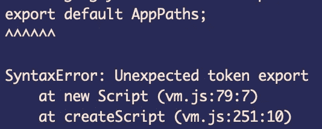

# 使用 Babel 在运行时“要求”ES 模块导出文件

> 原文：<https://levelup.gitconnected.com/require-an-es-module-exported-file-at-runtime-using-babel-c872d376a59c>

如何快速消除"*意外令牌导出* " woe😞

有时候，当你编写一个用 Node 执行的 CommonJS 程序时，你需要对一个用 es 模块`export { … }`或`export default ...`导出的文件使用 CommonJS 的`require`。当你的程序开始喊`Unexpected token export`滥用为控制台错误时，你就会知道这种挫败感。

对我来说，这个问题是在我为 React web 应用程序编写文档工具时出现的。该程序与 web 应用程序的运行没有任何关系，而是旨在帮助内部开发人员掌握我们构建的 web 应用程序。

我在`require`程序中需要的文件是一个简单的 JSON 导出对象。

在我的文档工具的一个子功能中，我需要做的就是`require('this/is/pathfile.js')`并开始使用 JSON 属性。应该很容易吧？没有。一点也不。

🤬为什么？为什么为什么？🤬

如果你遇到了`Unexpected token export`，毫无疑问你会在谷歌上搜索各种关于 CommonJS 和 es 模块导入/导出、实验模块和 JS 文件完全传输之间的差异的文章。

那么你是做什么的…？

我们中最聪明的人可能会建议显而易见的(正确的)解决方案是重构源文件。为什么有一个 JS 文件只导出一个 JSON 对象？为什么不只是一个 JSON 文件？所有这些都是有效的，但是在我的环境中，有一些原因使我无法将 *AppPaths.js* 文件更改为 *AppPaths.json* 。把文件本身放在一边，考虑问题是导出/请求，有些情况下你的例子也是一样的。

所以我是这么做的。

我用的是[巴别塔](https://babeljs.io/)。Babel 可以将 ES 模块文件转换成广泛兼容的 JavaScript，甚至可以与 CommonJS 兼容。要安装，请参见他们的[使用说明](https://babeljs.io/docs/en/usage)。

所以这可能不是你想要的惊喜因素，对吗？每个人和他们的祖母都知道巴别塔。那又怎样？这是一种可以理解的反应。

然而，如果你一直在谷歌搜索这个答案，你会注意到大多数答案是使用命令行/终端操作将源代码转换成 CommonJS 格式，通常会生成构建文件夹。我不需要所有这些，我只需要解析这个文件来得到一个简单的 JSON 对象。走吧。

巴别塔来救援了。有各种各样的`@babel/core` [转换函数](https://babeljs.io/docs/en/babel-core)允许你转换代码。我感兴趣的是 [transformFileSync](https://babeljs.io/docs/en/babel-core#transformfilesync) 。将此与[babel-plugin-transform-es 2015-modules-commonjs](https://babeljs.io/docs/en/babel-plugin-transform-es2015-modules-commonjs)结合使用，我有了一个在运行时转换恼人文件的解决方案。

但我们还没到那一步。我有了这个`babelTransformedFile`变量，果然，它有一个`code`属性显示转换后的代码。不过这已经足够用了。剩下要做的就是`writeFile`到一个目录，然后`require`现在兼容的文件。

我们在这里使用`default`是因为我们的 ES 模块文件是用`export default`编辑的。

就是这样！

## 摘要

这是完整的代码解决方案，用于检索 ES 模块文件，使用 Babel 进行转换，写入临时位置，最后使用`require`。有改进和抽象可以做，但对我来说那是 YAGNI 的事。

> 这是我的解决方案。有许多像它一样的，但是这一个是我的。

我希望这篇文章内容丰富，对您未来的编码冒险有所帮助。

> 如果你喜欢这篇高于平均水平的文章，请用友好的掌声分享你的喜爱👏。
> 
> 如果你不喜欢这篇文章，想要表达你对它的不满，你可以给它一个可恶的掌声👏

> 本出版物中表达的**观点是作者的观点。它们无意反映作者可能涉及的任何组织或企业的观点。**

 [## 学习 Node.js -最佳 Node.js 教程(2019) | gitconnected

### 前 33 个 Node.js 教程-免费学习 Node.js。课程由开发人员提交和投票，使您能够…

gitconnected.com](https://gitconnected.com/learn/node-js)