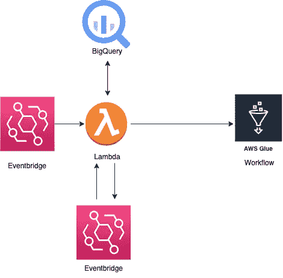
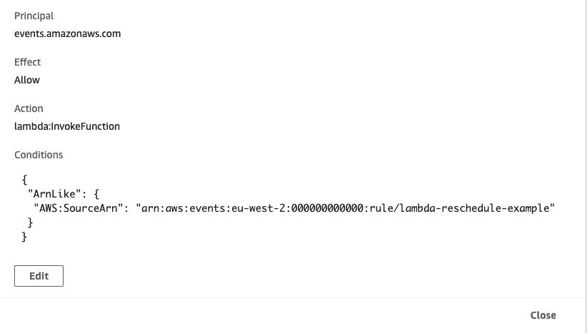
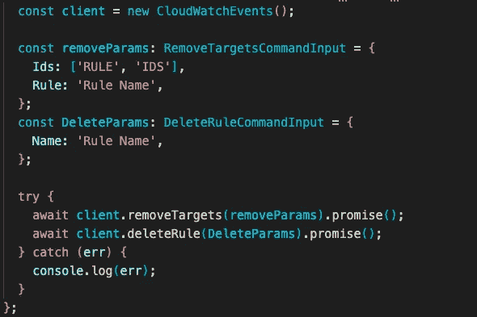
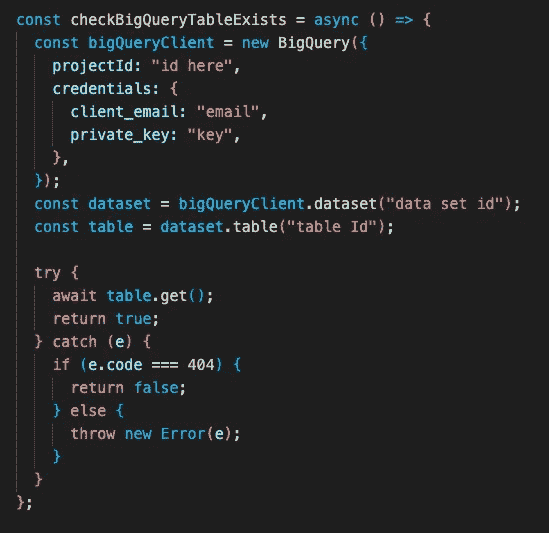
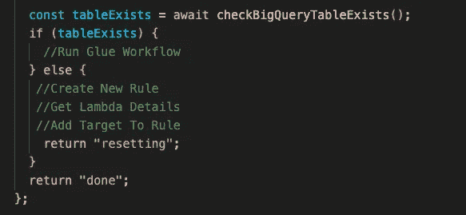
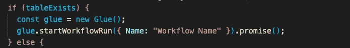
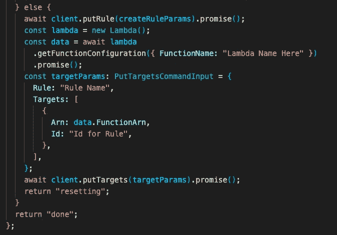
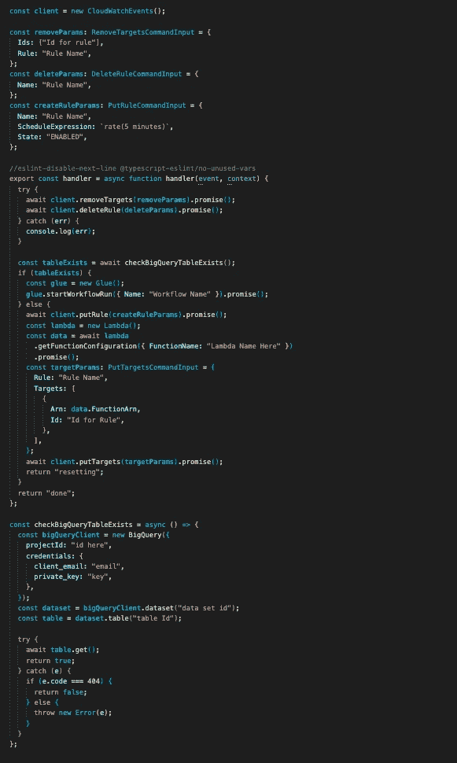

# 当 AWS 之外的目标数据不可用时，重新调度 Lambda

> 原文：<https://levelup.gitconnected.com/rescheduling-a-lambda-when-target-data-outside-of-aws-isnt-currently-available-d14590b7db32>

**问题:**
您希望 lambda 通过 AWS Glue 工作流触发从 AWS 之外的数据源获取数据。数据可以在 X 小时和 Y 小时之间的任何时间获得，但是您需要尽快接收。

在下面的例子中，我将使用 BigQuery 中的一个表作为 AWS 外部的数据源。

*注意:本文假设读者了解如何在 AWS 上创建和配置 lambda，因此不会一步一步地介绍。它将包括所需的权限和 lambda 的代码示例。*

可用示例代码:[https://github.com/MurrayCode/Reschedule-Lambda-Example](https://github.com/MurrayCode/Reschedule-Lambda-Example)

**解决方案:**

为了解决这个问题，可以使用 Cron scheduled EventBridge 规则来触发 lambda，然后 Lambda 可以使用 AWS SDK 沿着各种路径前进。lambda 将会发现预期的数据存在并触发粘合工作流，或者创建一个新的规则，目标是 lambda 在 X 分钟内重新触发。*注意:在这个例子中，X 将是 5 分钟。*

首先创建一个 lambda，使用 Cron Scheduled EventBridge 规则触发器在数据可用的最早时间进行调度。然后，lambda 需要以下权限，以允许它执行所有必要的操作。

**所需的 IAM 权限:**

*“胶水:StartWorkflowRun”*

*"事件:移除目标"*

*“事件:put rule”*

*“事件:删除规则”*

*“lambda:GetFunctionConfiguration”*

**所需的基于资源的政策**

允许 lambda:InvokeFunction 在初始 lambda cron 规则和由 lambda 处理的重新计划规则上运行的策略

**λ代码:**

*注意:以下代码示例展示了该解决方案所需的所有 SDK 调用。*

**阶段 1** — **使用 AWS SDK 从 lambda 中删除重新计划规则。**

最初，在我们的 lambda 中，如果这不是 Lambda 在那天第一次运行，我们希望尝试删除将存在的规则。如果这个规则还不存在，那么我们捕获并记录错误，但是允许 Lambda 继续。

**阶段 2 —检查数据是否存在:**

在本例中，我们将检查 BigQuery 中每天创建的表。首先，我们通过 Google Cloud SDK 创建一个 BigQuery 客户端，接下来检索数据集，并在数据集中获取表。

在 try/catch 中，我们尝试获取该表，如果它存在，我们返回 true，如果我们捕获到错误，我们检查错误代码是否为 404(未找到),这意味着数据当前不可用，然后我们返回 false。否则我们会抛出一个新的错误。

然后我们调用我们的函数并设置 lambda 可以通过的两条路径。

**路径 1 —表格存在:**

如果表格存在，我们创建一个新的 glue 客户机并运行预期的工作流。

**路径 2 —表格不存在:**

在该表不存在的情况下，我们使用 CloudWatchEvents 客户端函数 putRule 创建一个具有所需重新计划时间的新规则，在本例中为 5 分钟，并将状态设置为“ENABLED”。

然后，我们通过 SDK 创建一个新的 lambda 客户端，并使用 getFunctionConfiguration 函数传递我们在 AWS 上创建 lambda 时给它的名称。然后我们从这个带有*数据的结果中提取出λARN。并为下一个 CloudWatchEvents 客户端 SDK 调用 putTargets 提供参数，该调用接受规则名称、目标 lambda ARN 和一个 Id。*

下面是示例 Lambda 代码的完整图像:

[https://github.com/MurrayCode/Reschedule-Lambda-Example](https://github.com/MurrayCode/Reschedule-Lambda-Example)

# 分级编码

感谢您成为我们社区的一员！更多内容见[升级编码出版物](https://levelup.gitconnected.com/)。
跟随:[推特](https://twitter.com/gitconnected)，[领英](https://www.linkedin.com/company/gitconnected)，[通迅](https://newsletter.levelup.dev/)
**升一级正在改造理工大招聘➡️** [**加入我们的人才集体**](https://jobs.levelup.dev/talent/welcome?referral=true)