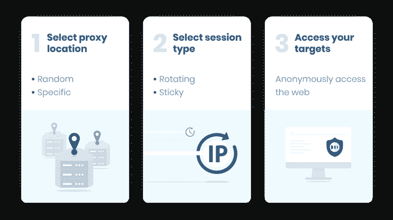

# 为什么住宅代理比迈克尔·乔丹更酷

> 原文：<https://levelup.gitconnected.com/residential-proxies-business-automation-3dd228dba84f>

## [网页抓取](https://rakiabensassi.medium.com/list/software-engineering-7a179a23ebfd)

## 你的指南，了解住宅代理，以及如何使用它们来自动化你的业务，远离麻烦


来自[派克斯](https://www.pexels.com/photo/friends-having-fun-playing-computer-game-7915250/?utm_content=attributionCopyText&utm_medium=referral&utm_source=pexels)的[罗德尼制作](https://www.pexels.com/@rodnae-prod?utm_content=attributionCopyText&utm_medium=referral&utm_source=pexels)的照片

超过 7200 万来自世界各地的 IP 地址抓取任何网络数据，从来没有得到阻止或掩盖。

Bright Data (原名 Luminati)在宣传其全球排名第一的住宅代理时如是说，这些代理被商业领袖、决策者、分析师、学者、软件工程师和 IT 专业人士所使用。

这听起来很棒，但是什么是住宅代理呢？出于什么原因，所有这些人，甚至你，需要使用它们呢？

在本帖中，我们将更深入地探讨这个话题，并回答这些问题以及围绕这个话题的许多其他问题。

```
**Table of Contents**[**What Is a Proxy?**](#1ad4)[**How Does a Proxy Work?**](#17d9)[**Types of Proxies**](#2a78)
   ∘ [Data Center Proxies](#833a)
   ∘ [Distorting proxy](#e4a8)
   ∘ [Sneaker proxies](#226c)
   ∘ [Rotating proxies](#74eb)
   ∘ [Anonymous Proxies](#34c4)
   ∘ [Residential proxies](#33ed)
[**Use Cases of Residential Proxies**](#572a)
   ∘ [Web scraping & Internet marketing](#8f85)
  **∘** [Brand protection & Ads verification](#1c5b)
   ∘ [Market price monitoring](#980c)
   ∘ [Retail & Accessing sneaker sites](#304f)
   ∘ [Social media management](#21d7)
   ∘ [Using social media bots or search engines-related work](#b0e4)
   ∘ [SEO content compliance](#9260)
   ∘ [Access geo-blocked content](#9786)
[**Types of Residential Proxies**](#1086)
  **∘** [Dedicated proxies](#9c40)
   ∘ [Rotating proxies](#922a)
[**How Do I Get a Residential IP Address?**](#867f)
```

# 什么是代理？

代理充当您的请求和 web 服务器之间的中间人，保护您的安全，并增强您的隐私。它通过隐藏您的 IP 地址并为您分配一个替代地址来隐藏您的身份。


什么是代理([来源](https://www.freecodecamp.org/news/what-is-a-proxy-server-in-english-please/))

代理在物理上可以位于任何地方。您可以在计算机上设置代理，或者将代理部署到云中。

# 代理是如何工作的？

当您向 GitHub 发出请求时，例如，通过键入 URL 并按回车键，在您使用代理的情况下，将执行以下场景:

1.  代理不会在您的请求中将您的计算机的 IP 地址直接发送给 GitHub，而是会拦截这些数据。
2.  在将请求发送到 GitHub 服务器之前，它可以从请求中完全删除您的 IP 地址和识别信息。
3.  它还可以在发送消息之前，在原始请求中通过设置像 *Forwarded* 和*这样的头。*
4.  一旦请求被更新和重新格式化，代理就把它发送给服务器。
5.  GitHub 现在认为您的请求来自不同的位置，并将通过该位置发送回您想要的数据。

# 代理的类型

有不同类型的代理，它们都有其特定的用途。以下是其中的一些例子:

## 1.数据中心代理

数据中心代理以其速度著称。它们有计算机生成的 IP 地址，不与真实设备相连，这类似于在云中有一个代理。

## 2.扭曲的代理

他们将自己标识为代理，并在请求中使用故意虚假的 IP 地址，这让您看起来好像在不同的位置，并绕过特定的内容地理限制。

## 3.运动鞋代理

它们没有子网限制(子网是更大网络的一个逻辑分支)、无限线程、快速响应时间和唯一的 IP 地址。他们与所有主要的运动鞋机器人合作，如耐克机器人、Supreme 机器人、EasyCop 机器人和 AIO 机器人。

## 4.旋转代理

旋转代理提供了高级别的安全性和隐私性，因为每次您连接到它时，您都会获得一个新的 IP 地址，您的请求将与它一起发送。这就是像 TOR 浏览器这样的代理在用户连接到 [deep web](https://en.wikipedia.org/wiki/Deep_web) 时保持用户匿名的工作方式。


什么是深度网络？([来源](https://www.geekboots.com/story/deep-web---the-hidden-part-of-the-internet)

## 5.匿名代理

如果您不希望您的位置附加到您的请求中，这些是很好的代理，因为它们不会将您的 IP 地址传递到您正在浏览的网站。他们帮助你摆脱互联网上针对你的广告。

## 6.住宅代理

住宅代理为您分配一个与物理设备(移动或桌面)相关联的 IP 地址。它们允许你选择任何你想去的地方(国家、城市或移动运营商),并作为该地区的真正居民在网上冲浪。

为了提供一个住宅 IP 池，代理提供商使用一些方法，如 [**代理网络**](https://brightdata.grsm.io/proxytypes) ，其中包括邀请许多用户加入网络，并请求他们允许使用他们未使用的带宽和 IP 地址，以换取报酬。


代理网络([来源](https://www.quora.com/How-do-residential-proxies-work))

# 住宅代理的使用案例

既然您已经知道了什么是住宅代理，那么了解它们如何让您避开许多问题并帮助您实现业务自动化是很有好处的。

以下是一些最常见的应用:

## 1.网络抓取和网络营销

为了获得竞争优势，你的营销策略需要超越广告和社交媒体帖子。你需要[搜集并分析竞争对手的信息](https://betterprogramming.pub/how-to-analyze-and-visualize-users-feedback-by-leveraging-reviews-scraping-container-go-case-db53333716c8)。要做到这一点，你可以使用住宅代理，不断轮换 IP，这使你能够大规模刮甚至巨型网站*。*

## 2.品牌保护和广告验证

你的竞争对手可能会利用恶意广告等不正当手段来损害你的品牌声誉。通过对网页上显示的广告进行充分验证，您可以识别并阻止可疑广告。

## 3.市场价格监测

对你的产品或服务定价过高会吓跑潜在顾客。另一方面，定价过低会让客户怀疑你的质量。为了做出关于企业销售的最佳决策，您可以依靠销售智能工具，这些工具通过使用住宅代理来收集、监控和比较及时的市场价格。

## 4.零售和访问运动鞋网站

运动鞋 copping 是一个非常有利可图的整个市场。但鞋子网站受到高度监控，以保护他们的身份，并防止极快地购买限量版运动鞋。他们可能只允许每个帐户购买一对，并阻止拥有多个属于同一 IP 地址的帐户的用户。

为了克服这些限制，人们使用带有运动鞋代理的运动鞋机器人来访问这些网站，但是一个更好、更可信的解决方案是使用住宅代理来解除封锁并[清除](https://javascript.plainenglish.io/web-scraping-with-nodejs-and-javascript-10e6b4268be1)易贝、Shopify、Craigslist 和其他零售网站。

## 5.社交媒体管理

脸书、Instagram、Twitter 和 Pinterest 等社交网络对于在同一台机器上运行多个社交账户非常谨慎。幸运的是，具有高级轮换功能的住宅代理使这个问题更容易解决。它们允许您无缝管理多个帐户，并无限制地增加您的关注或网络营销。

## 6.使用社交媒体机器人或搜索引擎相关的工作

如果你试图使用社交媒体的机器人或搜索引擎的脚本，这可能会导致阻止你的 IP 地址，并大大减少你的浏览选项，因为搜索引擎允许你每分钟从同一 IP 地址发出有限数量的请求。超过指定的比率将会被标记为可疑活动。

住宅代理为你省去麻烦。

## 7.SEO 内容合规性

[相关内容](https://bettermarketing.pub/digital-marketing-buzzwords-2eefd685c54a)索引正确且符合 SEO 的内容在搜索引擎中会获得更好的排名。为了提高您的索引和搜索引擎优化，并获得更好的流量，您需要为您的网站创建准确的链接，并通过利用与住宅代理一起工作的爬行和审计工具来监控它们。

## 8.访问地理封锁的内容

许多服务提供商对内容进行地理锁定，只允许某些国家的用户访问。住宅代理允许你流地理限制的网站没有被封锁或标记。一些提供商可能已经阻止了 IP，这就是为什么你需要在付款前检查和验证包裹。

# 住宅代理的类型

有两种类型的住宅代理:专用和轮换。

## 专用代理

专用代理意味着你将得到一个你自己拥有/使用的 IP 地址，其他任何人都不会。如果你想创建一两个社交媒体账户或做付费调查，这种代理是有益的。



住宅代理([图片来源](https://smartproxy.com/blog/what-is-a-residential-proxies-network)

## 旋转代理

不是将你的 IP 隐藏在另一个 IP 后面，旋转住宅代理(也称为反向连接代理)将你隐藏在一群代理后面，这些代理定期或每次会话时在它们之间切换，以便不断改变你的 IP。

这些代理是快速和灵活的，他们给你匿名，使你很难跟踪你的 IP 地址。但你需要确保你的提供商有一个大的 IP 池，以避免获得相同的 IP 或潜在的 IP 块。

此类代理更适合于:

*   [网页抓取](https://javascript.plainenglish.io/web-scraping-with-nodejs-and-javascript-10e6b4268be1)
*   价格监测
*   社交媒体自动化
*   社交媒体机器人
*   从票务中心网站购买门票
*   从不同的运动鞋网站购买运动鞋

# 我如何获得一个住宅 IP 地址？

在决定使用住宅代理之前，您需要验证您的使用目的，并确保它们符合您的要求。一般来说，如果你正在寻找高匿名性和安全性或计划进行大规模的刮，那么他们是最适合你的。

你还必须检查你的预算，比较供应商的价格和服务质量。其中一些提供代理类型的组合，如高度匿名、住宅、SSL 代理组合在一起。

这里列出了市场上一些最可靠的提供商:

*   [光明数据](https://brightdata.grsm.io/proxytypes)(原名 Luminati):是全球最大的住宅代理网络，提供 7 天免费试用。
*   普罗希亚夸
*   智能代理
*   氧化实验室

# 想要更多吗？

我为一群聪明、好奇的🧠人写关于工程、技术和领导力的文章💡。 [**加入我的免费邮箱简讯**](https://rakiabensassi.substack.com/) **独家访问**或在此报名媒介。

[](/top-data-collection-tools-a18fe72c16f7) [## 2022 年你不应错过的 4 种数据收集工具

### 信息是生存和发展的关键。这里有一些市场上最好的工具来获得它。

levelup.gitconnected.com](/top-data-collection-tools-a18fe72c16f7) [](https://betterprogramming.pub/how-to-analyze-and-visualize-users-feedback-by-leveraging-reviews-scraping-container-go-case-db53333716c8) [## 如何通过利用评论抓取来分析和可视化用户的反馈

### 搭建一个启发式评估角度 app

better 编程. pub](https://betterprogramming.pub/how-to-analyze-and-visualize-users-feedback-by-leveraging-reviews-scraping-container-go-case-db53333716c8)