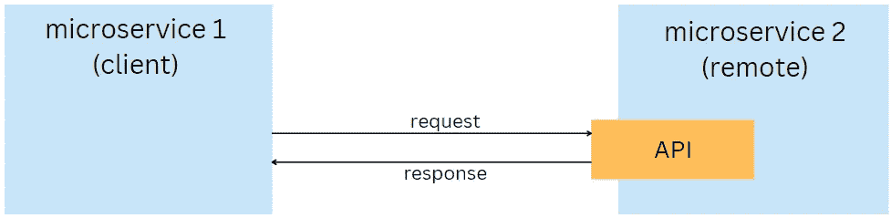
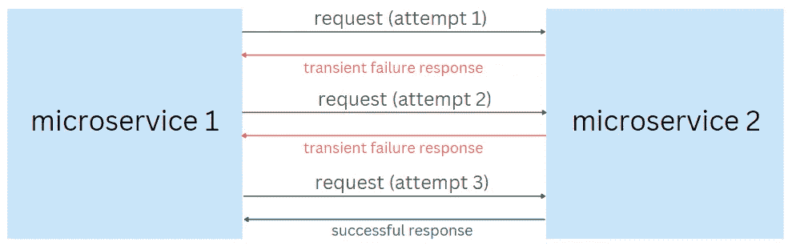
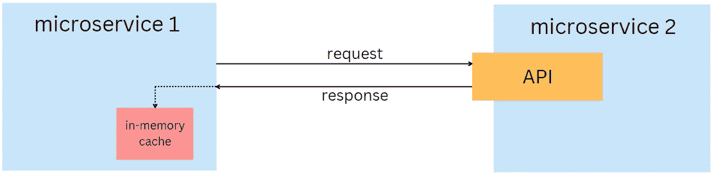

# 同步微服务通信的弹性模式

> 原文：<https://levelup.gitconnected.com/resilience-patterns-for-synchronous-microservices-communication-1cc9a0bbfc3d>

## 确保可靠和可预测的应用程序行为。

在 [Unsplash](https://unsplash.com?utm_source=medium&utm_medium=referral) 上由[米米·蒂安](https://unsplash.com/@mimithian?utm_source=medium&utm_medium=referral)拍摄的照片

(微)服务可以通过同步 HTTP 调用(或 gRPC 调用)相互通信:

服务之间的通信是系统中一个额外的活动部分。在这一点上，许多事情可能会出错，例如，请求可能会失败或需要很长时间才能完成，从而导致性能下降。因此，一旦做出了在服务之间使用同步集成的设计决策，下一步就是考虑**弹性模式**，这将尽可能多地防止故障，或者在故障发生时帮助从故障中恢复服务。

# 超时

客户端微服务等待响应的时间越长，收到成功响应的可能性就越小。经过一段时间后，继续等待来自远程的响应通常没有意义，因此使用超时来停止等待响应。

在实现超时模式时，至少要考虑以下因素:

*   **超时间隔。**在某些情况下，当预期响应时间很短时，超时可以是 5 秒，在其他情况下，超时可以是 30 秒或更长。超时间隔应根据具体情况选择。
*   **超时类型。**设置超时间隔时，了解设置将应用于哪种类型的超时非常重要。例如，存在连接超时和请求超时。开发人员可能认为他在为请求设置超时，但实际上它将应用于连接，反之亦然。
*   **可配置性。**考虑将超时值放在配置文件中，而不是硬编码。

# 重试模式

当对远程微服务的同步调用由于某种瞬时故障而返回不成功的响应时(*可能存在暂时的网络连接问题，或者远程微服务可能由于服务请求的高峰而暂时不可用)*，客户端应该重试请求。

在第二次或更多次尝试后，短暂的失败很可能会消失，最终调用会成功。

实施重试模式时，至少要考虑以下因素:

*   **仅选择暂时性错误类型进行重试。**重试逻辑应该只在出现暂时失败后重试请求，这在 HTTP 调用的情况下由这些状态代码表示:429(请求太多)、503(服务不可用)或其他。然而，诸如 400(错误请求)、403(禁止)、500(内部服务器错误)之类的响应是不可恢复的，因此重试逻辑不应该重试它们。
*   **最大尝试次数。**客户端可以无限次重试失败的呼叫，但这会导致无休止的操作。最大重试次数通常从 3 到 5 不等。
*   **尝试之间的间隔。**时间间隔不能太短，以免给远程服务恢复的机会，但也不能太长，以免对系统性能产生重大影响。
*   **线性补偿与指数补偿。**使用线性补偿时，重试之间的等待间隔是固定的，而使用指数补偿时，每次重试后等待间隔都会增加。

# 断路器

有时，重试模式并不是从故障中恢复的理想机制。这主要是因为两件事:

*   重试逻辑不断地向失败的服务发送请求，即使此时接收到成功响应的机会很低。这对调用者微服务的资源使用有负面影响。
*   不断用请求轰炸失败的远程服务可能会阻止它从故障中恢复。失败的服务可能不需要呼入或者只需要少量呼叫就能够从失败中恢复。

断路器可以解决这些和其他问题。该模式充当客户端和远程服务之间的智能代理，可以跟踪失败请求的数量。一旦失败的请求超过某个阈值，断路器将立即向客户端服务返回错误，而不会尝试联系失败的远程服务。

在某个时间段之后(或者在断路器可以周期性地向失败的服务发送成功的 ping 请求之后)，断路器代理将开始仅向远程服务转发一小部分请求。如果这些请求成功，断路器将恢复正常，并将所有请求重定向到恢复的远程服务。

# 回退操作

出现了这样的情况:客户端微服务在调用远程微服务后收到一个错误。在这种情况下，客户端应根据系统要求和障碍执行以下一项或多项操作:

*   将错误记录到日志系统中。
*   立即向客户端抛出一个异常，让他稍后再试。
*   再次重复请求(在暂时失败的情况下)。
*   适用时实现空对象模式。

缺少正确定义的回退操作会导致难以调查的错误。

# 贮藏

虽然服务电话是必要的，但最好尽量少打。每个服务调用都会产生潜在的故障点，并影响系统性能。减少调用次数从而减少失败请求数量的一种方法是在一定时间内缓存来自远程微服务的响应。

实施缓存以减少网络调用次数时需要考虑的事项:

*   在**到期**之前，数据应该在缓存中保留多长时间？到期时间将取决于多种因素，例如远程微服务中的数据更新频率和/或客户端微服务可以使用本地缓存中的陈旧数据多长时间。
*   数据应该缓存在服务的**本地缓存中，还是像 Redis 这样的远程缓存服务器中？诸如需要存储大量数据、扩展微服务实例等情况通常会导致需要使用远程缓存服务器。你可以在我的另一篇关于缓存的文章中读到更多。**

# 最后的想法

实现我们已经讨论过的一组持久性模式是使微服务交互更加可靠和可预测的良好开端。在设计阶段选择模式比当系统中开始出现问题时才选择和实现模式要好得多。

应用这些模式和一些超出本文范围的其他模式(隔板模式、健康检查、速率限制)可以使您的系统作为一个平衡的单元工作。

感谢阅读。如果你喜欢你所读到的，看看下面这个故事:

 [## 微服务之间建立通信的 4 种方式

### 每种方法的主要优缺点

levelup.gitconnected.com](/4-ways-to-establish-communication-between-microservices-984207f29497) 

可以考虑订阅我的电报频道 [**软件开发日报**](https://t.me/sd_daily) 从我这里获取更多内容。

还有，考虑成为[中等会员](https://esashamathews.medium.com/membership)。