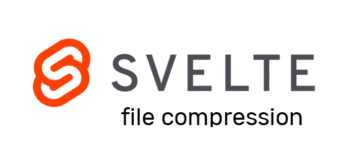

# 使用 svelte.js 在客户端调整图片大小

> 原文：<https://levelup.gitconnected.com/resize-your-images-client-side-with-svelte-js-1d33044b945a>



你已经开始了你的下一个大项目，它有一个允许用户上传图片的功能，你的团队同意将其命名为 Ultragram(你可以稍后判断我缺乏创造力)。

Ultragram 很棒，你有了用户，每个人都很开心。

然后，突然之间，你收到了用户愤怒的性能评论，你很快意识到你的用户的互联网速度没有你的快，你的办公室设置很花哨，应用程序的性能很慢，加载时间似乎没有尽头，经过调查，找到了罪魁祸首，你的用户上传了非常大的图像，来自他们全新的最先进的高清 iPhones。

如果您可以节省存储空间、带宽并提高应用程序的整体性能，会怎么样？原来可以！通过在客户端压缩图像文件。请记住，较小的文件大小也意味着您的云提供商支付的费用较少。

上传的文件会被你的客户端 app 咀嚼，压缩后的版本会被发送到服务器。

我们开始吧！

# 创建一个苗条的应用程序

首先，让我们创建一个苗条的应用程序。

```
npx degit sveltejs/template ultragram
cd ultragram && yarn#Or if you are using npmnpx degit sveltejs/template ultragram
cd ultragram && npm install
```

# 属国

我们将使用一个惊人的 npm 包，它使用画布来调整客户端图像的大小，它被命名为…抓住你的帽子…，react-image-file-resizer！。是的，我知道这也很奇怪，但这很有效！我们要用它搭配 svelte。

使用以下命令安装它:

```
yarn add react-image-file-resizer axios#Or if you are using npmnpm add react-image-file-resizer axios
```

我们需要 axios 来处理 POST 请求。

如果您使用苗条的 REPL 跟随，您可能会经历一些奇怪的行为，一旦您导入包，我会推荐使用您的本地环境与 VSCode，Atom，或任何编辑器为您工作。

# 启动项目

下面的片段解释了一切，粘贴到你的应用程序中

很简单，是吧？

# 调整图像大小

resize 操作可能需要几秒钟才能完成，我们将创建一个异步函数来包装库，以便返回一个承诺，请参见下面的要点:

你就完了。你现在推出了一个新的超高性能版本的 Ultragram，你的用户会永远感激你。

我希望你喜欢这篇文章，如果你有问题，请告诉我！