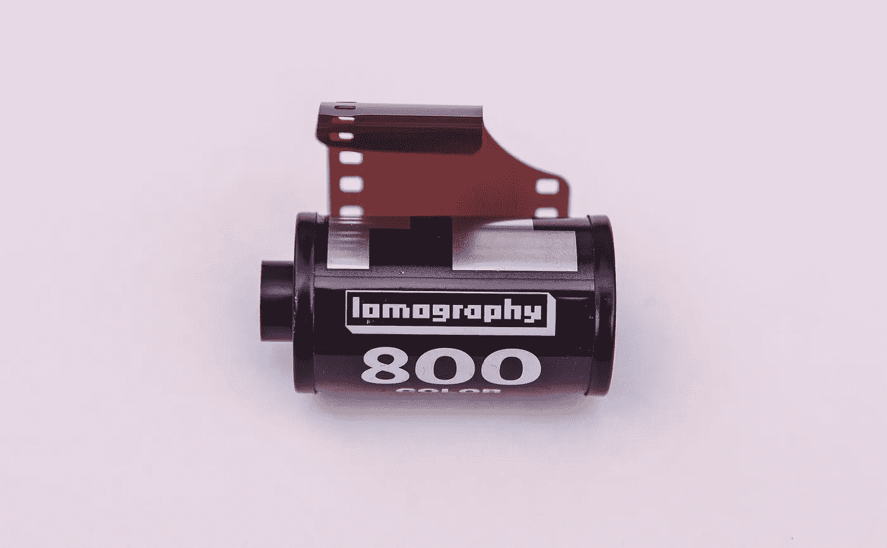
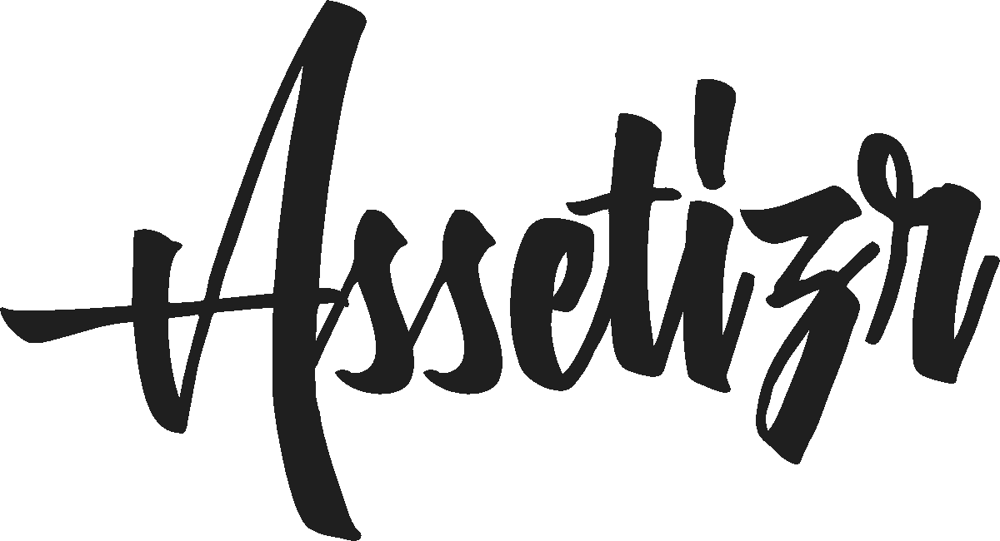
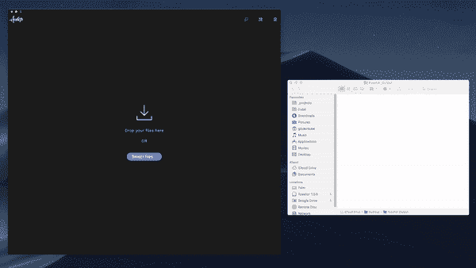

# 2019 年为网络和移动设备调整和优化图像

> 原文：<https://levelup.gitconnected.com/resizing-and-optimizing-images-for-web-mobile-in-2019-acc38d3f7cc0>

马库斯·斯皮斯克在 [Unsplash](https://unsplash.com/search/photos/image?utm_source=unsplash&utm_medium=referral&utm_content=creditCopyText) 上的照片

我的整个职业生涯都在互联网上工作——除了我的青少年时期，但我想那不算数。在 web(开发)领域工作是一件很棒的事情，这个行业正在不断发展，新的可能性无处不在，从人工智能到区块链再到物联网。然而，我开始设计和编码简单的网站。这第一次让我迷上了 web 开发，从那以后我一直很忙。

建立一个网站或应用程序需要花费大量的时间和精力，增加了复杂性。这是为什么呢？首先，我们有可能做出更好更复杂的东西。但是用户也渴望更多的信息，更重要的是媒体。我们看到社交网络非常受欢迎，并开始形成自己的行业和自己的商业模式。有一点似乎与不断发展的互联网一致:媒体。不管是什么形式，图片，gif，视频或故事。人们喜欢它，媒体对于建立良好的在线形象是必要的。

建立了无数的网站和应用程序，我总是遇到一个问题，你如何把你的媒体(对我来说主要是图片)放在正确的大小？当你从 [Unsplash](https://unsplash.com/) 下载一张图片时(谢谢你给我提供了很棒的照片)，你会得到一个很大的文件，从 1mb 到 10 MB 不等。仅仅把它放在网站或应用程序上会大大增加页面加载时间，甚至可能降低性能。你肯定不希望这样，因为谷歌很清楚这一点。所以你必须在把图片(或任何媒体)放到互联网上之前对其进行优化。

想要的结果是什么？

1.  你希望图像清晰，看起来不像是像素化的。
2.  您希望资产的大小尽可能小，以减少页面加载时间。

那么你是如何做到的呢？

1.  你在网上搜索一个图像缩放器/优化器，并继续使用一个充斥着广告的基于网络的工具。
2.  你可以在 Photoshop、Affinity Photo 或类似软件中手动打开文件，并以正确的大小导出。
3.  如果您有一个更大的项目，您可以使用 webpack 实现一个图像压缩工作流。

我们 dube.io 认为这些选择都不能解决上述问题。我们想要一个易于安装、使用和维护的多功能解决方案。使用在线工具是一件痛苦的事情，而且会占用你太多宝贵的时间。手动调整图像大小可能会给你最好的结果，你可以完全控制一切，但仍然需要这么多时间。使用自动化的工作流程是非常好的，但是需要一些时间来正确地设置它，这意味着它只适用于中型到大型的项目。此外，非技术人员，如设计师、社交媒体经理、在线营销人员或 wordpress 开发人员，将无法使用这些工作流程。

[asset zir](https://assetizr.com)

# 一个统治所有人的工具

我们建立了一个更好的工具，让**每个人**都有可能以正确的大小、质量和格式拥有他们的资产(目前只有图像)。Assetizr 是一个桌面应用程序，这意味着你不必上传你的资产，这使得调整大小，转换和优化图像变得非常容易。简单地拖放你的图片，它们就会被转换(或被资产化？我们还不确定措辞)。您将会看到，我们已经实现了智能预设，以及每个拖放文件有多个输出文件的选项。此外，您可以更改图像文件类型，目前我们支持以下内容:

*   使用 jpeg 文件交换格式存储的编码图像文件扩展名
*   PNG
*   挽救（saving 的简写）
*   GIF(甚至是动画)
*   WEBP
*   位图文件的扩展名(Bitmap)
*   争执

Assetizr 工作流

Assetizr 让你毫不费力地更改名字，并且可以一次处理许多不同的文件。输出文件仍然几乎保持原始质量(除了分辨率)，但是**最多保存原始文件大小的 90%** ，平均花费**不到 500 毫秒**。简而言之，你不必再过多考虑你的资产，只需通过 Assetizr 运行它们，它们就可以运行了。当然，Assetizr 中的一切都是可定制的，你可以选择不同的输出格式，更改名称或默认输出大小，以及优化设置。

# 前方是什么

我们已经爱上了 Assetizr，并在我们的软件开发机构[的日常生活中使用它。然而，有很多想法可以改进它，我们希望听到您的反馈。下面是一个简短的列表:](https://dube.io)

*   视频支持(也是视频到 GIF)
*   社交媒体和广告预设
*   图像裁剪
*   更多图像格式
*   转换和优化(甚至存储)资产的 API

让我们知道你接下来想看什么，以及你喜欢这个应用程序:[hello@assetizr.com](mailto:hello@assetizr.com)。

Assetizr 目前在有限的时间内对 T2 免费，并可用于 Windows 和 macOS。如果你想要一个 Linux 版本，也请告诉我们。

> 【macOS 下载
> 
> 【Windows 版下载

*关于作者:Lukas Gisder-Dubé作为 CTO 共同创立并领导了一家初创公司 1 年半，建立了技术团队和架构。离开创业公司后，他在*[*iron hack*](https://medium.com/u/1ff093a3da32?source=post_page-----acc38d3f7cc0--------------------------------)*担任首席讲师教授编码，现在正在柏林建立一家创业机构&咨询公司。查看*[*Dube . io*](https://dube.io)*了解更多。*

