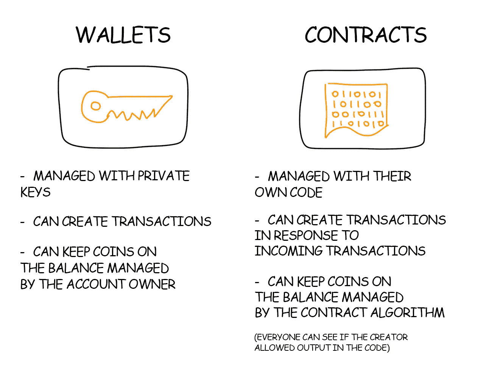

# 学习区块链和智能合约的资源

> 原文：<https://levelup.gitconnected.com/resources-for-learning-blockchain-and-smart-contract-eedbc06fec91>

德米特里·德米德科在 [Unsplash](https://unsplash.com?utm_source=medium&utm_medium=referral) 上拍摄的照片

最近，我有机会做一个智能合同项目。我觉得这是学习这个花哨概念的最好机会。

我在做的时候，收集了一些最好的资源，想和大家分享一下。

# 1.区块演示

这是一个基于网络的区块链概念演示。

链接:[https://andersbrownworth.com/blockchain/](https://andersbrownworth.com/blockchain/)

**包含内容:**

*   街区
*   分布式区块链
*   代币
*   公钥/私钥和签名

**视频:**

我相信这个视频是我迄今为止见过的最生动的区块链介绍。

# 2.区块链从里到外:比特币如何工作

**链接**:[https://vas3k.com/blog/blockchain/](https://vas3k.com/blog/blockchain/)

*   区块链是一个区块链
*   加密钱包地址是一个公钥。
*   去中心化:每个节点都保留一份区块链列表
*   公钥有助于验证加密数据是由拥有公钥的私钥的所有者创建的。

# 3.以太坊和智能合约如何工作

链接:[https://vas3k.com/blog/ethereum/](https://vas3k.com/blog/ethereum/)

以太坊是第二个最受欢迎的区块链项目，从技术角度来看似乎是最有趣的。

**链接**:[https://vas3k.com/blog/ethereum/](https://vas3k.com/blog/ethereum/)

*   账户分两种:**普通钱包**和**智能合约**。
*   智能合同只是运行在以太坊区块链上的简单代码。
*   对用户钱包的交易转移资金，而对合同的交易是对其方法的调用。
*   执行每一个契约操作都不是免费的；你需要支付汽油费。
*   要触发契约的执行，你需要发送一些以太并调用契约的函数。
*   在以太坊中，每 15 秒创建一个新方块。

 [## 以太坊和智能合约如何工作

### 以太坊和智能合约如何工作带 Blockсhain 保护的分布式图灵机这是…

vas3k.com](https://vas3k.com/blog/ethereum/) 

我希望你喜欢读这篇文章。如果你愿意支持我成为一名作家，考虑注册[成为一名媒体成员](https://jerryan.medium.com/membership)。你还可以无限制地访问媒体上的每个故事。