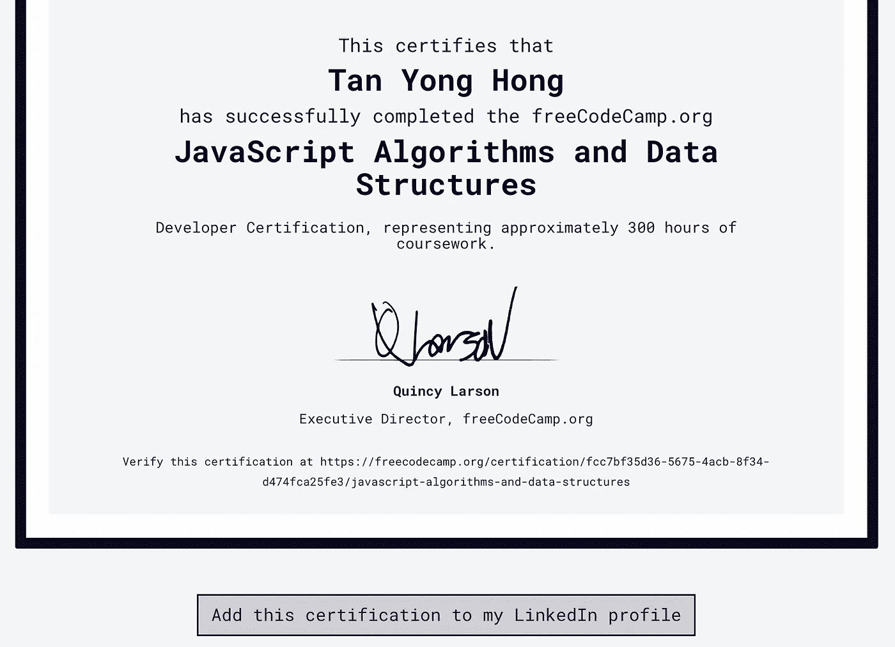

# 帮助我在没有计算机科学学位的情况下找到一份开发工作的资源

> 原文：<https://levelup.gitconnected.com/resources-that-helped-me-land-a-developer-job-without-a-cs-degree-d5c8a011fa90>

一边全职工作。

约书亚·雷德科普在 [Unsplash](https://unsplash.com?utm_source=medium&utm_medium=referral) 上的照片

首先，简单介绍一下我自己。我毕业于电气工程硕士学位，曾在日本乃至世界上最大的电信公司之一担任网络工程师。在我的公司度过了不愉快的一年后，我知道有些事情必须改变，我决定改变职业，从事软件开发。

经过 6 个月的努力工作和奋斗，我终于在一家跨国 IT 服务公司找到了一份初级软件工程师的工作(离 FAANG 很远，但对我来说绝对是一个很好的开始)。显然，我没有资格给出任何专业的职业建议，所以我将在这里分享我的旅程，并希望它能激励和帮助任何有同样热情的人。

# 第 1-3 个月:学习和进步

## ***资源#1 (Udemy 课程)*** :

 [## 完整的 2021 年网络开发训练营

### 欢迎来到完整的 Web 开发训练营，这是您学习编码并成为全栈 web…

www.udemy.com](https://www.udemy.com/course/the-complete-web-development-bootcamp/) 

我之前的公司为员工开设了一个 Udemy 商业账户，我参加的第一门课程是 Anglela Yu 博士的 2021 年网络开发训练营。我从她身上学到了很多，所以我用我的个人账户购买了这个课程，以防将来我需要再看一遍。清晰的解释、最新的教学大纲、充足的资源和个人成长提示:这一切都比我预期的要多。

## 资源#2 (YouTube 视频):

在我不断学习和进步的同时，我看到了 Traversy Media 制作的这个全面的视频，它“简直太棒了”。它不仅提供了开发世界的全景鸟瞰图，还包括从基本 HTML & CSS 到人工智能/机器学习技术等主题的课程/视频的实用建议。我只是希望我能早点发现这个视频。

## 资源#3 ( ***互动学习平台*** ):

 [## freeCodeCamp.org

### 免费学习编码

www.freecodecamp.org](https://www.freecodecamp.org/) 

没有一篇这样的文章可以忽略 freeCodeCamp (FCC)，它可能是最好的免费学习平台。通过 Angela 博士的讲座学习基础知识后，我发现 FCC 是一个很好的地方，让我可以轻松地修改、编写代码，甚至通过数百小时的交互式学习获得认证。让 FCC 更好的是，如果你有信心，你实际上不必通过整个课程来获得认证，你只需完成项目就可以了。如果你迷路了，不知道从哪里开始，推荐你今天就去看看。注册，并立即开始免费代码露营。

您甚至可以将认证添加到您的 LinkedIn 个人资料中！

# 第 3-5 个月:项目和投资组合

虽然从视频中学习并遵循课程会感觉很舒服，但你最终需要将你学到的东西很好地利用起来，并实际开始构建一些东西。

> 提示:当我在那里学习大量不同的东西时，我开始思考一些项目想法，并额外关注可能有助于在这些项目中实现一些特性/功能的课程/教程。

从一个简单的待办事项应用程序到让人工智能学会玩 Flappy Bird，有大量的项目想法。尝试任何你觉得有趣的事情。我从课程大纲中我做过的一些项目开始，一点一点地改进它们。如果你迷路了，不知道从哪里开始，我建议你也这样做。

一个展示你技能的好项目很重要，但在我看来，同样重要的是能够解释*为什么*你选择了那个项目。你不能只告诉面试官“这是我在 YouTube 视频上找到的”或“这是我学过的课程中的内容”。一定不止这些。*软件开发毕竟是关于解决现实世界的问题，并为客户或用户提供价值。*

例如，当我开始寻找开发人员的工作时，我的投资组合中有两个项目。一个简单的日语词典和问答应用程序。我这样做是因为我正在学习日语(现在仍然如此),觉得有必要保留一份搜索单词的列表，以后我可以用这些单词来测试自己。第二，[一个股票筛选程序](https://medium.com/analytics-vidhya/build-your-own-technical-analysis-stock-screener-using-python-5d1bb3d091f0)，帮助识别符合某些交易策略要求的潜在股票。我前段时间开始炒股，觉得这是我觉得有激情的两件事的完美结合。

这两个项目都让我在面试时有了可靠的话题，这表明我有能力识别并利用编程的力量来解决相关的生活问题，不管这些问题有多简单。

## 资源#4(中型文章):

 [## 自学开发人员的 10 个最佳项目教程

### 最好的学习方法是通过最好的教程和资源。

medium.com](https://medium.com/swlh/10-best-tutorial-projects-for-self-taught-developers-3e13e7907c9a) 

也就是说，如果你需要一些额外的项目想法，你可以看看这篇文章，它用不同的语言和框架介绍了 10 个非常棒的基于视频的项目教程。此外，我喜欢阅读作者 Ann Adaya 针对自学成才的开发人员撰写的其他文章。

## 资源#5 (YouTube 视频):

是的，你没看错。10 个项目在 10 小时的直播流。除了创作者令人瞠目结舌的忍耐力，我发现这些项目写得非常好，非常有趣，所有代码都可以在他的 [GitHub 库](https://github.com/florinpop17/10-projects-10-hours)中找到。

# 第 5-6 个月:求职和面试

## 资源#6(简历生成器):

 [## 反应式简历

### 反应式简历是一个免费的开源简历生成器，旨在使创建、更新…

rxresu.me](https://rxresu.me/) 

此时，我开始通过 LinkedIn 寻找和申请工作，事实上，还有一些当地的日本招聘网站。当然，在此之前，我必须先润色我的简历。一份好简历的重要性不言而喻，如果你像我一样，总是努力寻找“完美”的设计，去一些[简历制作网站](https://resume.io/)看看，从中获得一些灵感。我还推荐使用一些开源简历生成器，比如[反应式简历](https://github.com/AmruthPillai/Reactive-Resume)，因为你也可以了解这个程序是如何构建的。

## 资源#7 (YouTube 视频):

你不能在没有准备好数据结构和算法的情况下参加开发人员面试，这是我最近在 FCC YouTube 频道上发现的另一个亮点。略长，但仍然是一个非常全面和详细的指南，介绍了编程中最基本和最重要的两个主题。

## 资源 8:(编码练习)

 [## 问题- LeetCode

### 提高你的编码技能，迅速找到工作。这是扩展你的知识和做好准备的最好地方…

leetcode.com](https://leetcode.com/problemset/all/) 

在申请任何开发人员职位的过程中，编码测试或技术面试几乎是必不可少的，而且它们可能是出了名的困难。有很多关于 LeetCode 是否是一个有效工具的讨论，但是对于像我这样的初学者来说，我发现能够用我觉得最舒服的语言编码是非常有帮助的，我永远感谢 LeetCode 社区。浏览讨论部分总是让我大开眼界，为什么总是有不止一个解决方案来解决一个编程问题。这里有一个关于如何更有效地使用 LeetCode 的指南。

## 资源 9:(编码练习)

 [## freeCodeCamp.org |编码面试准备

### 如果你正在寻找免费的编码练习来为你的下一次工作面试做准备，我们已经为你准备好了。本节…

www.freecodecamp.org](https://www.freecodecamp.org/learn/coding-interview-prep/) 

联邦通信委员会又一次让我们得到了保护。[编码面试准备](https://www.freecodecamp.org/learn/coding-interview-prep/)是一门测试你的算法、数据结构甚至数学知识的伟大课程。著名的计算机科学和编程挑战，如[罗塞塔代码](https://rosettacode.org/wiki/Rosetta_Code)和[项目欧拉](https://projecteuler.net/)也可用。唯一的缺点是 FCC 目前只允许你用 JavaScript 写，它的社区没有 LeetCode 的活跃。

## 资源#10:(编码练习)

 [## 仪表板|黑客排名

### 加入 700 多万开发人员在 HackerRank 上解决代码挑战的行列，这是为…

www.hackerrank.com](https://www.hackerrank.com/dashboard) 

对于 SQL、Regex 等其他主题的准备，我使用了 HackerRank。有些问题有点老和平凡，但总的来说，我很满意。在这里，你也可以通过参加定时测试来获得技能认证，这类似于你在真实面试中获得的真实编码测试。其他平台如 [Coderbyte](https://coderbyte.com/) 和[hackere earth](https://www.hackerearth.com/)也很受欢迎，但我没有亲自试用过。

# 结论

以上是我个人一直在使用的一些资源，我相信其中一些在未来仍会派上用场。

我必须提到，即使我在 6 个月的时间里完成了大部分的课程和辅导，我也不是说你应该在同样的时间内完成。这里没有时间限制，每个人都有他/她自己的优先事项，慢慢来，找到最适合你的方式。此外，我当然没有看完视频的每一分钟，也没有通读文章的每一个字，你也不应该这样做。让我知道哪个最有帮助，你也可以和我分享你最喜欢的资源。祝你好运！

*免责声明:我不支持或隶属于本文中我所分享的资源的任何组织或作者。*

# 分级编码

感谢您成为我们社区的一员！[订阅我们的 YouTube 频道](https://www.youtube.com/channel/UC3v9kBR_ab4UHXXdknz8Fbg?sub_confirmation=1)或者加入 [**Skilled.dev 编码面试课程**](https://skilled.dev/) 。

 [## 编写面试问题+获得开发工作

### 掌握编码面试的过程

技术开发](https://skilled.dev)