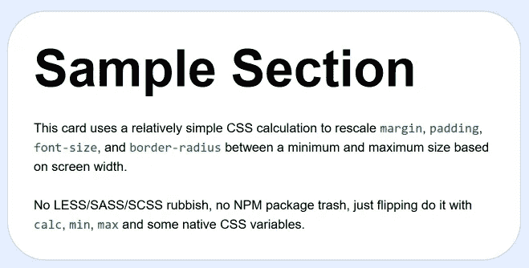
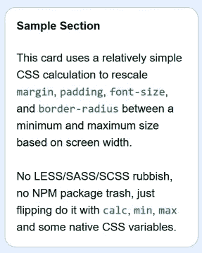

# 使用普通 CSS 的“响应式”字体大小

> 原文：<https://levelup.gitconnected.com/responsive-font-size-using-vanilla-css-51f81fe999db>

有时候，希望字体大小在屏幕宽度的两个极端之间。奇怪的是，我看到人们为了实现这一点而跳过去，比如使用“RFS ”,正如艾哈迈德·萨克(Ahmed Sakr)在《媒体》( Medium)上的文章(T2)中概述的那样。虽然他的文章写得很好，概述了它是如何工作的，但 [RFS 本身是一个臃肿的残骸](https://github.com/twbs/rfs)，说明在 CSS3 计算和比较的时代如何不这样做。

虽然可悲的是，这些问题在那些使用无意义垃圾(如 CSS 预处理程序)的人中很常见，其中*很像框架*——令人痛苦的是，创建这种系统的人*和使用它们的人*显然没有资格编写一行该死的 HTML，更不用说将 CSS 应用于它，然后厚颜无耻地告诉别人如何这样做了。

# 数学

可笑的是，这实际上很容易实现。假设您希望最小字体大小为 1em，最大字体大小为 4em，最大字体大小的缩放比例基于 75rem。75rem 对于 16px/普通用户是 1200px，对于像我这样的 20px/大字体用户是 1500px，对于很多 4k 设备是 2400px。

```
font-size:max(1em, min(4em, calc(100vw * 4 / 75)));
```

你也可以“自己算算”

```
font-size:max(1em, min(4em, 5.333vw));
```

数学中的 4 只需要在最小计算中匹配你的 4em。

你不再需要一些巨大的 derpy 框架或垃圾预处理器，或任何垃圾了。这是一个简单的数学问题，CSS 完全有能力自己解决。

然后可以利用 CSS 变量来存储各种值，使它们更容易应用到您的布局中。

# 与其他实现的主要区别

我们可以使用 min/max 将最小和最大大小硬编码到公式中，而不是使用媒体查询在其他地方手工指定最大大小。一个简单的电话就能搞定一切。我们不需要考虑(或编写代码)说出(max-width:1200px)或其他诸如包含最大值的单独媒体查询，我们只需将它们全部放在一个声明中。

它也允许事情**实际达到最小值。大多数这样的尝试只是在体宽的一部分上增加了一个基本尺寸，这意味着你所说的最小尺寸并不是你得到的最小尺寸，也不是版面可能达到的最小尺寸。**

同样，这也是 100%基于 EM 的，所以你不会因为像素化的东西而影响可用性和可访问性。同样，正如我在过去 15 年中说过的数千次，如果你使用 EM/%字体大小，你的填充、边距和媒体查询也应该是基于 EM 的。不要混合搭配，对于非标准字体大小的用户来说，它最终会坏掉…像我自己，我的笔记本电脑和工作站上有 20px = = 1REM，我的媒体中心上有 32px == 1EM。

> 似乎宇宙不喜欢把豌豆和麦片粥混在一起。-卢特塞

# 所以让我们开始吧！

以一个简单的页面部分为例:

```
<section>
  <h2>Sample Section</h2>
  <p>
   This card uses a relatively simple CSS calculation to rescale <code>margin</code>, <code>padding</code>, <code>font-size</code>, and <code>border-radius</code> between a minimum and maximum size based on screen width.
  </p><p>
   No LESS/SASS/SCSS rubbish, no NPM package trash, just flipping do it with <code>calc</code>, <code>min</code>, <code>max</code> and some native CSS variables. 
  </p>
 </section>
```

首先，我们创建一些变量来处理各种所需的最小和最大尺寸:

```
:root {
 --base-scale:calc(100vw / 75);
 --h2-font-size:max(1em, min(4em, calc(var(--base-scale) * 4)));
 --padding-size:max(1em, min(2em, calc(var(--base-scale) * 2)));
 --margin-size:max(0.5em, min(2em, calc(var(--base-scale) * 2)));
 --border-radius:max(1em, min(3em, calc(var(--base-scale) * 3)));
}
```

你想要一个不同的宽度作为最大尺寸的基数，只要把 75 改成你想要的就行了(em)。我们只是根据需要应用我们的计算。

同样，“最大(值)”实际上是您的最小尺寸，您的“最小(值)”是您的最大尺寸，最后的乘法值应该与您的“最小(值)”匹配

应用它们非常简单:

```
main section {
 max-width:40em;
 padding:var(--padding-size);
 margin:var(--margin-size);
 border-radius:var(--border-radius);
 background:#FFF;
 border:1px solid #0484;
}h2 {
 font-size:var(--h2-font-size);
}
```

结果呢？当页面非常大时:



而当小的时候:



…填充、边框半径、标题大小等等都会缩小。

# 现场演示

 [## 用普通 CSS 重新缩放部分

### 这个卡使用一个相对简单的 CSS 计算来重新调整边距、填充、字体大小和边框半径…

cutcodedown.com](https://cutcodedown.com/for_others/medium_articles/responsiveRescale/responsiveRescale.html) 

和我所有的例子一样，目录:
[https://cutcodedown . com/for _ others/medium _ articles/responsive scale/](https://cutcodedown.com/for_others/medium_articles/responsiveRescale/)

是完全开放的，可以方便地访问这些有趣的内容，并且包含了一个完整的. rar 文件，可以方便地下载、测试和播放。

对于喜欢 codepen 的人来说:

给你。

# 缺点

真的只有一个。传统浏览器会被它卡住。你猜怎么着哦，太好了！！！

但是，如果你担心这个问题，就像往常一样去问“caniuse”

[https://caniuse.com/css-math-functions](https://caniuse.com/css-math-functions)

除此之外，我有几个人说它“太难记了”。真的吗？^C^V 人民！

# 结论

我经常惊讶于人们为了“让事情变得更简单”而抛出的大量代码，在这个过程中，你失去了对结果的控制。即使有人使用预处理器或脚本辅助来做这类事情，也应该像将值插入上述公式一样简单。老实说，如果你认为花 9k 的 SCSS 去做这件事是值得的，那么，也许是时候离开键盘，去做一些不太注重细节的事情了，比如麦克拉伦。

但是公平地说，“最小”和“最大”是真正新的 CSS 功能——至少到 2020 年——尽管所有当前/最近的浏览器引擎都强烈支持它们。那些浪费时间的预处理器垃圾被设计用来填补规范中的空白。通常不再存在的差距。

*只要看看原生 CSS 变量比预编译变量有多高级就知道了，因为你可以动态地改变它们，这会影响所有调用它的东西。有了预处理器，它们就编译出来了。我用 LESS/SASS/SCSS 给它们贴上了无用垃圾的标签，让那些懒得知道如何搜索/替换的人看。原生实现其实很有用！*