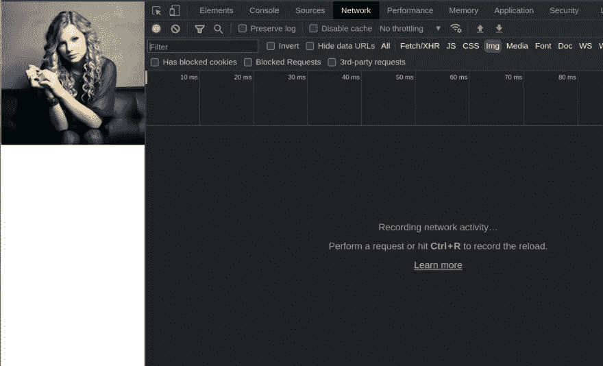

# 使用宽高比的响应图像|无需媒体查询

> 原文：<https://levelup.gitconnected.com/responsive-image-using-aspect-ratio-no-media-queries-are-needed-2abef1544c96>


在这个博客中，你将学习如何在没有任何媒体询问的情况下制作一个有反应的图片。我们将使用长宽比，使我们的图像响应。

# 视频教程

我已经在我的 youtube 频道上制作了一个视频。看看这个。

请喜欢并订阅 [Cules 编码](https://www.youtube.com/channel/UCBaGowNYTUsm3IDaHbLRMYw?sub_confirmation=1)。它激励我创造更多这样的内容。

# 实时预览

这里的基本思想是当浏览器屏幕尺寸改变时，设置图像宽度。而当宽度会发生变化时，高度也会在宽度的基础上发生变化。

现在有两种类型的长宽比可以使用。

*   图像的原始比例
*   自定义纵横比

我会给你们俩看的。我还将向您展示如何在 nextjs 图像组件中使用纵横比。

# 原始纵横比

```
<style>
    * {
        padding: 0;
        margin: 0;
        box-sizing: border-box;
    }

    .container {
        width: 100%;
        margin: 0 auto;
    }

    img {
        width: 100%;
        height: auto;
    }
</style>
<body>
    <div class="container">
        
    </div>
</body>
```


解释:

*   容器将占据 80%的宽度，并且将水平地位于中心。
*   该图像拍摄了容器的整个宽度。
*   图像需要多高就有多高。宽度变了就变了。

# 自定义纵横比

现在有两种方法可以在 CSS 中使用自定义纵横比。

*   纵横比属性
*   填充顶部属性

# 使用填充顶部属性

这个过程非常简单，但是有点棘手。你只需要创建额外的容器。

```
<head>
    <style>
        * {
            margin: 0;
            padding: 0;
            box-sizing: border-box;
        } .container {
            width: 100%;
            position: relative;
            padding-top: 56.25%;
        } .image {
            position: absolute;
            top: 0;
            left: 0;
            width: 100%;
            height: 100%;
            object-fit: cover;
        }
    </style>
</head>
<body>
    <div class="container">
        
    </div>
</body>
```


解释:

*   容器现在将采用全宽和相对位置。
*   图像将占据其容器的全部空间。但是它将被绝对定位并与其容器对齐。如果你不了解 CSS 职位，可以看看这个视频。

*   我们需要使用`padding-top`给出容器的高度。该值将取决于纵横比。

要得到长宽比，做简单的数学运算。在计算器上做这个。把高度除以宽度就可以了。然后乘以 100 得到百分比值。

```
1920 X 1080 resolution1080 / 1920 = 0.5625 --> The ratio0.5625 * 100 = 56.25%<style>
    .container {
        width: 100%;
        position: relative;
        padding-top: 56.25%;
    }
</style>
```

有时图像在小屏幕上可能会变得太小。然后，您可以使用媒体查询，并使图像为方形。

```
<style>
    @media screen and (max-width: 400px) {
        .container {
            padding-top: 100%;
        }
    }
</style>
```



解释:

*   `padding-top`将是 100%，因为在一个正方形中高度和宽度是相同的。如果你把它们分开，你会得到 1。剩下的你都知道了。

# 对 Nextjs 图像组件使用纵横比。

```
import React from 'react'
import Image from 'next/image'const Responsive = () => {
    return (
        <div>
            <Image
                src='/ts.jpg'
                height={9}
                width={16}
                layout='responsive'
                objectFit='cover'
            />
        </div>
    )
}export default Responsive
```


解释:

*   这里的想法是一样的。使布局具有响应性。
*   根据比例给出高度和宽度。

这个博客到此为止。我试图简单地解释事情。如果你卡住了，你可以问我问题。

顺便说一下，我正在一家公司寻找一个新的机会，在那里我可以用我的技能提供巨大的价值。如果你是一名招聘人员，正在寻找一个精通全栈网络开发并对改变世界充满热情的人，请随时联系我。此外，我愿意谈论任何自由职业者的项目。

从[这里看我的作品](https://www.thatanjan.me/projects)

# 联系人

*   电子邮件:[thatanjan@gmail.com](mailto:thatanjan@gmail.com)
*   LinkedIn: [@thatanjan](https://linkedin.com/in/thatanjan/)
*   作品集:[安健](https://thatanjan.me/)
*   Github: [@thatanjan](https://github.com/thatAnjan/)
*   Instagram(个人): [@thatanjan](https://instagram.com/thatAnjan/)
*   推特: [@thatanjan](https://twitter.com/thatAnjan)