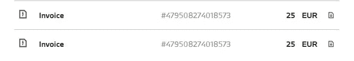
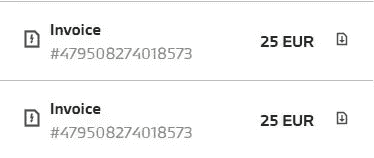
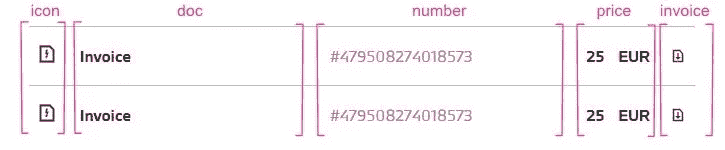
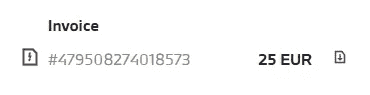
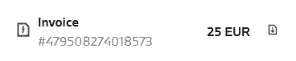
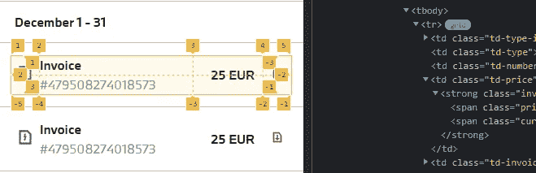

# 带有 CSS 网格-模板-区域的响应式表格

> 原文：<https://levelup.gitconnected.com/responsive-table-with-css-grid-template-areas-1cd84eb71adf>

## 将 CSS 网格用于更复杂的表格

构建响应式表曾经很棘手。这完全取决于设计，但是以前我们经常不得不使用 CSS 属性，比如`*display: block*`、`*float: left*`、`*position: absolute*`等等。为移动设备正确显示元素。Flexbox 让事情变得更简单，但是有一个更好的解决方案，那就是 CSS grid。在本文中，我将特别关注[网格模板区域](https://developer.mozilla.org/en-US/docs/Web/CSS/grid-template-areas)。


丹尼尔·麦卡洛在 [Unsplash](https://unsplash.com?utm_source=medium&utm_medium=referral) 上拍摄的照片

我们来看一个具体的例子。下面我们有一个普通的 HTML 表格，它在桌面和平板电脑上都是一样的。它包含 5 列。我们可以看到一个图标，文件类型(发票)，数量，价格和下载图标。



表格(平板电脑视图)

HTML 可能看起来像这样:

```
<table class="invoices-table">
  <tbody>
    <tr>
      <td class="td-type-icon">
        <span class="icon-invoice"></span>
      </td>
      <td class="td-type">Invoice</td>
      <td class="td-number">#479508274018573</td>
      <td class="td-price">25 EUR</td>
      <td class="td-invoice">
        <a href="" class="download-icon">Download invoice</a>
      </td>
    </tr>
  </tbody>
</table>
```

在手机上，我们无法在一行中显示所有信息。我们想稍微调整一下，把“发票”和它的号码放在一栏里。



网格(移动)

我们可以用 CSS grid 很容易地实现这一点，从而避免使用我在开始提到的旧技术。为了更好地控制单元格，我们可以使用 grid-template-areas 属性。

> *`***grid-template-areas***`*CSS 属性指定命名为* [*的网格区域*](https://developer.mozilla.org/en-US/docs/Glossary/Grid_Areas) *，在网格中建立单元格并给它们命名。**

*这意味着我们可以为表格中的每个单元格指定一个名称。*

**

# *网格区域*

*有`***grid-area***`的财产。给定上面的 HTML，我们简化的 CSS 将如下所示:*

```
*.td-type-icon{
  grid-area: icon;
}

.td-type{
  grid-area: doc;
}.td-number{
  grid-area: number;
}.td-price{
  grid-area: price;
}.td-invoice{
  grid-area: invoice;
}*
```

*我们已经为每个单元格分配了名称，所以现在可以在网格中使用它们。*

# *网格-模板-区域*

*我们希望表格行在移动设备上表现为网格，而在更大的屏幕上，它将是普通的表格行，所以我们为此定义了一个断点。*

```
*tr{
  display: grid;
  grid-template-columns: 35px 1fr 25% 35px;
  grid-template-rows: auto;
  **grid-template-areas:
  ". doc . ."
  "icon number price invoice";**
  align-items: center;
  @extend %u-p-3; @include breakpoint('from-tablet') {
    position: relative;
    display: table-row;
  }
}*
```

*让我们再细分一下。*

*我们还定义了列的宽度。注意，在手机上，我们只需要 4 列。
Fr 是一个分数单位，1fr 代表可用空间的 1 部分，我们将其分配给第 2 列。*

```
*grid-template-columns: 35px 1fr 25% 35px;*
```

*由于我们希望在一列中同时显示文档类型及其编号，我们可以执行以下操作:*

```
***grid-template-areas:
  ". doc . ."
  "icon number price invoice";***
```

*圆点代表一个没有命名的区域，因此是空的，空间会相应地分配。基本上我们定义了 2 行 4 列，文档和编号在第 2 列。它看起来是这样的:*

**

*太好了，但是我们如何将这些项目垂直居中呢？我们可以将[网格行](https://developer.mozilla.org/en-US/docs/Web/CSS/grid-row)跨越 2，因为我们已经定义了 2 行。*

```
*grid-row: span 2;*
```

> *`***span && [ <integer> || <custom-ident> ]***`*
> 
> **为网格项目的放置贡献一个网格跨度，使得网格项目的网格区域的对应边与对边相距 n 行。**

*这意味着我们必须跨越第一、第三和第四列:*

```
*.td-type-icon{
  grid-area: icon;
  grid-row: span 2;
}.td-price{
  grid-area: price;
  grid-row: span 2;
} .td-invoice{
  grid-area: invoice;
  grid-row: span 2;
}*
```

**

## *小费*

*在所有现代浏览器中，你也可以打开开发者工具，看到我们把表格行变成了网格。您可以将鼠标悬停在“网格”标签上或激活它来查看视觉指南。*

**

*Chrome 中的网格高亮显示*

# *摘要*

*除了使用 CSS grid 来设计主要的布局和网格，我们还可以用它来将 HTML 表格行转换成网格。在移动设备上显示更复杂的表格非常方便，因为我们可以使用 grid-area 为每个单元格指定一个名称，然后将它们应用到 grid-template-area 中。有了这个 grid 属性，我们可以看到表的可视化表示，然后根据需要简单地对齐行/列。*

*公平的说，有时候*不如***盒子*里面的 *！:)***