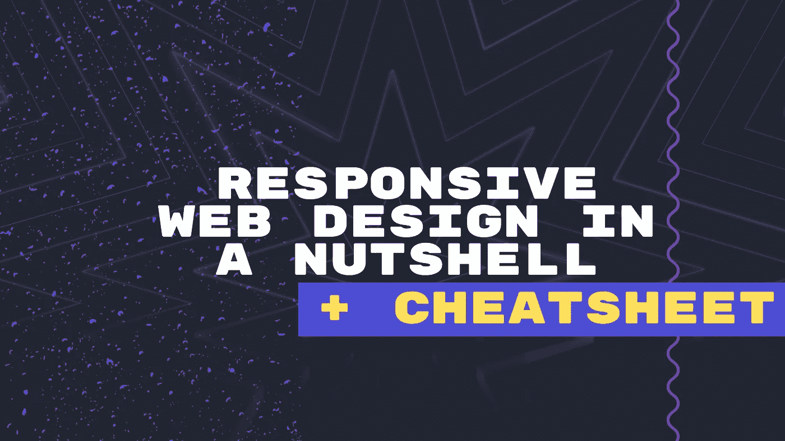
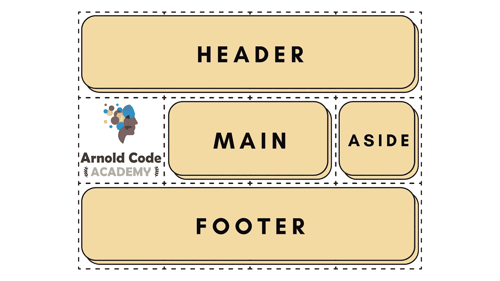
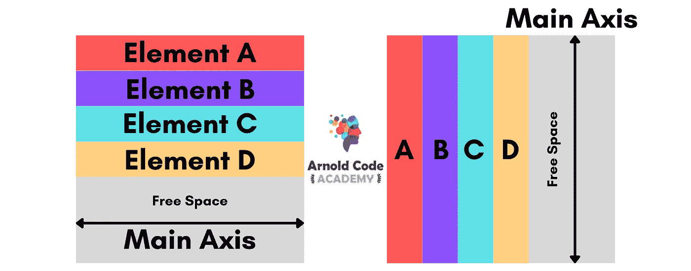
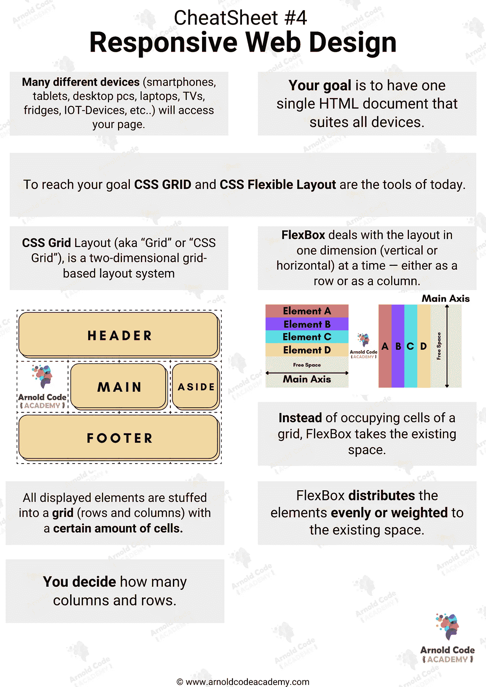
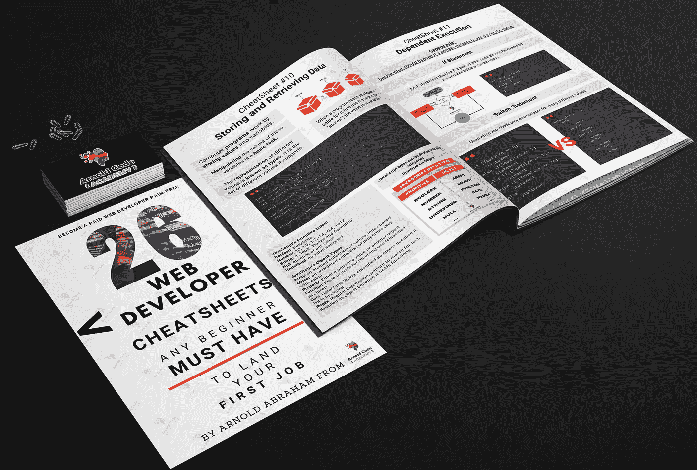
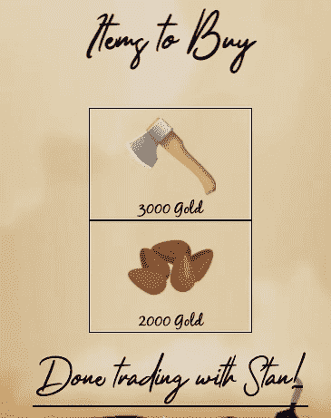
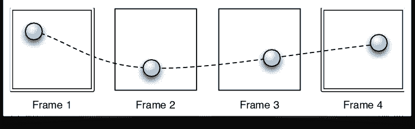

# 简而言之，面向 Web 开发初学者的响应式 Web 设计

> 原文：<https://levelup.gitconnected.com/responsive-web-design-in-a-nutshell-for-web-developer-beginners-281927de35fc>

## 备忘单包括让你的知识总是在手边

图片由[作者](http://www.arnoldcode.com)用 Canva 制作

成为一名网站开发者意味着与时俱进，学习最新最好的技术。

在当今的 web 开发世界中，已经建立了两种技术:

1.  ***CSS 网格***
2.  ***CSS 灵活布局。***

你可以把它们比作麦当劳和汉堡王。没有一个是真正最好的，只是个人喜好的味道。

# 众多的设备

自古以来，CSS 一直被用来布局网页。但是当显示屏尺寸改变时，它从来没有做得很好。

每当你创建一个网页，你需要记住许多设备(智能手机，平板电脑，台式机，笔记本电脑，电视，冰箱，IOT 设备等..)将访问您的页面。

你无法预测用户如何访问你的页面。

因此，你的目标是拥有一个适合所有这些不同屏幕尺寸的网站。最佳情况是一个适合所有设备的 HTML 文档。这是通过根据给定的显示大小(垂直=高度，水平=宽度)创建样式来实现的。

# CSS 网格布局

CSS 网格布局(又名“网格”或“CSS 网格”)是一个基于二维网格的布局系统。Grid 是第一个专门为解决布局问题而创建的 CSS 模块，开发人员在制作网站时就一直在解决这个问题。

理解概念至关重要。

阿诺德代码学院提出的 CSS 网格概念

所有显示的元素都被填充到具有一定数量的单元格的网格(行和列)中。您决定有多少列和多少行。每个元素可以跨越一个或多个单元格。只要一个元素在一个单元格内，它就会占据整个单元格。

概念到此为止👍

# FlexBox 又称柔性盒模块

FlexBox 是完全响应和个性化布局系统的最终选择。它也是一个很棒的布局工具，但是它的单向流有不同的用例。

柔性框模块被设计为一维布局模型，作为一种可以根据屏幕尺寸在项目之间提供空间分布的方法。

FlexBox 一次处理一个维度(垂直或水平)的布局——行或列。它有两个轴，主轴和横轴。以此作为与 CSS 网格布局的二维模型的对比，CSS 网格布局共同控制列和行。

FlexBox 不占用网格的单元，而是占用现有的空间，并将其平均分配或加权到现有的元素。

这里有一个**概述**flexbox 如何使用空间在页面上分配元素。

阿诺德代码学院提出的 Flexbox 概念

# 备忘单

[阿诺德代码学院的响应式网页设计备忘单](https://cntr.click/gCF1M0f)

[*拿到备忘单，只研究你第一份工作真正需要的东西！*](https://arnoldcodeacademy.ck.page/26-web-dev-cheat-sheets)

# 额外收获:简洁的 CSS 动画

[模态窗口——来自 DucIdle 的商户 Stan】](https://cntr.click/r0F6AAc)

CSS 动画让一个元素逐渐从一种风格变成另一种风格，就像上图一样。您可以根据需要更改任意多的属性和次数。

要使用 CSS 动画，您有两种选择:

1.  使用转场属性— *简单但功能强大的动画* **例如:**转场:0.7s 渐出；
    遍历每一个属性变化到一个 0.7s 长度的平滑淡入淡出事件。
2.  创建关键帧— *可重复使用的复杂动画* 使用过渡，您可以定义从样式 A 到样式 B 的过渡长度和方式。但是关键帧动画允许您指定所有其他状态。

你对行动有精确的控制。沿途的点称为*关键帧。*

关键帧插图

它们允许您将动画分成多个片段。

*你可以在我的网页游戏*[*DucIdle*](http://seekoapp.io/6203f829f11e6c7e55631929)*中领悟到很多动画。*

[醉酒大叔殖民者网页游戏](https://cntr.click/r0F6AAc)

# 为您提供更多资源

[响应式网页设计深潜](http://seekoapp.io/6203f82af11e6c7e5563192a)
[CSS 网格深潜](http://seekoapp.io/6203f82bf11e6c7e5563192b)
[FlexBox 深潜](http://seekoapp.io/6203f82cf11e6c7e5563192c)