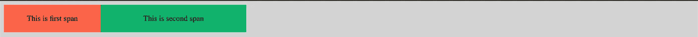
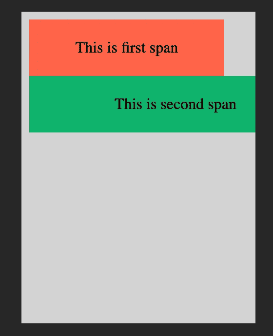
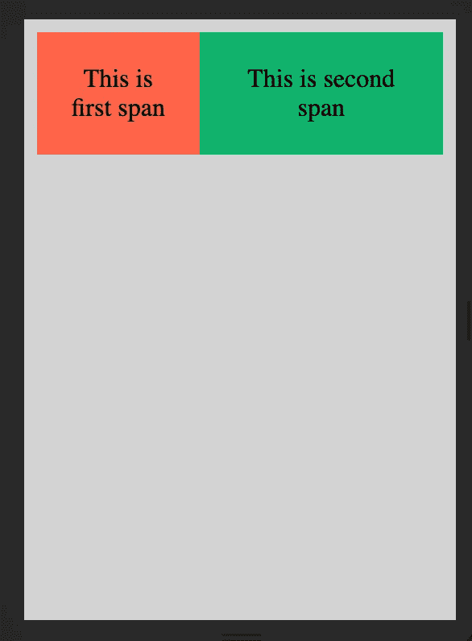

# 响应式网页设计

> 原文：<https://levelup.gitconnected.com/responsive-web-design-why-we-need-it-and-how-to-implement-it-657f716bef3>

## 我们为什么需要它，它是如何实现的

在使用 HTML 的早期，大多数终端用户只能通过他们的台式电脑或笔记本电脑访问网站。Web 开发人员过去常常为大屏幕房地产开发，并相应地设计他们的网站。然而，最近，通过移动设备访问网络的用户数量呈指数级增长。随着廉价数据计划的出现，用户对移动设备的采用在过去十年中出现了大幅增长。例如，回到 2012 年，英国的手机数量比人口还多。

因此，web 开发人员需要考虑到此类设备的较小屏幕尺寸，并设计他们的网站，以便针对所有屏幕尺寸进行优化。出于同样的目的，响应式网页设计已经被引入并被大多数人作为网页设计的事实标准。

# 响应式网页设计

响应式网站设计被简单地定义为为每种设备和屏幕尺寸(无论大小)构建网站的实践。它包括跨多个平台提供统一的用户体验。这个术语是由[伊森·马科特](https://alistapart.com/article/responsive-web-design/)在 2010 年创造并进一步发展的。

在研究响应式设计时，人们经常会碰到术语*自适应*或*移动*。尽管这些术语可以互换使用，但它们之间还是有细微的区别。响应式设计指的是对任何环境做出快速有效的反应，而适应性设计则涉及到拥有一个基础设计，可以很容易地为任何特殊目的进行修改。另一方面，移动设计是指专门为移动用户设计一个单独的网站。

响应式设计是有益的，因为它满足了所有三种设计的要求，因此受到广泛的青睐。响应式设计主要由三个部分组成，即灵活布局、灵活媒体和媒体查询。现在让我们来详细看看如何在他们的网站上实现它们。

# 灵活的布局

灵活布局的使用包括将 HTML 元素封装在一个灵活的容器或网格中，该容器或网格根据屏幕宽度动态调整大小。这些布局的尺寸以百分比或 em 单位指定，而不是静态值。这可以确保布局(以及其中的元素)根据屏幕大小自动调整。

让我们看一个例子

```
* {
    box-sizing: border-box;
}.container:before,
.container:after {
    content: "";
    display: table;
}.container:after {
    clear: both;
}.container {
    *zoom: 1;
}span {
    padding: 20px;
    text-align: center;
    float: left;
}.span--1 {
    width: 200px;
    background: #ff6347;
}.span--2 {
    width: 300px;
    background: #0eb36d;
}
```



正如您在上面看到的，我们有一个容器，其中包含两个宽度分别为 200px 和 300px 的元素。在桌面浏览器中，元素正常显示，没有任何停顿。让我们看看它是如何出现在尺寸为 240x320 的移动设备上的。



我们可以看到第二个跨度正在运行到下一行。这是因为移动设备的宽度为 240 像素，小于两个元素的总宽度 200+300 = 500 像素。此外，第二个跨度似乎也在屏幕外运行，因为其 300 像素的宽度大于屏幕宽度。现在，让我们通过为跨度指定百分比来使布局更加灵活，从而尝试解决这个问题。

```
* {
    box-sizing: border-box;
}.container:before,
.container:after {
    content: "";
    display: table;
}.container:after {
    clear: both;
}.container {
    width: 100%;
    *zoom: 1;
}span {
    padding: 20px;
    text-align: center;
    float: left;
}.span--1 {
    width: 40%;
    background: #ff6347;
}.span--2 {
    width: 60%;
    background: #0eb36d;
}
```



我们可以看到，上述布局对移动和桌面屏幕都很有效。使用同样的方法应用百分比，我们可以创建一个完全动态的网站，适应所有的屏幕尺寸。为了更好地控制布局，您还可以尝试使用最小宽度和最大宽度属性。

# 柔性媒体

媒体元素需要根据屏幕大小和尺寸来调整大小，以便获得平滑和不失真的观看体验。确保媒体元素可缩放的一个快速方法是将 max-width 属性设置为 100%。这适用于像`img`、`video`和`canvas`这样的媒体元素。

然而，这种方法并不适用于所有形式的媒体，尤其是`iframe`和嵌入式媒体。为了使它们也可伸缩，它们必须放在父元素中，并且它们的位置设置为绝对。然后父元素需要有 100%的宽度，以便它可以根据视口进行缩放。您还需要将父元素的高度设置为 0，以便启用 Internet Explorer 的`haslayout`机制。

# 媒体查询

媒体查询用于根据设备属性指定不同的 CSS 属性，如视口宽度或屏幕方向。在 CSS 中嵌入媒体查询有不同的方法，在现有的样式表中使用`@media`规则，使用`@import`规则导入新的样式表，或者从 HTML 文档中链接到一个单独的样式表。然而，首选方法是在现有样式表中使用`@media`规则，以避免任何额外的 HTTP 请求。

媒体查询被写成带有规范的规则。每个媒体查询以其目标媒体的类型开始，例如`all`、`screen`、`print`、`tv`、`braille`等。该规则之后是逻辑运算符和某些带有值的 CSS 属性。如果该值适用于当前场景，则应用该规则。让我们看一个例子

```
// For mobile devices
.container {
    width: 800px 
}// For desktop devices
@media all and (min-width: 1024px) { .container {
        width: 1200px 
    }
}
```

在上面的 CSS 中，包含类容器的元素的宽度为 800 像素。但是，我们应用的媒体规则规定，对于最小视窗宽度为 1024px 的所有设备，将宽度设置为 1200px。通过使用这种方法，可以为移动设备和桌面设备设计页面样式，而不必为不同的布局创建单独的 HTML 文件。