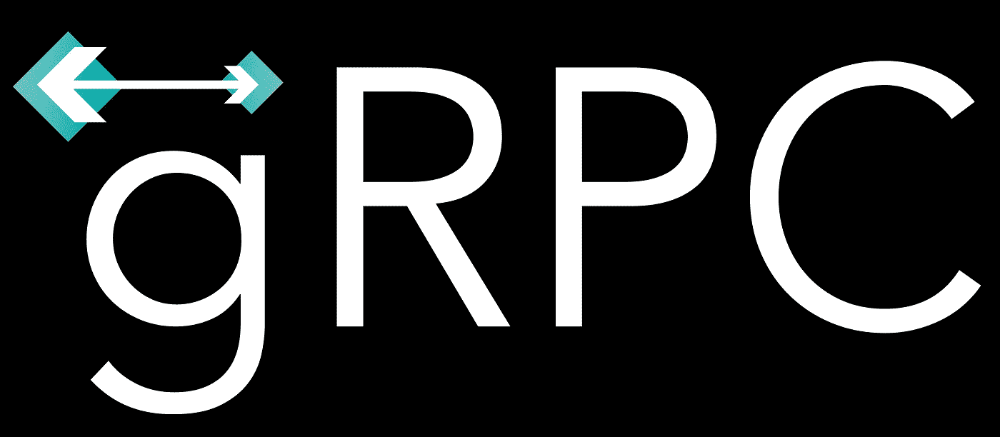
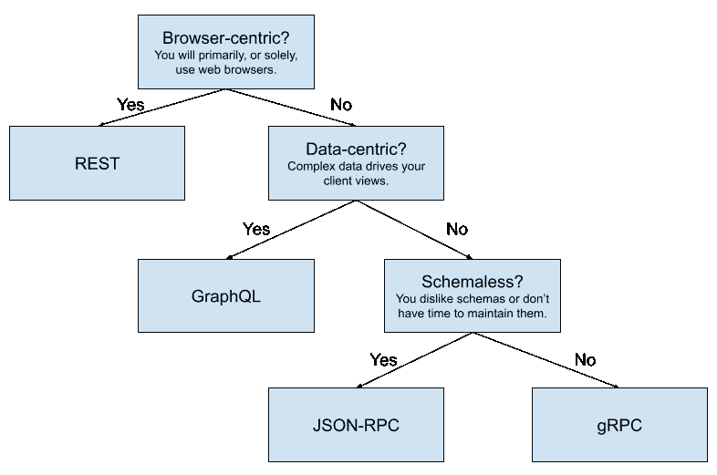

# REST 和 API 的未来

> 原文：<https://levelup.gitconnected.com/rest-and-the-future-of-apis-ef9cf4e1706b>

gRPC 徽标( [https://grpc.io](https://grpc.io) ) —只是众多消息协议中的一种

每当有人开始谈论 web 服务和 API 时，您最终会讨论是使用 REST 还是一些新技术。让我先声明一下，我并不认为使用 REST 有什么本质上的不好。这是一个很好的规范，充分利用了现有的 HTTP 技术，实现符合该规范的客户机和服务器非常简单，并且允许很大的灵活性。

然而，同样的“现有 HTTP 技术”非常陈旧，不一定能很好地适应现代用例。此外，该规范并没有真正定义如何实现 REST 服务的规则，所以你可以有三个不同的 API，它们都使用 REST，但不遵循相同的“标准”。

我知道我在这篇文章的顶部有一个 gRPC 标志的图像，但我不是 gRPC 的死忠粉。我觉得很管用，我觉得有它的用武之地，很扎实的推荐。它也是 CNCF 的一部分，在我看来这是一个伟大的里程碑，在许多基于容器的框架中有很多对 gRPC 的内置支持，比如那些运行在 Kubernetes 上的框架。但不一定是 API 的未来。

此时你可能会想，“如果不是 REST 或 gRPC，那是什么？”我认为这取决于你们互动的目标是什么。对我来说，除非有充分的理由，否则我总是会考虑四种解决方案:REST、JSON-RPC、gRPC 和 GraphQL。

# 我们快点休息吧

不管别人说什么，休息仍然是坚实的。但它肯定是面向基于浏览器的客户端的。如果您使用几乎任何非 REST 解决方案，您要么会丢失一些内置于 web 浏览器中的有价值的功能，要么需要编写大量的 JavaScript 代码来适应变通方法。

例如，为特定页面添加书签。例如，如果你建立了一个电子商务网站，你试图用 JSON-RPC 使它成为一个 PWA 或别的什么东西，你需要考虑到人们可能想要给一个特定的产品加书签。他们可以做到这一点的唯一方法是产品页面可以用一个唯一的 URL(包括查询参数)来表示。

REST 从一开始就将这一切构建到系统中，因为它脱离了浏览网页的标准方式。你*可以*用 JSON-RPC 解决方案做到这一点，但是这需要更多的代码，潜在的更多错误，最终不值得付出额外的努力(在我看来)。

基本上，如果 web 浏览器是 web 应用程序的主要或者唯一的客户端目标，那么应该首先考虑 REST。关于 REST 替代方案的大讨论应该留给不使用 web 浏览器作为主要客户端的 API 或其他系统。

**注意**:在有意义的地方混合搭配解决方案是完全可以接受的。在同一个应用程序中使用 REST 和 GraphQL。或者对 web 服务器使用 REST，对单独的后端服务使用 gRPC。您不必认为您构建的每个服务都应该使用单一的协议/规范。挑选两三个可能有利于确保每种*类型的服务使用最适合它的解决方案。*

# 数据与功能

当我不构建网站并且需要 REST 之外的东西时，我喜欢回答的一个大问题是:我将主要呈现复杂的数据负载还是我将需要与我的后端系统进行大量的交互？

让我们再次以电子商务网站为例。假设您使用 REST 作为基础来服务网站的大部分内容。但是，您还需要查询相关产品、评论或其他附加数据，这些数据没有产品描述、价格等重要。由于您主要需要的是*数据*，除了添加评论或者将产品添加到购物车之外，不太可能有太多的交互，您可能希望使用 GraphQL 来异步加载所有这些额外的数据。

GraphQL 肯定是一个普遍流行的选择，如果您主要处理数据的呈现，尤其是复杂的数据关系，那么它很有意义。客户可以很容易地请求*精确地*他们想要的每个查询的属性和相关数据。

如果您试图使用 REST 甚至任何 RPC 选项来实现这一点，您需要添加头或函数参数来包含/排除哪些属性、相关模型等。客户想要的每一个电话。或者，每次想要显著改变响应负载时，都需要创建一个新函数。

另一方面，如果你有类似客户支持聊天服务的东西，那么交互将是你的主要目标，GraphQL 在这些情况下就没那么有用了。现在，实际上一个聊天服务会使用一个定制的二进制协议，并使用 web sockets 或其他东西，但 gRPC 和 JSON-RPC 和那些都可以很好地工作，仍然可以通过 web sockets 完成。

因此，在这些频繁执行操作的情况下，并且您正在调用需要到达后端服务器的状态更改，RPC 选项是可行的方法。在这种情况下，您的问题就变成了是否需要这些 RPC 消息的模式。

gRPC 使用协议缓冲区，所以您创建一个 protobuf 模式，其中包含您的客户端可以使用的所有请求和响应消息，然后 gRPC 处理这些消息的打包，适当地路由它，并将其转换为后端的函数调用。gRPC 也是 Kubernetes 工具和框架的流行选择，如 Istio，所以如果您在 Kubernetes 集群中运行，那么您绝对应该将 gRPC 放在考虑列表的首位。

JSON-RPC 是无模式的，所以您遵循约定而不是配置来进行调用。这样做的好处是允许函数签名以较低的开销进行更改，或者允许松散类型的参数，而无需任何特别的努力。但是这样您就错过了诸如客户端和服务器消息验证之类的事情，确保被调用的函数是服务器允许的，并且参数的正确数量及其类型与签名匹配。

# 流程图

REST、gRPC、GraphQL 和 JSON-RPC 之外还有很多解决方案。就我个人而言，这些只是目前流行的。我通常会问几个核心问题，以了解我应该调查通信协议/规范的哪一类,然后我会查看这些类别中最多的类别，并寻找它们的直接替代方案。如果我找不到任何既能充分满足我们的技术需求，又能适应我们的业务需求和现有工作流的替代方案，那么我会选择该类别中最丰富的方案。

我制作了这个简单的图表来帮助你根据你的需求和我在这篇文章中讨论的内容来确定你应该关注的网络交流的*类别*。

便捷的网络通信流程图

从本质上来说，交付可以轻松加入书签、使用 web 链接导航等的网页。，您的客户端主要——或者唯一——web 浏览器应该继续使用 REST。

以数据为中心的客户端，即大多数客户端专注于显示数据关系的客户端，应该使用 GraphQL。GraphQL 肯定有竞争对手，但老实说，我认为在这一点上，它是以数据为中心的客户端事实上的选择。大量的支持，很多人知道它，大量的集成选项…它实际上是这个类别的黄金标准。

以 API 为中心的服务，即那些调用函数和修改状态的服务，以及更有可能异步或通过非浏览器客户端(如移动应用程序、其他后端服务)进行通信的服务，应该考虑使用 RPC 选项，如 gRPC 或 JSON-RPC。如果需要一个模式，看看 gRPC 和它的直接替代方案。如果 schema 是可选的，那么包括 JSON-RPC 及其直接替代方案。

如果你专门在 Kubernetes 上运行多种服务，我强烈建议考虑 gRPC。它是 CNCF 的一部分，许多 Kubernetes 工具和框架都支持 gRPC。看起来 gRPC 将成为更复杂的 Kubernetes 部署中服务间通信的实际手段。

# 结论

就我个人而言，我会坚持使用 REST 来开发网站——也就是说，一种将网络浏览器作为其主要或唯一客户目标的服务——并可能在适当的时候混合使用 GraphQL。重复前面的例子，您可能有一个产品页面，当页面第一次加载时，它会填充所有主要内容，但是您也可以使用 GraphQL 加载相关的产品、评论或任何数量的其他非即时必要的信息。

如果您的服务主要有非浏览器客户端，尤其是如果您正在进行服务对服务的通信，REST 肯定没什么用处。最好使用通过 TCP 连接处理的二进制协议，或者有一个单一的端点向其发出 RPC 请求。在这些情况下，我会考虑 gRPC 或类似的产品。

如果你有一个高度交互的基于 web 的应用程序，你应该看看 web sockets，考虑一个与后端服务通信的非 REST 方法。使用 web sockets 肯定可以使用 gRPC、JSON-RPC，甚至 GraphQL，所以不要认为 web sockets 需要一套完全不同的解决方案。

如果您最终在后端服务器和客户端之间实现了高度的双向通信，那么考虑定制二进制协议也是一个好主意。例如，如果您要使用 Erlang 或 Elixir，有一个名为 *BERT* 的二进制消息格式，它有一个足够简单的规范，可以在现有库不可用的情况下在您的客户机中实现。使用 BERT 编码的二进制负载可以使用内置函数解码成后端代码中的本机对象，反之亦然:本机对象可以使用内置函数编码成 BERT。然后，您只需将有效负载推过 web socket 连接，就大功告成了。

如果你没有一个好的理由，我不会推荐一个定制的二进制协议。但是这样做也没有错。例如，您可以在不使用 gRPC 的情况下使用 protobuf 消息，这对于特定的用例可能更有意义。请随意追求能够为您的特定问题提供最佳解决方案的技术。