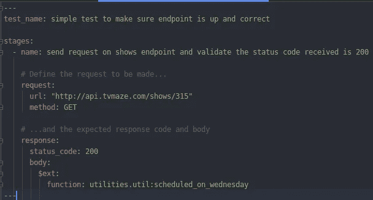

# 使用 Python 和 tavern-ci 实现 REST-API 测试自动化—第 1 部分

> 原文：<https://levelup.gitconnected.com/rest-api-test-automation-using-python-with-tavern-ci-part-1-707026eae702>

## 当您正在寻找一个完整的 python 解决方案来满足您的 REST API 测试需求时

当你谷歌 Rest-API 测试自动化时，似乎没有太多的选择。突出的是 newman-cli 和 Java 的放心库，但是如果你的自动化解决方案像我的一样围绕 Python，你会想要一个原生的 Python 解决方案。事实证明，这可能是最好的 Rest-API 测试自动化解决方案。这就是酒馆图书馆


资料来源:https://taverntesting.github.io/

tavern-ci 与其他解决方案的不同之处在于用 YAML 编写的测试文件的声明性 JSON 格式，这使得手动测试人员甚至业务分析人员可以很容易地开始编写测试。在大多数情况下，只需要 Python 代码来验证响应，这种响应不够简单，无法被 tavern-ci 框架验证。

说够了！让我们看一些例子，从这一部分的简单测试开始，到下一部分的复杂测试。我将在 http://www.tvmaze.com/api 的[使用免费的公共 REST API 作为例子。](http://www.tvmaze.com/api)

我还将使用 pytest 测试运行程序来运行测试。如果您已经在使用 pytest test runner 运行单元测试或 selenium 测试，tavern 的另一个优点是。创建一个文件 *test_simple.tavern.yaml* ，并添加以下代码片段。

**注意—** pytest 测试发现只会挑选名为 test_*.tavern.yaml 的文件


断言响应状态代码 200 的简单 API 测试

该测试只是验证返回的状态代码是 200。要运行代码，打开一个终端，切换到文件的目录，运行 *pytest -v.* 这将给出以下输出

```
============== test session starts================================== 
platform linux -- Python 3.6.8, pytest-4.5.0, py-1.8.0, pluggy-
0.13.0 -- /home/imran/venvs/mediumrestapitutorial/bin/python3
cachedir: .pytest_cache
rootdir: /home/imran/development/mediumrestapitutorial
plugins: tavern-0.26.4a0
collected 1 itemtest_simple.tavern.yaml::simple test to make sure endpoint is up and correct PASSED           [100%]========================= 1 passed in 1.28seconds===================
```

就这样。非常基本的第一个测试

查看测试文件的结构。每个文件可以有许多测试，每个测试由关键字 **test_name 标识。**然后你有关键字 **stages** 和每个阶段的**name****其中每个测试可以有多个阶段，我们将在接下来的部分中看到。接下来是最重要的部分**请求**和**响应**关键词。请求部分将包含 url 和 http 方法。tavern 框架将在响应部分验证每个键的所有值。**

**在下一个例子中，我们来看一个稍微复杂一点的例子，其中响应值实际上是一个字典，而不仅仅是一个值。假设我们想测试 Archer 这个节目是否安排在“星期三”。端点[http://api.tvmaze.com/shows/315](http://api.tvmaze.com/shows/315)的 JSON 响应如下**

```
{"id": 315,"url": "http://www.tvmaze.com/shows/315/archer","name": "Archer","type": "Animation","language": "English","officialSite": "http://www.fxnetworks.com/archer","schedule": { "time": "22:00", "days": [ "Wednesday" ] }}
```

**创建另一个文件 test _ slightlycomplex . tavern . YAML，并添加以下代码片段**

****

**稍微高级的测试使用一个函数来断言显示预定在星期三**

**除了关键字 **$ext** 之外，其他的都应该已经很熟悉了，这是一个特殊的语法，指示 tavern 将验证交给一个外部函数，该函数位于 python 文件 util 中的实用程序包内，函数名为*scheduled _ on _ 星期三*。该函数如下所示。**

****

**测试调用的外部断言函数**

**该函数接受一个由 tavern 传递的响应对象，可以使用 response.json()将该对象加载到 python 字典中。如果你使用过 python dictionary，那么方括号语法应该很容易理解，这就是你如何测试*星期三*是否在预定日期的方法。**

**本文中我想展示的最后一个例子是，您可能会注意到 url 是如何被硬编码的，如果您的测试列表随着时间的推移而增长，那么对 URL 的任何更改都意味着在每个测试中进行更改。对此有一个简单的解决方案。YAML 配置文件。**

****

**一个简单的 YAML 配置文件**

**然后根 url 可以放在上面所示的**变量**部分下。现在要将配置文件包含到测试中，添加关键字 **includes** 并传递文件名，如下所示**

****

**一个简单的测试展示了配置文件中变量的使用**

**这就是了。现在可以使用花括号语法 *{tv-maze.host:s}* 从配置文件中访问根 url，您只需提供端点 *shows/315* 。随着时间的推移，这使得测试易于维护**

**希望这是有意义的，我能够展示使用 tavern 作为 REST-API 测试自动化解决方案的美妙之处。下一系列文章将涵盖更复杂的测试场景，其中包括一系列测试，每个测试都从上一个测试中获取输入，以及如何进行文件上传等。敬请期待！**

**PS:如果你有兴趣通过实时项目深入学习 API 测试自动化，你可以查看我的 udemy [课程](https://www.udemy.com/course/api-test-automation-using-python-with-tavern-ci/?referralCode=7D4E22A93C0D4EDC73F5)**

## **资源**

> **[https://taverntesting.github.io/](https://taverntesting.github.io/)**
> 
> **[https://www.tvmaze.com/api](https://www.tvmaze.com/api)**