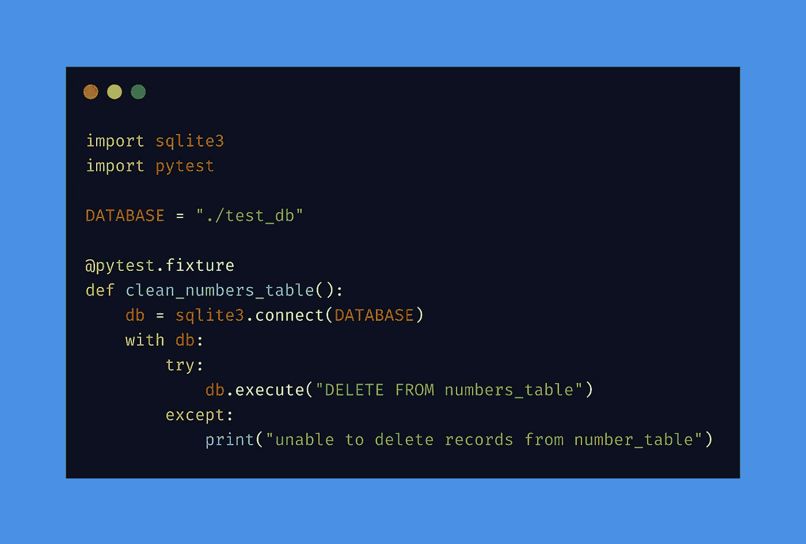

# 使用 Python 和 tavern-ci 实现 REST-API 测试自动化—第 2 部分

> 原文：<https://levelup.gitconnected.com/rest-api-test-automation-using-python-with-tavern-ci-part-2-16e07da7e8fa>

## 当您正在寻找一个完整的 python 解决方案来满足您的 REST API 测试需求时

这篇文章是我去年同一时间提交的第[篇文章](/rest-api-test-automation-using-python-with-tavern-ci-part-1-707026eae702)的延续。不敢相信现在已经一年了，所以我想继续下去，完成这个主题的系列。

https://taverntesting.github.io/

## **这次我将谈论什么话题？**

这次我想采用一种不同的方法，尝试解决在实际项目中设置 API 自动化解决方案时遇到的一个常见问题。这个问题的解决方案将会是 tavern 令人兴奋的特性，你也将会学到这个特性。所以让我们深入研究一下

## **那么这是什么问题呢？**

当您运行 API 测试套件时，您通常会试图模仿与您的应用程序交互的用户。其中一部分涉及到创建一些存储在应用程序数据库中的对象。数据库通常有一些独特的约束，以避免重复记录。尝试插入另一条相同类型的记录可能会导致 SQL IntegrityError。这是一个问题，因为您的测试使用了某种测试数据。因为测试数据没有改变，你的测试开始失败，因为数据库一直拒绝它们

## 一个解决方案..

确保在运行测试套件之前清理数据库表，以确保您是从一个干净的石板开始的。你会怎么做呢？答案是借助 pytest 夹具。让我们看一个例子

## 例子

假设我们有一个酒馆测试，它有三个阶段

1.  注册
2.  发布一个号码(该号码被添加到数据库中)
3.  获取数字(从数据库中读取数字)并验证它是否与步骤 2 中发送的内容相匹配

测试看起来会像这样

如果您尝试第二次运行测试，它可能会失败，因为 DB 表上可能存在约束。

**pytest-fixture 来拯救..**

创建一个连接到数据库并清理表的 python 函数。下面是一个例子。在这个函数上使用 decorator*pytest . fixture*可以在您的 tavern 测试中使用它

现在修改 tavern 测试并使用如下所示的夹具

现在发生的是，每次运行 tavern 测试时，fixture 将首先运行，并确保 DB 表是干净的。然后，测试可以正常进行。这样你就不必改变你的测试数据，并且可以一遍又一遍地运行测试

## 结论

作为一个 pytest 插件，Tavern 可以使用 pytest 及其庞大的插件生态系统的所有功能。现在，您一定很清楚在 tavern 测试中 pytest 特性的巧妙集成。顺便提一下，清理数据库的例子也可以使用删除端点来完成，而不是直接修改数据库。这只是取决于你喜欢什么样的解决方案

PS:如果你有兴趣通过实时项目深入学习 API 测试自动化，你可以查看我的 udemy [课程](https://www.udemy.com/course/api-test-automation-using-python-with-tavern-ci/?referralCode=7D4E22A93C0D4EDC73F5)

# 资源

> [T3【https://taverntesting.github.io/】T5](https://taverntesting.github.io/)