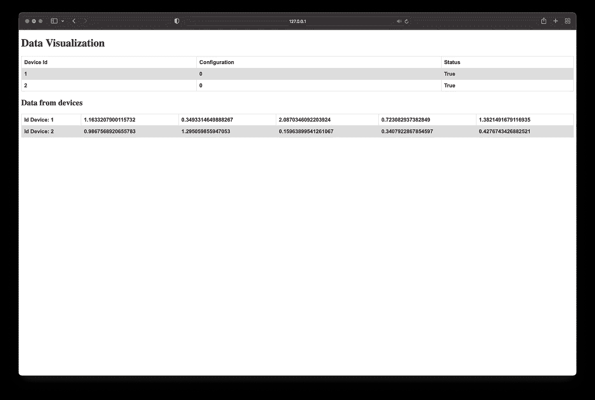

# 使用 Python 和 Flask 的 Rest API

> 原文：<https://levelup.gitconnected.com/rest-api-with-python-857ef8b8fb17>


道格拉斯·洛佩斯在 [Unsplash](https://unsplash.com?utm_source=medium&utm_medium=referral) 上的照片

在本文中，我将讨论如何创建一个简单的服务器和多个与 rest 调用通信的客户机/设备。

我们将使用 Python、Flask 和 SQLALCHEMY 作为数据库。

这个想法是让一个服务器收集多个设备(客户端)产生的信息。

## 计算机网络服务器

首先，我们使用 SQLALCHEMY 从数据保存开始实现服务器。

```
from flask_sqlalchemy import SQLAlchemyapp = Flask(__name__)
api = Api(app)
app.config['SQLALCHEMY_DATABASE_URI'] = 'sqlite:///database.db'
db = SQLAlchemy(app)
```

让我们创建两个表，一个名为 Device，另一个名为 Data，它们是相互关联的。

通过创建表示表的类来定义表。

```
class Device(db.Model):
    id = db.Column(db.Integer, primary_key=True)
    status = db.Column(db.Boolean, nullable=False)
    config = db.Column(db.Integer, nullable=False)
    data = db.relationship('Data', backref='device', lazy=True, cascade="all, delete-orphan")class Data(db.Model):
    id_device = db.Column(db.Integer, db.ForeignKey('device.id'), primary_key=True)
    timestamp = db.Column(db.Float, primary_key=True)
    data = db.Column(db.Float, nullable=False)def __repr__(self):
    return f"Data(id_device = {self.id_device}, timestamp = {self.timestamp}, data = {self.data})"
```

现在，我们可以定义来自设备的数据的管理，定义 API Rest。

因为数据将以 JSON 格式传递，所以我们定义了一个解析器来验证数据的格式是否正确

```
device_data_put_args = reqparse.RequestParser()device_data_put_args.add_argument("id_device", type=int, help="id device", required=True)device_data_put_args.add_argument("timestamp", type=float, help="timestamp epoc", required=True)device_data_put_args.add_argument("data", type=float, help="data", required=True)
```

在这种情况下，JSON 将由 3 个参数组成(id_device、timestamp、data)。

我们定义了当设备发出 PUT 请求时接收数据的函数。

除了 PUT，还可以定义其他方法。

*   `GET` -用于获取指定的资源
*   `POST` -用于在指定资源创建新数据
*   `PUT` -用于在指定资源创建新数据或替换现有数据
*   `PATCH` -用于在指定资源创建新数据或更新/修改现有数据
*   `DELETE` -用于删除指定资源中的现有数据

现在让我们将该类与和调用相关联的 URL 关联起来。

```
api.add_resource(DataDevice, "/data_device")
```

如果要将参数直接传递到 URL 中，必须声明将要到达的变量的类型和相关名称:

```
api.add_resource(ConfigUpdate, "/config_update/<int:id_device>")
```

接下来，在定义处理调用的方法时，它们将有两个参数，如下所示:

```
def patch(self, id_device):
```

## 客户

客户端/设备端数据传输非常简单:

```
try:
    resp = requests.put(BASE_SERVER + 'data_device', json=send_data)
    resp.raise_for_status()
except HTTPError as http_err:
    logging.warning(f'HTTP error occurred: {http_err}')
    return resp
except Exception as err:
    logging.warning(f'Other error occurred: {err}')
    return
else:
    if resp.status_code == 201:
        # update configuration
        self.config = resp.json()
```

## 数据可视化

此外，我还添加了一个用于数据可视化的网页:



作者图片

可在 [http://127.0.0.1:5000](http://127.0.0.1:5000) 查看

下面我离开知识库。

要启动服务器，请执行以下操作:

```
python3 server.py
```

要启动设备，请将 id 放在 python3 device.py 之后

```
python3 device.py 1
python3 device.py 2
```

[](https://github.com/pietrocolombo/example_api_rest_python) [## GitHub-Pietro Colombo/example _ API _ rest _ python

### 在 GitHub 上创建一个账号，为 Pietro Colombo/example _ API _ rest _ python 开发做贡献。

github.com](https://github.com/pietrocolombo/example_api_rest_python) 

如果你有任何问题或者你已经用其他方式解决了它们，不要犹豫，在评论中写下它们！

为了获得无限的故事，你也可以考虑只花 5 美元注册成为媒体会员。如果你用我的 [*链接*](https://pietrocolombo.medium.com/membership) *注册，我会收到一点佣金。*