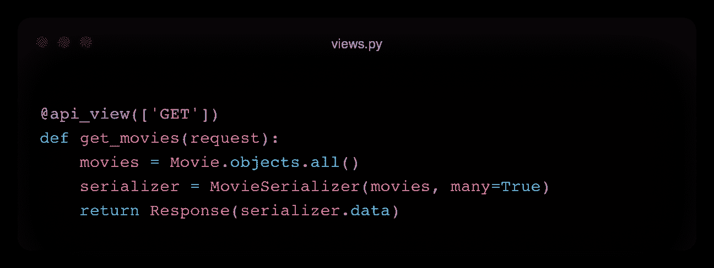

# RESTful Django — Django REST 框架

> 原文：<https://levelup.gitconnected.com/restful-django-django-rest-framework-8b62bed31dd8>

## 让我们开发一个 RESTful Django 项目


Django 不直接支持 Restful API。但是多亏了 REST 框架包，我们可以在 Django 项目中创建 Restful APIs。你可以在这里查看官方文档。在这篇博文中，我将解释如何在 Django 项目中创建 REST APIs。

**内容**

*   什么是 API？
*   什么是 REST API？
*   Django REST 框架

# 应用程序接口

API 这个词代表应用编程接口。它们负责使两个软件单元相互通信。

考虑一个 web 应用或移动应用。当您访问 web 应用程序时，您的浏览器会下载一个 react 应用程序。所以你可以浏览他们的网站。当数据请求发生时，从体系结构的角度来看，不允许用户直接访问数据库。那会非常危险。相反，我们试图控制人们如何以及人们可以对我们数据库中的数据做什么。


简单的结构。

通过设计一个 REST API，我们构建了另一个结构，它独立于这两个结构。通过这种方式，我们设置并管理如何连接到数据库。


在当今的应用程序中，我们有多个数据源，我们需要利用它们来开发更好的应用程序。

# REST 架构

REST 是表述性状态转移的首字母缩写。它是一个通用架构，为 API 的工作方式定义了标准。按照 REST 标准创建的 API 称为 REST APIs，使用它们的 web 服务称为 RESTful web 服务。REST API 必须满足一些原则。

## 无国籍的

来自客户端的每个请求必须携带所有必要的信息，并且这些信息不能存储在服务器端。服务器上没有状态信息。客户端提供必要的信息。


有状态架构

在有状态架构中，信息与全局变量一起存储在服务器端。例如，在 web 应用程序中，客户端首先登录。这个信息也保存在一个变量中，比如服务器端的 is_logged。在后续操作中(如页面浏览量等。)，该变量被检查并相应地动作。但是，在这种结构中，如上图所示，如果有多台服务器，就会出现问题。如果登录到服务器 1 的用户被负载平衡器重定向到另一个服务器，他必须再次登录。

在无状态架构中，没有状态信息保存在服务器端。令牌与客户端共享。当客户端发出请求时，它也会发送令牌信息。通过这种方式，它可以与多台服务器协调工作。


无状态架构

无状态使得 REST API **轻松** **可伸缩**。因为我们不需要保存任何状态信息，所以每个服务器必须能够跟踪客户机的请求。

由于不需要状态同步，我们**降低了系统的复杂度**。

客户端的每个请求都发生在**隔离**中。因此，服务器不需要跟踪客户机请求。这也**增加了** **的性能**。

请求会稍微大一点，因为它们包含诸如令牌之类的信息。

## 客户端-服务器

客户端和服务器是系统中两个不同的组件。根据关注点分离的原则，这两个组件应该相互独立地工作。这样，用户界面和数据存储操作彼此独立工作。


客户端和服务器。[来源](https://www.oreilly.com/library/view/hands-on-restful-api/9781788992664/7127df4f-b536-44ab-b6cb-f5899d8a6b4c.xhtml)

通过使用客户机-服务器设计模式，我们增加了用户界面的可移植性。我们将让它在多个平台上都能轻松使用。此外，服务器组件的可伸缩性得到了提高，因为它独立于用户界面工作。

## 统一界面

每个服务都必须以相同的方式使用 HTTP 接口。服务器必须以标准格式传输其信息。例如，我们使用 GET 请求来获取或读取信息，这在全局上是相同的。它有助于保持 web 上应用程序的一致性。通过这样做，架构被解耦以进行扩展。

实现这种一致性有 4 个架构限制:

**资源的标识:** REST 是面向资源的。在 REST 结构中，资源是一段抽象的信息。任何信息都是资源。资源在任何给定时刻的状态称为资源表示。它包含数据、描述数据的元数据和超媒体链接。

每个资源应该由唯一的标识符来标识，该标识符是唯一的资源标识符。创建 URI 时会使用等级方法。例如

```
www.example.com/users/{{userId}}/comments/{{commentId}}
```

标识符与响应的格式没有任何关系。

标识符不应该改变。它应该总是遵循一些层次化的方法

**资源操作:**客户端应该能够操作资源。因此，它应该有足够的关于资源表示的信息。服务器提供资源的表示。它可以是任何格式，如 JSON、XML、HTML、图像等。

Accept : application/json，它将定义响应的格式，在 URI 中没有任何变化。

```
[www.example.com/users/1/comments/23](http://www.example.com/users/1/comments/23)
Accept: application/jsonOR[www.example.com/users/1/comments/23](http://www.example.com/users/1/comments/23)
Accept: application/xml
```

因此，客户端将根据需要请求某种格式的响应，这就是所谓的“内容协商”。

**自描述消息:**在无状态通信中，服务器不跟踪状态和客户端，每个请求都是相互独立的。因此，所有关于请求本身的必要信息都应该包含在请求中。也就是说，请求是不言自明的。

这可以通过方法类型来完成。我们可以对同一个 url 使用不同的方法，比如 GET (read)、PUT (modify)或 DELETE。

我们也可以将这些信息放在元数据中。元数据可以放在正文或标题中。

**作为应用状态引擎的超媒体(HATEOAS):** 访问一个 API 应该类似于访问一个网页。客户端应该能够从响应中访问 API 的其他部分。API 的响应应该包括到其他相关资源的链接。

```
[www.example.com/users/1/comments/23](http://www.example.com/users/1/comments/23){
   "userId":"xxx",
   "msg":"asd",
   "links":[{
       "rel":"delete",
       "link":"/comment/23"},
       {"rel":"edit",
        "link":"/comment/23"}]}
```

## 可缓冲的

服务器将每个响应标记为可缓存或不可缓存。客户端可以缓存响应，并在下次从缓存中返回它。因此，它不必再次发送相同的请求。因此，客户端和服务器之间的交互将会减少。它支持可伸缩性和性能。


[来源](https://www.freecodecamp.org/news/restful-services-part-ii-constraints-and-goals-530b8f6298b9/)

## 分层系统

一个架构中可以有 n 层。每一层都应该有一个独特的职责，他们中的每一个都不应该知道任何关于其他层的事情，但是可以与其他层进行交互。


[来源](https://www.oreilly.com/library/view/hands-on-restful-api/9781788992664/4044736b-331f-43fd-8607-01d419f17a19.xhtml)

## 按需编码(可选)

客户端可以下载特性或源代码。例如，当您填写表单时，浏览器会指出表单中的错误。例如，格式错误的电子邮件地址。浏览器可以通过服务器发送的代码来实现这一点。

## 方法

*   获取:检索关于源的信息
*   POST:创建一个 REST 资源
*   上传:更新资源
*   删除:删除资源

# REST 框架

出于演示的目的，我创建了一个模板 Django 项目。GitHub 链接在这里是。

在这个项目中，我们只有一个名为 *api* 的 app。

## 装置

所以，首先要做的是安装 Django REST 框架包:

```
pip install djangorestframework
```

稍后，将其添加到 settings.py 中的应用程序列表:

```
INSTALLED_APPS = ['django.contrib.admin','django.contrib.auth','django.contrib.contenttypes','django.contrib.sessions','django.contrib.messages','django.contrib.staticfiles',**'api',****'rest_framework',**]
```

## 模型

我已经创建了一个名为 Movie 的简单模型:


电影模型

## 资源定位符

接下来，让我们在 *api* 应用程序的 urls.py 中创建端点。稍后我们将看到，我们可以用两种方式构建视图，使用方法或使用视图类。如果我们使用视图的方法:

```
urlpatterns = [path('', movie_create),path('list/', get_movies),path('<int:pk>', movie)]
```

或者对于视图类:

```
urlpatterns = [path('',MovieCreate.as_view()),path('list/', MovieList.as_view()),path('<int:pk>',MovieRecord.as_view())]
```

## 序列化程序

现在，我们可以在一个名为 serializers.py 的新文件中创建序列化程序。

我们需要将序列化器映射到模型。我们可以用两种方法做到这一点。在第一种方法中，我们手动将模型字段与序列化程序的字段进行匹配。我们需要为新记录的创建和更新操作定义单独的方法，同样，我们需要将信息传递给模型。


串行器

或者，我们可以定义一个元类，上面的过程可以自动化。


串行器

我们还可以定制验证流程。 *validate_xfield* 方法检查给定字段。或者，我们可以定义一个通用的验证方法。

我们可以为序列化程序定义字段。 *get_x* 类型的方法自动追加字段，即*description->get _ description()*

## 视图

首先，让我们检查方法视图。

GET:我们从模型中检索数据，并将它们发送到序列化程序中。稍后我们会回复。



得到

POST:我们将请求中的数据发送给序列化程序。在保存之前，我们应该检查数据是否有效。


邮政

PUT & DELETE:使用主键检索要更新(或删除)的记录。如果没有任何记录，我们发送一个错误。根据请求中发送的方法类型执行必要的操作。


上传并删除

第二种方式(也是更好的方式)是使用视图类。APIView 类是继承的。


得到


邮政


上传并删除

## 端点

最后，让我们看看端点 URL 并尝试一些功能。

要创建新记录:

```
[http://127.0.0.1:8000/movies/](http://127.0.0.1:8000/movies/)
```


添加新电影

我们插入了一条新记录。您可以注意到它自己创建了一个新的“描述”字段。


添加成功。

让我们列出所有记录:

```
[http://127.0.0.1:8000/movies/list/](http://127.0.0.1:8000/movies/list/)
```


所有记录

我们可以更新任何记录:

```
[http://127.0.0.1:8000/movies/**2**](http://127.0.0.1:8000/movies/2)
```


放


记录更新。

这就是关于 Django REST 框架的全部内容。谢谢你读到这里。你可以关注我，订阅我的博客，了解类似的内容，并阅读我的其他博文。谢谢你。

# 阅读更多

[](https://faun.pub/learn-django-signals-79c5e67134b0) [## 学习姜戈信号

### 解释 Django 信号

faun.pub](https://faun.pub/learn-django-signals-79c5e67134b0) [](https://python.plainenglish.io/autocomplete-search-suggestions-in-django-fe18981585a5) [## Django 中的自动完成搜索建议

### Django 中自动补全搜索框的实现

python .平原英语. io](https://python.plainenglish.io/autocomplete-search-suggestions-in-django-fe18981585a5) [](https://towardsdev.com/scala-5-classes-63fc049d9665) [## Scala #5:类

### 关于在 Scala 中使用类的简单帖子

towardsdev.com](https://towardsdev.com/scala-5-classes-63fc049d9665) [](/design-patterns-in-python-command-pattern-be5b72533829) [## Python 中的设计模式:命令模式

### 命令设计模式在 Python 中的实现

levelup.gitconnected.com](/design-patterns-in-python-command-pattern-be5b72533829) 

# 参考

[https://www.django-rest-framework.org/#example](https://www.django-rest-framework.org/#example)

[https://www.youtube.com/watch?v=mlr9BF4JomE](https://www.youtube.com/watch?v=mlr9BF4JomE)

[https://aws.amazon.com/tr/what-is/restful-api/](https://aws.amazon.com/tr/what-is/restful-api/)

[https://www.hosting.com.tr/bilgi-bankasi/rest-api/](https://www.hosting.com.tr/bilgi-bankasi/rest-api/)

[https://restfulapi.net](https://restfulapi.net)