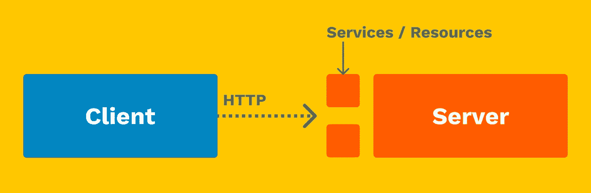
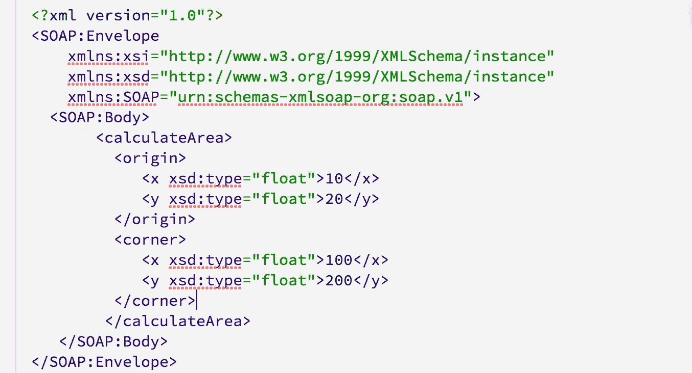
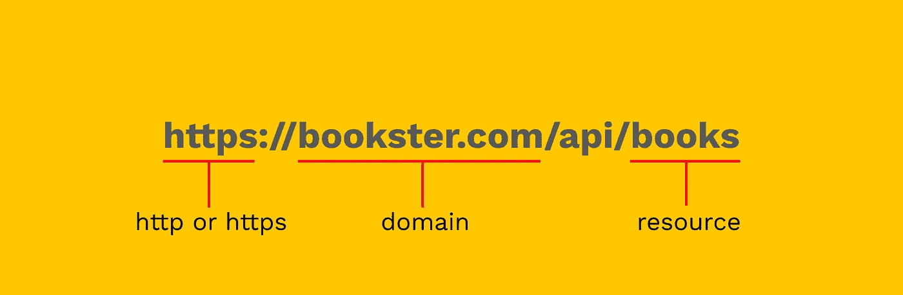

# RESTful 服务解释！

> 原文：<https://levelup.gitconnected.com/restful-services-explained-185009310ddf>

理解 RESTful Web 服务是当今任何软件工程师的关键。


RESTful APIs 几乎用于每个软件项目。安娜斯塔西娅·杜尔吉尔在 [Unsplash](https://unsplash.com/s/photos/connected?utm_source=unsplash&utm_medium=referral&utm_content=creditCopyText) 上的照片

表述性状态转移是一种软件架构风格，它定义了一组用于创建 Web 服务的约束。符合 REST 架构风格的 Web 服务，称为 RESTful Web 服务，提供互联网上计算机系统之间的互操作性。

好吧，什么？这是你在谷歌上搜索“RESTful 服务”时出现的第一个定义，听起来就像是从软件开发人员的噩梦中走出来的。

让我们深入研究一下&用更简单的术语真正理解什么是 RESTful 服务。

在我们开始之前，让我们看一下客户机-服务器体系结构。

## 客户机-服务器体系结构

我们今天使用的大多数(如果不是全部)应用程序都遵循客户端-服务器架构。它由希望从服务器访问资源的客户机组成，服务器是提供客户机请求的所有数据的中央存储。客户端可以是一个应用程序或前端部分本身&它需要从服务器或后端获取数据。这种传输是通过 HTTP 协议进行的，该协议为网络提供了动力。

服务器揭示了一组可以通过 HTTP 请求访问的服务。



客户机-服务器体系结构

客户机向服务器发送一个 HTTP 请求&服务器返回所需的数据。请注意，一个客户端可以同时连接到许多服务器，发送 HTTP 请求。类似地，服务器可以接收来自多个客户端的请求。

这是休息的切入点。

## REST:表征状态转移

REST 的完整形式可能相当吓人，尤其是对于一个新的开发人员来说，甚至很难大胆猜测它在做什么。Roy Fielding 和他的同事在他们的博士论文中首次定义了这个术语，他有一个清晰的愿景:

> 创建一个允许任何服务器与世界上任何服务器通信的标准。

如果你认为 REST 很复杂，那么检查 SOAP，它是 REST 出现之前使用的标准。



呀，呃-呃。

在高层次上，REST 原则为执行一些基本操作提供支持，例如:

1.  创造
2.  阅读
3.  更新
4.  删除

它们更简单地被称为 CRUD 操作。让我们用一个真实的例子来看看这个约定。假设我们有一个网上书店， ***Bookster*** ，顾客可以从那里订购书籍。我们有一个客户端应用程序，列出了可供销售的书籍。

客户端可以通过向 URL `http://bookster.com/api/books`发送 HTTP 请求来与我们的服务器对话

**注意**:我们的 URL 可以以`https`开头，用于安全通道上的通信&建议我们使用`https`，因为用户在我们的网站上订购图书时会输入他们的支付信息。

然后是我们网站的域名，`bookster.com`。接下来，我们有`/api/`,它实际上不是强制性的，但被许多公司用作公开其 RESTful 服务的最佳实践。此外，在 URL 的某个地方使用`api`有助于清楚地识别这个端点将连接到一个服务器。

另一种方法是创建一个包含单词`api`的子域，比如`api.bookster.com`。

之后，我们有了集合名称，注意是复数形式的`books`。在 REST 架构中，这被称为资源。



分解一个网址

我们可以公开我们的服务，如书籍、订单、作者等。所有的 CRUD 操作，如获取书籍、更新书籍、添加新书或删除书籍，都将通过向上述 URL 发送适当的请求来完成。

HTTP 请求的类型定义了请求对资源的意图。这种类型称为 HTTP 动词。

标准的 HTTP 动词有:

1.  **GET** :读取资源列表或特定资源
2.  **发布**:向资源添加数据
3.  **上传**:更新资源数据
4.  **删除**:从资源中删除数据

让我们用 Bookster API 例子来研究这些动词。

## 得到

让我们得到一份在 Bookster 数据库中所有可用书籍的清单。请注意，我们使用了复数`books`来表示书籍列表。

```
Request Type: GET /api/booksResponse:
{
   [
     {'id':1, 'name':'Steve Jobs', 'author': 'Walter Issacson'},
     {'id':2, 'name':'Bad Blood', 'author': 'John Carreyrou'},
     {'id':3, 'name':'The Godfather', 'author': 'Mario Puzo'},
     ...
   ]
}
```

如果我们想得到一本书，我们应该在请求中传递这本书的 id。这确保了 API 将返回关于单本书的信息。

```
Request Type: GET /api/books/**1**Response:
{
  'id':1, 
  'name':'Steve Jobs', 
  'author': 'Walter Issacson'
}
```

## **帖子**

要将一本新书添加到数据库中，我们必须使用 POST 动词。POST 请求需要一个包含要添加到数据库中的新数据的信息的主体。

此外，由于我们正在向数据库中添加一本新书，所以我们不必向请求中添加一个`id`。

```
Request Type: POST /api/books/Request Body:
{ 
  'name':'A Gentleman in Moscow', 
  'author': 'Amor Towles'
}Response:
{ 
  'id': 4,
  'name':'A Gentleman in Moscow', 
  'author': 'Amor Toles'
}
```

API 在我们的数据库中创建一个新的图书条目&数据库分配一个 ID 并返回添加到数据库中的数据。

## 放

哦不！当我们在 POST 请求中插入一个新条目时，我们在作者的名字上犯了一个错误。谢天谢地，我们有一个 PUT 类型请求来更新我们笨拙的拼写。

PUT 请求类型用于更新数据库中的现有条目。因为我们在更新时处理一个特定的条目，所以我们需要传递一个`id`。

```
Request Type: PUT /api/books/4Request Body:
{ 
  'author': 'Amor Towles'
}Response:
{ 
  'id': 4,
  'name':'A Gentleman in Moscow', 
  'author': 'Amor Towles'
}
```

## 删除

删除请求正如它所说的那样，从数据库中删除一个条目。这需要一个 id 来知道要删除哪个条目。

```
Request Type: DELETE /api/books/4Response:
{ 
  'msg': 'Book deleted successfully!'
}
```

所以这都是关于 RESTful Web 服务的。我们使用一个简单的有意义的地址向客户端公开我们的资源，并支持各种操作，如创建、读取、更新和删除。这些是几乎所有软件应用程序中最常用的 HTTP 动词。

```
GET      /api/books
GET      /api/books/1
POST     /api/books
PUT      /api/books/4
DELETE   /api/books/4
```

使用使用上述 REST 动词设计的定义良好的结构和架构，您可以为您的客户创建可维护和可伸缩的后端服务！

编码快乐！❤️

# 分级编码

感谢您成为我们社区的一员！ [**订阅我们的 YouTube 频道**](https://www.youtube.com/channel/UC3v9kBR_ab4UHXXdknz8Fbg?sub_confirmation=1) 或者加入 [**Skilled.dev 编码面试课程**](https://skilled.dev/) 。

[](https://skilled.dev) [## 编写面试问题

### 掌握编码面试的过程

技术开发](https://skilled.dev)