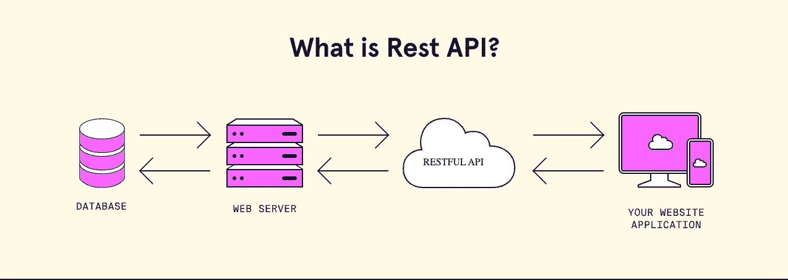

# 用 Java 实现 RESTful

> 原文：<https://levelup.gitconnected.com/restful-with-java-6ff632931d6f>

图片来源:[www.codecademy.com](http://www.codecademy.com)

在之前的帖子中，我试图解释异步通信的两个例子， [Rabbitmq](/rabbitmq-with-java-fe4390be6e87) 和 [Kafka](/apache-kafka-with-java-7c3a0dafd7f5) 。

今天，我想讨论同步通信及其众所周知的例子，其余的文章将主要是理论性的。但是，我也会分享一些代码来解释我们如何使用它。

# **宁静**

这是一种众所周知的同步通信方式。 **RESTful** 是**RE**presentational**S**tate**T**transfer 的首字母缩写，它是一种架构风格，用于在 web 上的系统之间提供标准，使系统之间更容易相互通信。

REST 已经被整个软件行业所采用，并且是一套被广泛接受的创建无状态、可靠的 web APIs 的指导原则。遵循 REST 约束的 web API 被非正式地描述为 *RESTful* 。

无国籍状态

它是无状态的，这意味着理想情况下客户机和服务器之间不应该保持任何连接。

客户端负责将其上下文传递给服务器，然后服务器可以存储该上下文来处理客户端的进一步请求。例如，由服务器维护的会话由客户端传递的会话标识符来标识。

**无国籍的好处**

*   Web 服务可以分别对待每个方法的调用。
*   Web 服务不需要维护客户端之前的交互。
*   这反过来简化了应用程序设计。
*   与 TCP 不同，HTTP 本身是一种无状态协议，因此 RESTful Web 服务可以与 HTTP 协议无缝协作。

**无国籍的弊端**

*   需要为每个请求添加一个额外的标题层来保存客户端的状态。
*   为了安全起见，我们可能需要在每个请求中添加标题信息。

RESTful web APIs 通常松散地基于 HTTP 方法，通过 URL 编码的参数访问资源，并使用 JSON 或 XML 传输数据。

## HTTP 动词

我们在与 REST 系统中的资源进行交互的请求中使用了一些基本的 HTTP 动词:

*   **GET** :检索一个特定的资源(通过 id)或者一个资源集合(列表)
*   创建一个新的资源
*   **PUT** :更新一个特定的资源(按 id)
*   **补丁**:对资源应用部分修改。
*   **删除**:根据 id 删除特定资源

## 响应代码

我想在下面提供一些重要的或最常用的响应代码。

**信息回复(100 - 199)**

信息性响应表明请求已被接收和理解。

**成功回复(200–299)**

这些状态代码表示客户端请求的操作已被接收、理解和接受。

成功的回应

**重定向消息(300–399)**

指示客户端必须采取额外的操作来完成请求。

重定向消息

**客户端错误响应(400–499)**

当您得到这些错误代码时，请注意这是由客户端问题引起的。

**客户端错误响应**

**服务器错误响应(500–599)**

但是当您得到这些错误代码时，您应该考虑您的服务器端问题。

**服务器错误响应**

更多响应代码请点击[此处](https://developer.mozilla.org/en-US/docs/Web/HTTP/Status)。

## 描述语言

人们对用语言来描述 API 以便更容易地为客户机和服务器编写文档甚至生成框架有着浓厚的兴趣。其中一些描述如下:

*   **Swagger:** 是一种用于描述 API 的YAML/JSON 语言。它包括编辑器、代码生成器、API 文档以及与其他服务的集成。详情可以点击[这里](http://swagger.io)。
*   **RAML，Apiary.io 等。**

## 客户

为了调用和测试我们的 RESTful API，我们需要一个客户端。可以使用浏览器来调用 REST API。此外，我们可以使用几个不同的客户端来测试我们的 API。我主要使用 Postman 来调用和测试我的 RESTful APIs。

*   浏览器特别是与 swagger 集成，你可以很容易地将其用作客户端。
*   **Postman "** 使您能够轻松地探索、调试和测试您的 API，同时还使您能够为 HTTP、REST、SOAP、GraphQL 和 WebSockets 定义复杂的 API 请求
*   Curl:Curl 是一个比较流行的库和命令行工具，它允许你在不同的资源上调用不同的协议。详情请点击[这里](https://curl.haxx.se)
*   HTTP pie:是一个非常灵活且易于使用的客户端，用于通过 HTTP 与资源进行交互。详情可以点击[这里](https://httpie.org)

如何用 Java 开发 RESTful API？

你会在这部分下面找到用 Sprinboot 写的 RESTful API 例子。但是，在跳到代码部分之前，我想解释一些 **@nnotations** 。

***@RestController*** 是 RESTful API 整个 Web 层的核心构件。它是控制器的专门版本。它包含了 ***@Controller*** 和***@ response body***注释，从而简化了控制器的实现。如果你用***@ rest controller***，那就没必要用***@ response body***也。

***@ response body***将一个 Java 对象映射到 *HttpRequest* 主体。简单地说，将 Java 对象转换成 JSON 对象，并传递回 *HttpResponse* 对象。

**@RequestBody** 将 *HttpRequest* 主体映射到一个 Java 对象上。简单来说，就是把 JSON 对象转换成 Java 对象。

***@ ResponseStatus****用于设置 HTTP 响应代码。*

**@RequestMapping** 用于将 web 请求映射到方法上。此外，当我们使用方法级别时，spring 为我们简化了这一点。

*   **@PostMapping** 其实和**@ request mapping**(method = request method)一样。帖子)
*   **@GetMapping** 其实和**@ request mapping**(method = request method)一样。获取)
*   **@PutMapping** 其实和**@ request mapping**(method = request method。放)
*   **@DeleteMapping** 其实和**@ request mapping**(method = request method)一样。删除)
*   **@PatchMapping** 其实和 **@RequestMapping** 一样(method = RequestMethod。补丁)

***@ path variable***用于从 URI 中提取值。

***@ request param***用于从请求中提取查询参数。

代码如下所示:

我之前为这个例子开发了两个项目。我把它们上传到了我的 Github。如果你愿意，你可以在这里找到第一个和第二个项目[。此外，我强烈建议你小心这个](https://github.com/atesibrahim/vending-machine)[链接](https://medium.com/@liams_o/15-fundamental-tips-on-rest-api-design-9a05bcd42920)中给出的一些规则。

期待在下一篇文章中见到您。

希望有帮助。

感谢阅读…

***参考文献:***

 [## 经验和评价

### 自 1994 年以来，REST 建筑风格一直被用来指导设计和开发…

www.ics.uci.edu](https://www.ics.uci.edu/~fielding/pubs/dissertation/evaluation.htm#sec_6_3)  [## 什么是休息？代码学院

### REST 或表述性状态转移是一种架构风格，用于在计算机系统之间提供标准…

www.codecademy.com](https://www.codecademy.com/article/what-is-rest)  [## HTTP 状态代码列表-维基百科

### 这是超文本传输协议(HTTP)响应状态代码的列表。状态代码由服务器在…

en.wikipedia.org](https://en.wikipedia.org/wiki/List_of_HTTP_status_codes)  [## HTTP 响应状态代码- HTTP | MDN

### 这个临时响应表明客户端应该继续请求或者忽略响应，如果请求…

developer.mozilla.org](https://developer.mozilla.org/en-US/docs/Web/HTTP/Status#successful_responses)  [## 什么是 REST - REST API 教程

### REST 是表述性状态转移的首字母缩写，是分布式超媒体系统的一种架构风格…

restfulapi.net](https://restfulapi.net/)  [## Postman API 平台|工具

### Postman 平台包括一套全面的工具，有助于加速 API 的生命周期——从设计、测试…

www.postman.com](https://www.postman.com/product/tools/) 

# 分级编码

感谢您成为我们社区的一员！在你离开之前:

*   👏为故事鼓掌，跟着作者走👉
*   📰查看[升级编码出版物](https://levelup.gitconnected.com/?utm_source=pub&utm_medium=post)中的更多内容
*   🔔关注我们:[Twitter](https://twitter.com/gitconnected)|[LinkedIn](https://www.linkedin.com/company/gitconnected)|[时事通讯](https://newsletter.levelup.dev)

🚀👉 [**软件工程师的顶级工作**](https://jobs.levelup.dev/jobs?utm_source=pub&utm_medium=post)