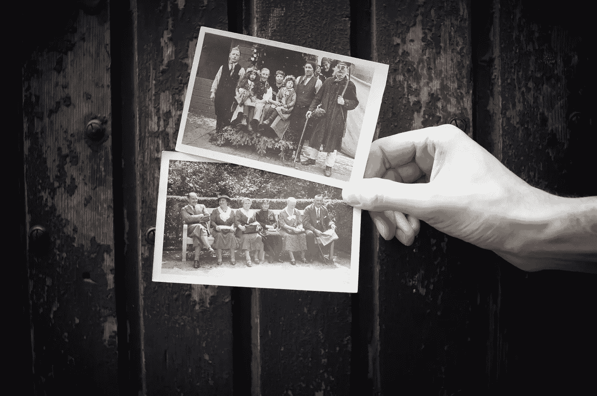
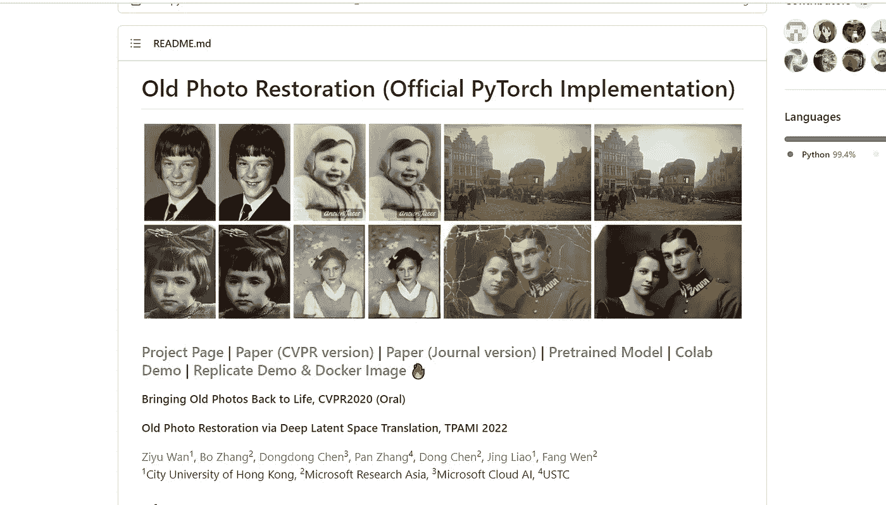
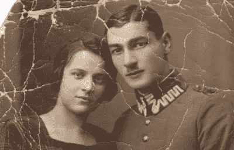
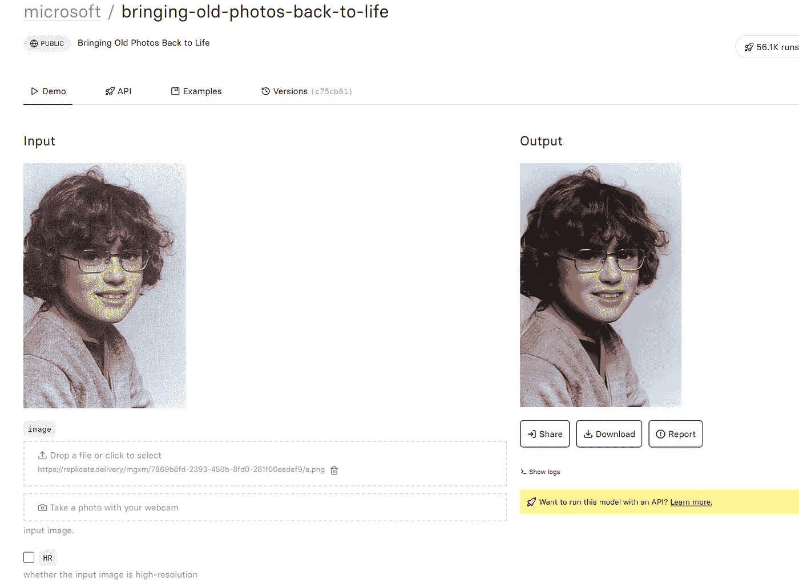
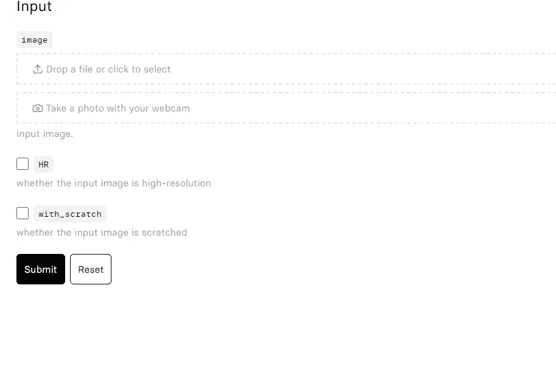
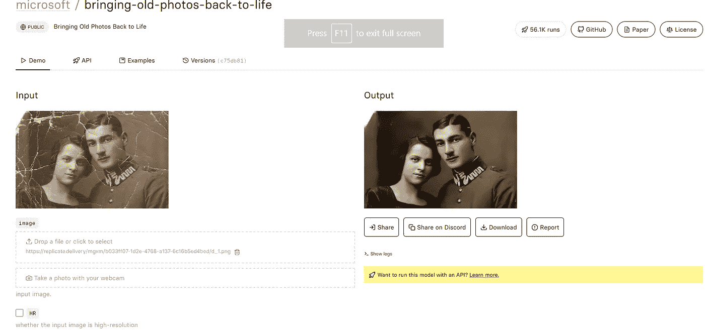
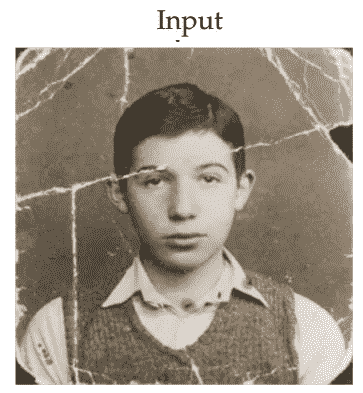
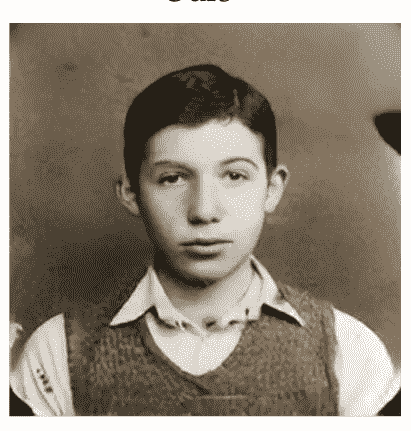
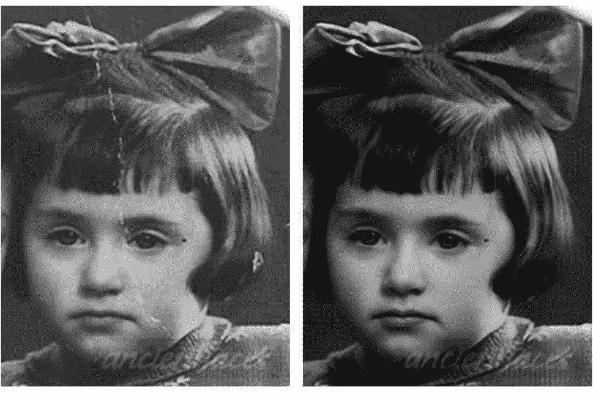

# 使用人工智能和 Python 恢复旧照片

> 原文：<https://levelup.gitconnected.com/restoring-old-photos-using-ai-and-python-d44fb71f9fdc>

修复那些随着时间严重退化的老照片。

你祖父母年轻时的照片被折叠，有些地方被撕破，有刮痕和灰尘，没有数码备份。如果人工智能能够恢复它们呢？甚至把它们转换成高清。这难道不是你感兴趣的事情吗？

谢丽尔·温-布尼达在 [Unsplash](https://unsplash.com/s/photos/vintage-old-photographs?utm_source=unsplash&utm_medium=referral&utm_content=creditCopyText) 上的照片

在这篇文章中，我将向你展示如何做到这一点。不需要编程知识。我们将使用一个网络应用程序，人工智能模型被加载并准备好处理您的图像。

*文章末尾还有一个人工智能模型的链接，可以帮助你给这些图像上色。*

微软研究院前段时间发布了一篇名为《通过深度潜空间翻译进行老照片修复》的论文。这里有 https://github . com/Microsoft/bring-Old-Photos-Back-to-Life 提供 PyTorch 实现和 colab 笔记本。

我将使用 replicate.com，那里的人工智能模型已经发布，可以运行。我将使用下面的图像来测试模型。

样本输入图像

转到[https://replicate . com/Microsoft/bring-old-photos-back-to-life](https://replicate.com/microsoft/bringing-old-photos-back-to-life)
这是托管 AI 模型的地方。您应该会看到类似这样的内容。

Replicate.com 模型页面

点击“放下文件或点击选择”选项。这将要求您输入图像。根据您上传的图像选择其他选项。

输入选项

单击提交。预测通常在 88 秒内完成。之后，您应该会看到类似这样的内容。

输入和输出

瞧啊。这是你重建的图像。现在拿出旧相册，开始吧。

此外，这里还有一些输入和输出图像的示例。

示例图像

这是另一个例子。

示例 2 输入

输出:

示例二输出

示例 3 输入和输出

示例 4 输入和输出

这是我们使用的原始图像，并排输入和输出。

并排的原始图像

现在我们已经修复了图像，我们可以用人工智能给它们着色吗？

是的，我们可以！

> **你对人工智能和机器学习有热情吗？**您是否希望**了解**该领域的最新进展和见解？
> 
> 然后**订阅介质是必须的**。只需**每月 5 美元**，你就可以**从该领域的专家那里获得丰富的知识和见解**。
> 
> 另外，你的订阅有助于支持像我这样的独立作家和研究人员。随着人工智能世界的快速变化，保持消息灵通至关重要。
> 不要错过——今天就加入 Medium，成为人工智能革命的一份子。这是你做过的最好的决定。
> **今日订阅中** **利用本** [**链接**](https://medium.com/@arjungullbadhar/membership) **。**

 [## 使用 Python 和 AI 给黑白照片上色。

### 想知道你以前的黑白照片在现实中是什么样子吗？让我们找出答案。

levelup.gitconnected.com](/colorize-black-and-white-photos-using-python-and-ai-5b3e5f85df44) 

# 分级编码

感谢您成为我们社区的一员！在你离开之前:

*   👏为故事鼓掌，跟着作者走👉
*   📰查看[升级编码出版物](https://levelup.gitconnected.com/?utm_source=pub&utm_medium=post)中的更多内容
*   🔔关注我们:[Twitter](https://twitter.com/gitconnected)|[LinkedIn](https://www.linkedin.com/company/gitconnected)|[时事通讯](https://newsletter.levelup.dev)

🚀👉 [**加入升级人才集体，找到一份惊艳的工作**](https://jobs.levelup.dev/talent/welcome?referral=true)