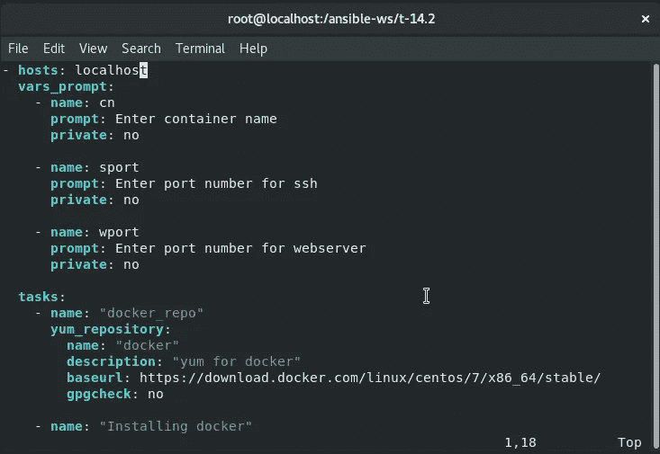
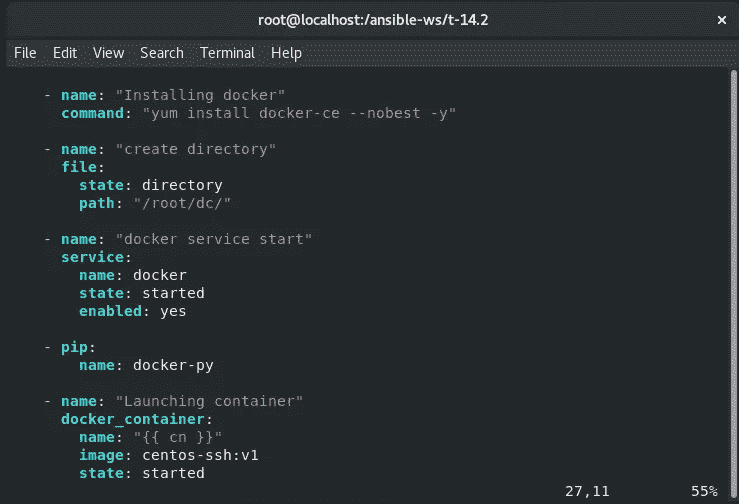
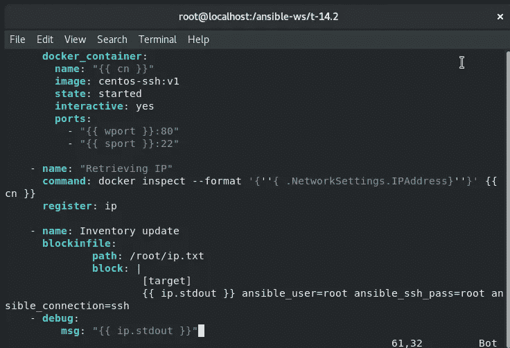
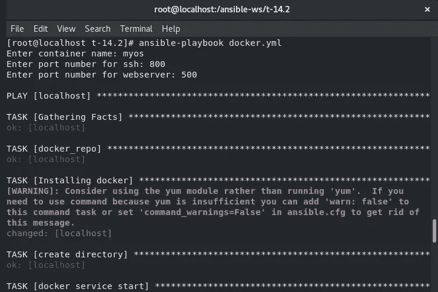
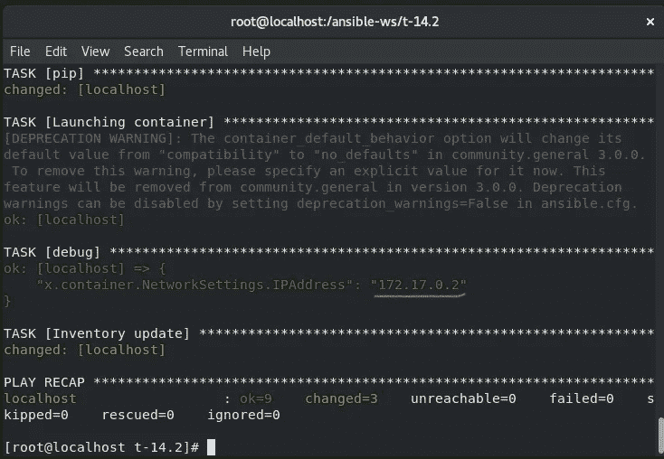
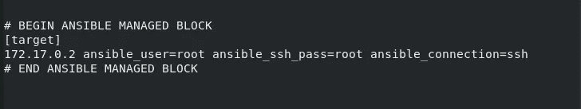
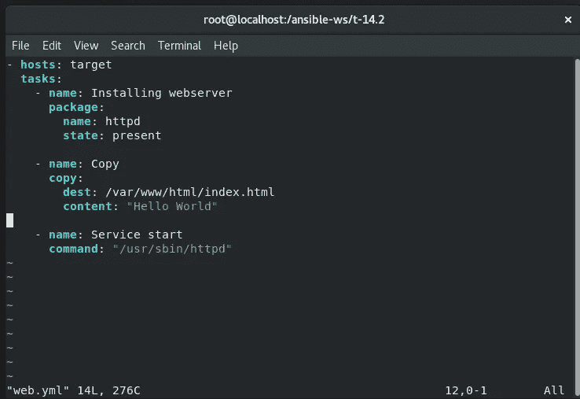
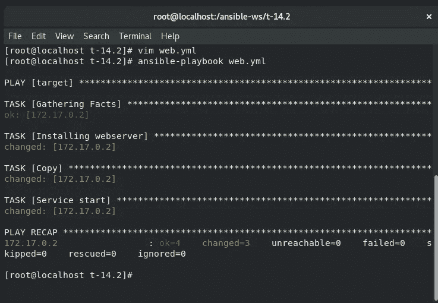
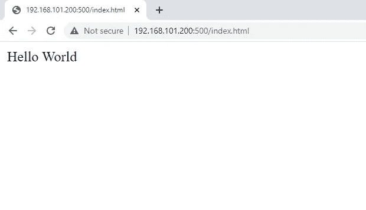

# 使用 Ansible 动态检索 Docker 容器的 IP 并在容器内配置 web 服务器。

> 原文：<https://levelup.gitconnected.com/retrieving-docker-containers-ip-dynamically-using-ansible-and-configuring-a-webserver-inside-the-275b749db01d>

在**责任**中，由**责任控制节点**控制的托管主机或服务器在**主机清单文件**中定义，如中所述。主机清单文件是一个文本文件，由托管主机或远程服务器的**主机名**或 **IP 地址**组成。

**托管主机**既可以作为单独的条目列出，也可以在一个组名下分类，我们将在后面看到。在 Ansible 中，库存档案有两种类型:**静态**和**动态**。静态清单文件是一个纯文本文件，它包含在主机组下使用主机名或 IP 地址声明的受管主机列表。

在配置中，尤其是像 **Docker** 这样的容器化设置中，当您添加或停用服务器时，清单文件会不断变化，因此监视清单文件中定义的主机是一项真正的挑战。返回到主机文件并用主机的 IP 地址更新主机列表变得很不方便。

**在这篇博客中，我们将使用 dockerfile 创建并构建一个支持 SSH 的 Docker 映像，然后从该映像启动一个容器，使用 ansible playbook 检索 IP 地址并在清单中动态更新它，并在启动的 Docker 容器中进一步配置 webserver。**

对于这个问题陈述，我在 Dockerfile 的帮助下使用了我自己的支持 ssh 的 docker 映像，并将其推入 DockerHub。我们需要一个支持 ssh 的映像，因为默认情况下 ansible 使用 ssh 协议登录任何容器或操作系统，并在那里进行配置。这是我的 docker 图片，你可以直接下载使用:

 [## 码头枢纽

### CentOS-SSH

hub.docker.com](https://hub.docker.com/repository/docker/divyakurothe/centos-ssh) 

现在，下一部分是创建一个 Ansible playbook，它将启动容器，检索其 IP，并动态更新清单中的 IP***。***

这个剧本将询问容器名称、暴露的 SSH 和 WebServer 端口，然后它将从给定的映像启动容器。启动后，它会将输出注册到一个名为“x”的变量中。然后，它将检索变量容器的 IP，并在名为“ip.txt”的清单文件中更新它。

行动手册的输出:

库存 ip.txt:

接下来，我们只需为 webserver 编写一个剧本，ansible 将在容器中配置它

行动手册的输出

在这里，我使用了基本容器的 IP 和我公开的端口号，即端口 500。另一种方法是你可以写容器的 IP 来查看你创建的网页。

**因此，我们已经成功启动了一个容器，并使用 ansible playbook 检索和更新了 IP 地址，还在其中配置了 web 服务器。**

这项任务是与 [Prithviraj Singh](https://medium.com/u/7ac4667c8ebe?source=post_page-----275b749db01d--------------------------------) 合作完成的，感谢他的建设性努力和支持。

这是所有的乡亲。感谢阅读:)