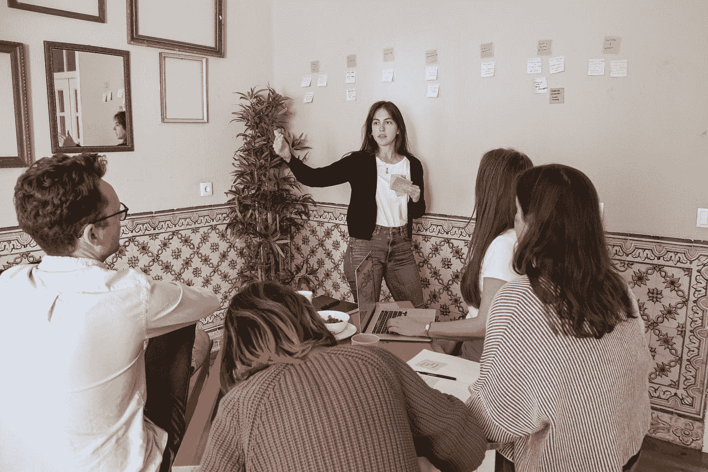
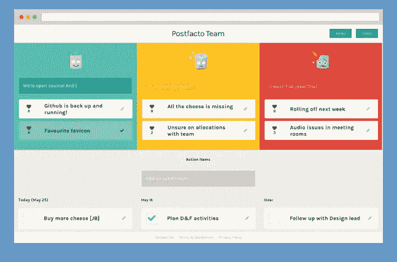
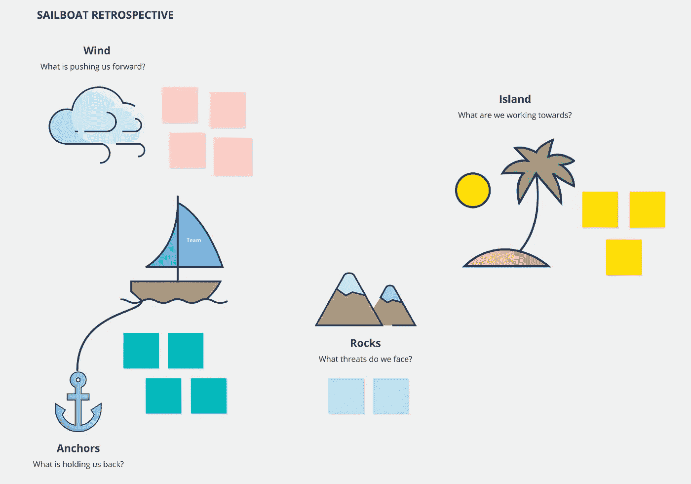
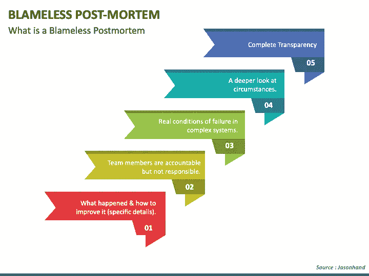

# 回顾:为什么以及如何使用它们

> 原文：<https://levelup.gitconnected.com/retrospectives-and-how-to-use-them-dd3d333ff825>

你和你的团队目前是否在使用回顾，并希望从中获得更多？听说了这些回顾性的东西，想了解更多？我在回顾会上分享了我的个人经历，以及我在会议过程中学到的一些技巧和诀窍。

由 [Unsplash](https://unsplash.com?utm_source=medium&utm_medium=referral) 上的 [Parabol](https://unsplash.com/@parabol?utm_source=medium&utm_medium=referral) 拍摄

# **目的**

没有人想被困在没有目的或价值的会议中，尤其是在一个偏远的工作场所。我们都有太多的项目需要进展！回顾通常与某种敏捷风格联系在一起，是 sprint 中重复出现的会议之一，每周或每两周一次。最初的参考来自于[项目回顾:
Norm Kerth 的团队回顾手册](https://amzn.to/3ukKDHE)。我们的目标是留出明确的时间，作为一个团队在最后的冲刺阶段回顾过去，并确定哪些进展顺利，存在哪些问题，以及哪些可以改进。有时回顾会包括演示，还包括高层管理人员或外部利益相关者，但是我鼓励你将这部分分成单独的会议，这样你就可以从回顾会中获得最大收益。

**什么进展顺利**

这部分是关于团队的成功和分享成就。快速修复生产中的一个 bug？在只关注生产问题之前，对他们的工作大加赞赏。最终升级一个困扰您团队超过 2 年的数据库？！？也庆祝一下吧！不要忘记庆祝系统或软件的衰落，因为这也是一项成就，可能需要付出很多努力。

*下面是一个要庆祝的事件的示例列表:*
-表扬团队目标的伟大工作或成就
-发布到产品中(MVP，release 1，release 1001)
-学习(可能是领域、技术或从失败中学习)
-夕阳系统或大型重构

**有哪些问题**

我看到这个部分以“我想知道”或“如果”开始，提出发人深省的问题，并让更广泛的团队参与解决问题的技能。

> "如果我们推迟发射会怎么样？"“我想知道是否有人会真正不快乐”

也许你有一个需要 3 个审查者的过程。有必要吗？创建该流程的初衷是什么？团队中有人记得为什么做出这个决定吗？这个决定应该重新考虑吗？

这些问题有助于突破不必要的流程，寻找团队甚至跨团队改进的机会。保持好奇会发现这些情况，如果你经常问这类问题，团队会继续学习。

杰森·古德曼在 [Unsplash](https://unsplash.com?utm_source=medium&utm_medium=referral) 上的照片

**有哪些可以改进的地方**

这是真正好的对话开始和可能发生的地方。对团队来说，保持足够的心理安全是至关重要的，这样在讨论问题的时候，你就不会感到被指责或被点名。重点是*团队或流程改进*，而不是一个人是如何搞砸的。

> 心理安全是能够展示和利用自己，而不用担心自我形象、地位或职业的负面后果。威廉·卡恩

注意没有记下行动项目的过度抱怨或抱怨。如果某件事在团队中引起了如此多的挫折或摩擦，那么就应该讨论解决方案，从而重复并改善或消除这些挫折。

> 回顾的一个，如果不是最重要的部分，是捕获行动项目。

你就是这样迭代，实验，失败，继续学习的。如果回顾会中没有行动项目，你应该质疑是否讨论或确定了真正的问题。

在记录行动项目时，确保记录下来，并放在一个一周都可以使用的地方。如果行动项目不可见，那么它们更容易被遗忘，你或团队将出现在以下回顾和*中，然后*记住应该注意的行动项目。次要说明:为每个行动项目分配负责人。如果一个行动项的所有者是“团队”,那么它可能永远不会取得任何进展。

亚历克斯·康德拉蒂耶夫在 [Unsplash](https://unsplash.com?utm_source=medium&utm_medium=referral) 上拍摄的照片

# **追溯变异**

在任何一种回顾形式中，主要的问题仍然被提出或被回答，但是在我们对每个主题的详细程度上存在差异。

**3 列格式**

这是一个开源回顾工具，叫做[事后](https://mooingcat.github.io/postfacto/)。您可以看到这 3 列概括了我们之前讨论的三个时段。通常团队会见面(可能是虚拟的),花几分钟时间在背景音乐下将项目添加到板上，然后指定某人领导或分享他们的屏幕，并从板上选取项目。另一种变化是做“爆米花”,谁有这个东西，谁就挑选下一个人。这使得会议的领导权分散了。行动项目在底部捕获，一旦回顾完成，它将被存档(右上)，以便以后查看。我个人总是喜欢以绿色栏中的东西结束，但是做对你有用的事情！

**优点**

*   灵活的
*   开放的形式，任何问题都可以浮出水面

**缺点**

*   会偏离主题，陷入抱怨或抱怨
*   可以忘记行动项目的独立工具

上图是**舰回顾**。这个变体的名字来源于作为团队的船，它识别风(帮助)、岩石(威胁)和岛屿(目标)。我见过这种风格被用在 MVP 发布的中间，以及在发布过程中有规律的节奏，以适应每个主题。对于团队中一些人不了解的问题，理解全局并在团队中获得共鸣是非常有用的。

**优点**

*   更有条理的对话
*   非常适合在重要目标或风险方面与团队保持一致

**缺点**

*   讨论不符合框架的感受或问题时不够灵活

上图是一个**无可指责的验尸结构**。这只是回顾的不同结构，通常在产品发布、生产事件或系统中断后进行。这种格式有更多的细节，通常您会看到特定事件发生的时间以及您的流程如何处理该事件。最常见的情况是，会议中有高管或首席级代表，以更好地理解和确定是否有必要进行更多的外部沟通。拥有一次成功的无可指责的事后检查的关键在于名字。 ***得无可指责*** 。目标是识别流程或理解或员工中的差距，然后创建行动项目来解决它们。一个无可指责的事后分析可以是一个回顾的有力变体，特别是如果一个过程的详细概要是所期望的。

**优点**

*   进行透明对话和确定流程改进的良好结构
*   关于要保留和重复的流程的文档

**缺点**

*   最高管理层或管理层的参与可能会令人伤脑筋
*   需要外部团队成员的心理安全，以保持其无可指责

# **多久一次**

就像我之前提到的，回顾通常是在你冲刺周期的最后，所以每一到两周。但是，只要有意义，你就应该使用其他形式，如果你需要对某个特定的特性、版本或主题进行回顾，那么我鼓励你把它和你的“正常”回顾分开安排，作为一个更大的小组或团队来讨论。敏捷的一个重要方面是获得快速反馈，你越快、越小地获得反馈，你就能越快地适应或改变实验过程并获得新的知识。在我看来，回顾会是 ***最重要的*** 定期会议，如果出现冲突，你应该重新安排回顾会，而不是取消。取消回顾是团队成员不理解价值或不参与的标志。

# **结论**

回顾是一个强大的工具，对于一个高绩效的团队来说非常重要。确保你能从回顾中得到最大的收获，改变形式或节奏，使之对你和你的团队有意义。不要忘记确定行动项目并跟进，这样你就能继续拥有一个高绩效的团队！如果你的回顾陷入了大喊大叫或抱怨，那就把它拉回来，重新关注行动项目，讨论实际上可以改进的问题。如果你对回顾的起源感兴趣，可以看看这篇文章。你还有其他的回顾性变化吗？请在评论里分享，这样我才能学习！

如果你喜欢这篇文章，考虑[订阅 Medium](https://medium.com/@ascourter/membership) ！

如果你或你的公司有兴趣找人进行技术面试，那么请在 Twitter ( [@Exosyphon](http://twitter.com/Exosyphon) )上给我发 DM，或者访问我的[网站](https://andrewcourter.com/)。如果你喜欢这样的话题，那么你可能也会喜欢我的 Youtube 频道。如果你想支持更多像这样的内容 [buymeacoffee](https://www.buymeacoffee.com/andrewcourter) 。祝您愉快！

# 分级编码

感谢您成为我们社区的一员！更多内容见[级编码出版物](https://levelup.gitconnected.com/)。
跟随:[推特](https://twitter.com/gitconnected)，[领英](https://www.linkedin.com/company/gitconnected)，[通迅](https://newsletter.levelup.dev/)
**升一级正在改造理工大招聘➡️** [**加入我们的人才集体**](https://jobs.levelup.dev/talent/welcome?referral=true)