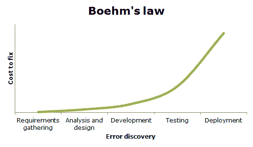
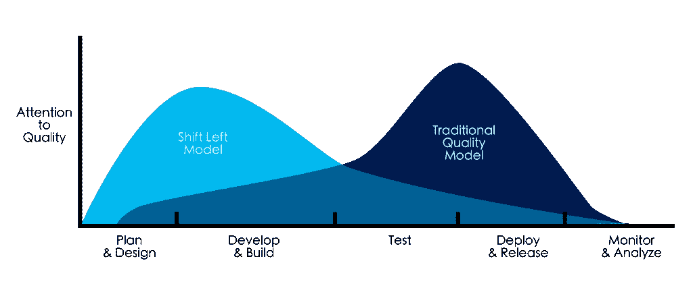
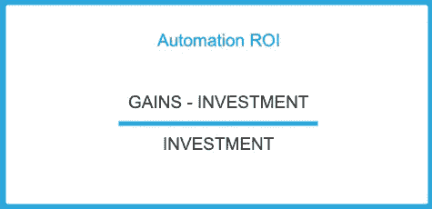

# 软件测试的投资回报是一个神话

> 原文：<https://levelup.gitconnected.com/return-on-investment-for-software-testing-is-a-myth-c54e989cbc9f>

## **或者:如何解释为什么你的客户应该投资测试**

照片由[尼克·费因斯](https://unsplash.com/@jannerboy62?utm_source=unsplash&utm_medium=referral&utm_content=creditCopyText)在 [Unsplash](https://unsplash.com/?utm_source=unsplash&utm_medium=referral&utm_content=creditCopyText) 上拍摄

我总是必须向我的客户解释为什么投资测试自动化或者一般的测试是重要的。我总是发现很难解释他们实际上节省了多少。我使用这样的论点:“在开发的早期阶段采用测试将会为您省钱”。但是我永远无法依靠任何实际数字来支持这些说法。

# 投资回报理论

当我第一次开始测试时，我被告知 TMap 方法的方式。培训中的一个概念被称为“博姆定律”，以巴里·博姆命名。背后的想法很简单。如果你能在早期开发阶段发现缺陷，你将会节省大量的时间和金钱。但是如果你在后期发现缺陷，成本会很高。这是因为解决需求比解决软件更容易。

[https://briankegels . files . WordPress . com/2012/07/boehmlaw . gif](https://briankegels.files.wordpress.com/2012/07/boehmlaw.gif)

这是在 1979 年，虽然波姆定律今天仍然适用(现在被采用为'[左移【T9])，但它只是一个参考。它说明了为什么在过程的早期开始测试是一个好主意，但是它并没有显示出你实际上会节省多少。](https://en.wikipedia.org/wiki/Shift-left_testing)

我决定做一些研究，但没多久我就发现关于这个主题的文章并不多。我找到的大部分文章，参考的都是波姆定律或者左移。

[https://devopedia.org/shift-left](https://devopedia.org/shift-left)

在阅读了大量关于通过测试省钱的商业网站后，我看到了 Smartbear 的一篇文章。

Smartbear 是知名测试工具 SoapUI 背后的公司。或者对铁杆付费粉丝来说:准备好了！API。Smartbear 开发了一个[模型](https://smartbear.com/resources/ebooks/6-ways-to-measure-the-roi-of-automated-testing/)，你可以用它来计算测试的成本和潜在收益。该模型由以下变量组成:

*   测试用例的数量，
*   可用自动化，
*   测试用例的复杂性，
*   测试冗余，
*   缺陷泄漏，
*   还有更多。

Smartbear 声称，基于这些变量，你可以计算在工具和资源上的投资。当你知道投资和可能的收益，你就可以计算你的投资回报率。他们使用以下公式:

由我创造的。

当然有些变量很难分析。但是 Smartbear 在计算投资回报率方面提供了一个有趣的解决方案。如果你想让你现有的测试过程更加有效，这是很有用的。但是这并没有帮助我告诉我的潜在客户为什么投资测试会为他们省钱。

# 打破神话

正如我前面提到的，我永远无法给出正确的答案。但是，我总能让我的客户相信测试是重要的，值得投资。

最近，我和另一位测试爱好者 Jan-Jaap Cannegieter 进行了一次对话。Jan-Jaap 写了大约 10 本关于测试的书，并在国际会议上发言。我很好奇像他这样有经验的人会如何回答这个问题。所以我问他，他这样回答我:

> "你永远不会知道你是否预先存了钱。"

等等，什么？现在，你可能认为这不是给你潜在客户的明智答案。但是让我们面对它，它是诚实和真实的。想一想:通过引入测试，你正在引入一个新的过程。这个过程必须嵌入到组织中。这将耗费时间和资源。人们必须适应新的工作方式。他们必须学习新技能和新工具。bug 会被发现，甚至会被阻止，但目前还没有基准来衡量。直到过了一段时间，你才能对统计数据有深入的了解，并衡量进步。所以省钱只有长期才有可能。

那么你应该怎么做呢？如果你的客户还在听，告诉他不测试的潜在风险。

问他或她以下两个问题:

1.  在将产品发布给客户之前不进行测试会有什么风险？
2.  为了最小化这些风险，你愿意付出多少？或者换句话说:你愿意承受多大的痛苦，如果有的话？

有些风险在短期内会让你付出代价，但从长期来看，其他风险会让你付出更大的代价。如果一家公司的地位受到损害，可能需要数年时间才能恢复。这将影响销售，因为顾客会把生意转移到别处。我敢打赌，这将花费一个公司比投资在适当的测试。

以 GPDR 为例。你准备好冒数据泄露的风险了吗？这会严重损害你的形象。当他们发现自己的数据被放错地方时，没有人会高兴，如果你有点名气，媒体会对此大做文章。想想所有的文书工作和罚款。这不是开玩笑。

# 底线

当然，这些问题都是假设的。但是通过询问，你帮助你的客户意识到测试的重要性。

如果他或她意识到了，那么你就可以展示你的真正价值；通过预防这些风险。

# 让我们结束它

下次你的客户问你帮他们省了多少钱时，告诉他们不会预先省钱。但是解决他们不测试时所冒的风险。然后询问他们愿意支付多少来避免这些风险，以及为什么他们应该与你合作。总得有人干脏活，所以还是你干吧。

## 资源

*   [左移](https://en.wikipedia.org/wiki/Shift-left_testing)，
*   [Smartbear ROI 计算模型](https://smartbear.com/resources/ebooks/6-ways-to-measure-the-roi-of-automated-testing/)。