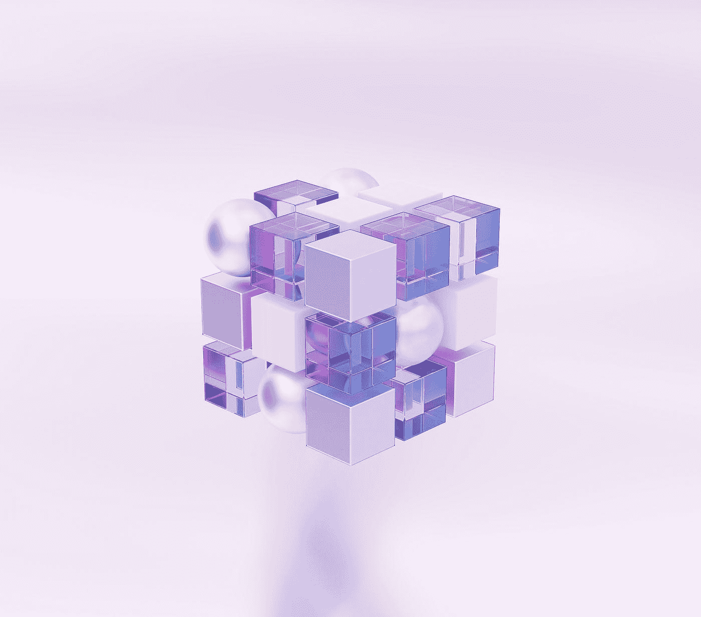
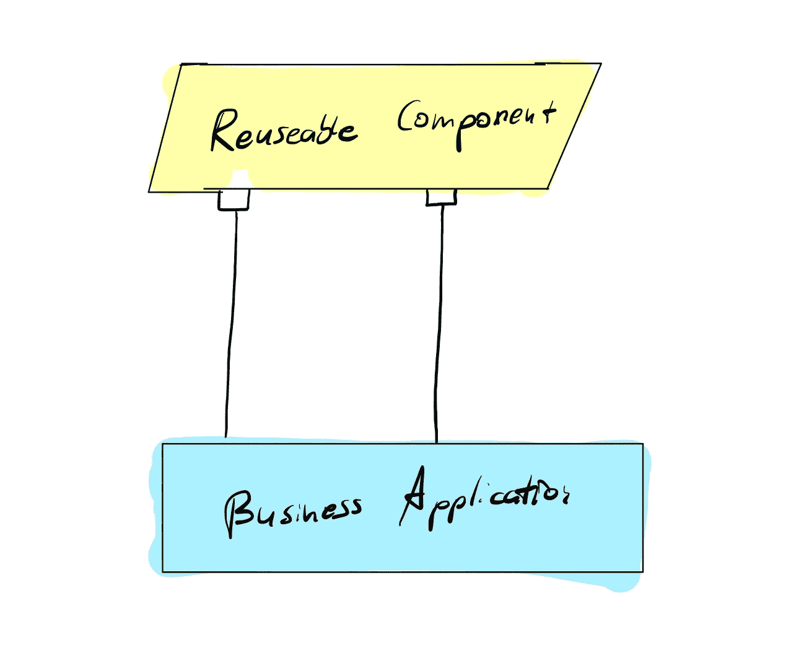
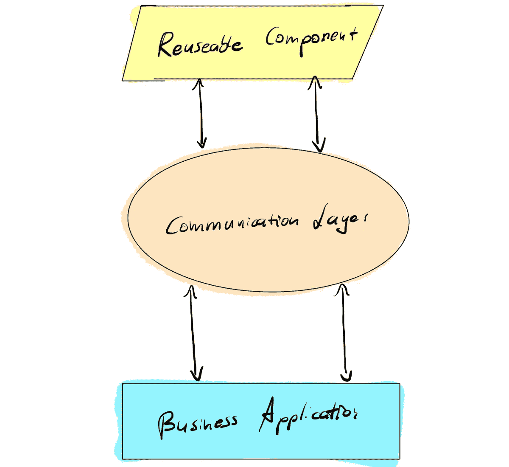
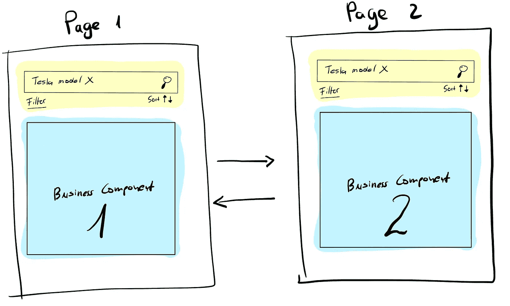

# 具有集成状态管理通信层的可重复使用的角度组件

> 原文：<https://levelup.gitconnected.com/reusable-angular-components-with-integrated-communication-layer-d9664c567601>

在 [Unsplash](https://unsplash.com?utm_source=medium&utm_medium=referral) 上由[vignesh Dudani](https://unsplash.com/@vighneshd?utm_source=medium&utm_medium=referral)拍摄的照片

您有多经常在项目中实现 UI 组件，并在一种或另一种情况下发现其中一些可以重用？可能经常。

有很多例子。其中之一是模态窗口:它有通用属性，如标题、内容、按钮等。，这可以根据上下文而变化。然而，代码没有变化。因此，假设它可以作为组件重用。

组件越简单，就越容易集成。在大多数情况下，向它们提供参数就足够了。随着复杂性的增加，交流也在增加。下面，我将展示两种方法，并讨论它们的优缺点。

# 角度组件之间的典型通信方式

最后，当组件变得更加复杂时，交流变得更加混乱，一些架构原则被忽略。实现组件间通信的常用方法如下所述。

角度组件之间的典型通信

第一种方法是通过[@输入](http://twitter.com/Input)和[@输出](http://twitter.com/Output)与组件通信的经典方式。

第二种方式已经更加松散耦合，因为通信是通过服务进行的。在这种情况下，业务应用程序和可重用组件共享服务来相互通信。然而，这也意味着清晰度的丧失。消息是在哪里产生和消费的并不明显。还有一种趋势是将逻辑从业务应用程序转移到服务中。因此，不一定要完全分开。

基于这两种可能的实现，可以总结出以下发现:

*   (可重用的)组件和业务应用程序之间没有松散的耦合。
*   通过[@输出](http://twitter.com/Output)和[@输入](http://twitter.com/Input)参数注释进行通信。
*   业务应用程序向 Observable(例如 Subject)注册，以接收来自组件的消息。根据通信的范围，可以有任意数量的用户。这使得人们很难理解这些沟通渠道的范围和意义。想象一下你必须做出调整。你会从哪里开始？
*   基本上，交换的信息是无状态的，即使使用了*行为主体*或*重放主体*。信息最迟在刷新或组件寿命结束时丢失。

即使这种类型的通信服务于它的目的。因此，它不仅对开发人员，而且对应用程序都提出了挑战

*   乍一看，沟通渠道很难掌握。
*   代码维护和进一步开发很难管理。
*   可重用组件与业务应用程序混淆了，尽管业务应用程序对此一无所知。

# 组件之间可伸缩、易于维护且松散耦合的通信

上面讨论了约束，我想提出一个可扩展的方法。我们希望为自己设定以下目标:

*   业务应用程序不应该知道可重用组件。
*   业务应用程序和可重用组件之间的交互应该易于理解，并且便于开发或维护。
*   应该可以在不影响业务应用程序的情况下替换可重用组件，也不必为此进行修改。
*   通信接口和组件都可以作为捆绑库部署，并在任何业务应用程序中使用。它还应该防止业务应用程序的逻辑流入通信层。
*   如果需要，通信可以是有状态的。

为了支持松散耦合并实现上述目标，引入了一个新的层作为通信中心和数据存储。*业务应用程序的接口保持不变，即使可重用组件被替换。*

具有通信层的角部件

## 概念验证——日常生活中的一个例子

假设我们必须为一家汽车租赁公司实现一个 web 应用程序。这将由几个子页面组成，这意味着内容方面不同的技术需求。

然而，这些页面的共同点是都有一个搜索汽车的搜索掩码(下图中黄色的*)。*

**

*为了能够举例说明代码上的需求，我们保持需求简单:*

*   *搜索汽车*
*   *搜索掩码的配置(颜色、特征等。)*
*   *确定选定的客车*

*下面我就不赘述具体实现了，只描述接口和类。*

## *通信层*

## *用户界面组件*

## *业务应用程序*

*正如您所看到的，业务应用程序和可重用组件之间的通信是分离的，因为它们只通过通信层相互通信。*

*如上所述，UI 组件可以作为库与通信层一起部署，或者两者都可以作为独立的库使用。通信层的可重用性将允许包含不同版本的 UI 组件。对于业务应用程序，这些将保持隐藏。只有通信层与交互相关。*

*如果您对本文感兴趣或有任何问题，请随时联系我。快乐编码。*