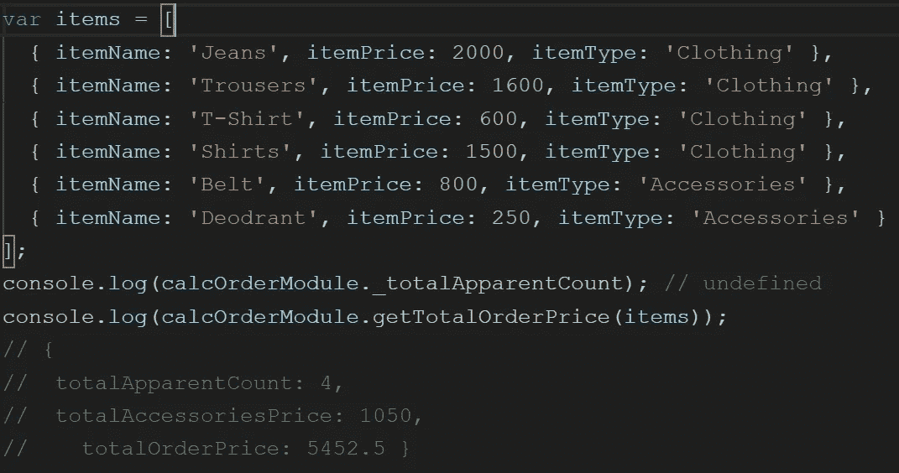

# 揭示 JS 中的模块模式

> 原文：<https://levelup.gitconnected.com/revealing-module-pattern-in-js-5fa4a6499dd5>

让我们了解一下模块模式背后的一些理论，以及它在实现这种模式时的目的。

模块模式最初被定义为一种为类提供私有和公共封装的方式。

它还用于通过在单个对象中包含私有和公共属性/方法和变量，从而封装底层细节(实现细节、属性、变量等),来体现类的概念。)从全局范围来看。

如果我们试图总结模块模式的要点，它服务于以下目的:

1.  代码封装
2.  数据保密

让我们借助代码来理解这个模式。

第一步是创建一个模块。

下一步是为我们的模块创建一个公共方法，这样用户就可以调用这个公共方法。为了公开方法，我们将返回一个定义了方法的对象。

如果我们尝试执行上面的方法，我们将看到从公开给我们的 calcOrderModule 的公共方法中获得输出。否则，如果我们试图从模块函数中执行私有属性或方法，我们会得到 undefined。只是为了做一个小的标识更改，私有属性或方法以下划线(`_`)开始。

简单概括一下，我们已经执行了 3 个步骤:

1.  使用生命创建一个模块。
2.  创建私有属性和私有方法。
3.  创建一个公开在模块外的公共方法。

到目前为止，我们已经介绍了模块模式的基础知识。让我们继续讨论揭示性的模块模式。

**模块模式和揭示模块模式的实现方式几乎相似，唯一的区别是后者在从我们的模块**中公开公共方法时返回对象。

**旁注:模块模式类似于工厂函数，因为我们创建对象时没有使用“new”关键字的细微差别。**

没有进一步的延迟，我们将尝试使用揭示模块模式实现代码，稍后将强调代码片段发生了什么。

让我们尝试在现有模块中添加一些私有属性和私有方法。

因此，我们声明了一些私有属性和两个私有方法来计算购物车商品列表的折扣。

如果列表中的任何商品有折扣，这个方法将给出商品的数量和价格。

这是我们的最后一个方法，它将返回一个包含总计数和总订单值的对象。

最后，我们从模块返回的公共方法将调用上面的方法。

上面的代码片段展示了揭示模块模式的实现。

现在，让我们通过提供输入来执行代码，并检查它的输出。

如果您尝试执行上面的代码，我们会发现在获取私有属性时，我们会得到未定义的。大多数代码实现都是不言自明的。

正如承诺的那样，下面附上完整的代码片段。

我希望，你可能已经对模块和揭示模块模式有了一些想法。

这样我们可以实现数据封装和隐私，这是使用模块模式或显示模块模式背后的思想。

快乐编码。不断学习。继续探索。