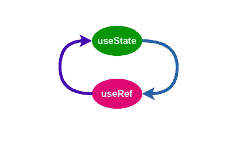

# 逆向工程反应钩

> 原文：<https://levelup.gitconnected.com/reverse-engineer-react-hooks-4abfb4163e37>

我开始用功能组件已经一年多了。对于功能组件，我们可以使用很酷的 React 钩子，比如 useState，useEffect…等等。钩子成为我们应用程序的主要构件之一，理解它们如何工作是成为一名更好的 React 开发人员的关键。我个人认为，弄清楚事物如何工作的最好方法之一是尝试对其进行逆向工程。

# 怎么才能做到呢？

React 钩子最酷的一点是我们可以在其他钩子的帮助下实现它们。所以我们可以在使用钩子的同时对它们进行逆向工程，这将有助于我们更好地理解钩子的逻辑，并开发一个合适的心智模型，事不宜迟，让我们实现一些内置的钩子。

**注 1:真正的实现使用完全不同的方法。**

**注 2:我不能保证我们的定制钩子在新的并发模式下会像预期的那样工作。**

# useRef

让我们从 useRef 开始，因为我们将使用这个钩子作为其他实现的主要构件。

根据 React [文件](https://reactjs.org/docs/hooks-reference.html):

> `useRef`返回一个可变的 ref 对象，其`.current`属性被初始化为传递的参数(`initialValue`)。返回的对象将在组件的整个生存期内保持不变。

所以我们需要某种“盒子”来存储我们的价值，那么我们的 custom **useRef** 应该遵循哪些基本原则？

*   该框应该包含一个带有一个 key = "current "的对象
*   盒子的`current`应该是可变的
*   更改框的`current`值不应触发重新渲染

每当我必须存储某种对象/数据/值时，我首先想到的当然是状态，我们可以用状态实现 useRef 吗？让我们看看

是的，我知道我们不应该在普通函数中使用`useState`而直接修改它，(顺便你可以查看一下 [**这篇文章**](https://medium.com/@ryardley/react-hooks-not-magic-just-arrays-cd4f1857236e) 以便更好地理解那个 hook 的规则背后的原因)，但是我们就破例这一次吧。您可以查看 [**现场演示**](https://codesandbox.io/s/my-custom-ref-vsg9z?file=/src/my-own-ref.ts) ，因为我们可以看到我们的自定义钩子的行为与 React 的内置 **useRef** 完全一样。如果你不明白为什么这样做，去玩一下给定的演示，在 **useRenderCount** 钩子中添加一些`console.log` -s，仔细看看存储在我们的“盒子”中的对象。

# 使用状态

我们用**使用状态**做什么？如果你正在读这篇文章，你已经知道什么是状态，那么让我们写下一些我们习惯使用状态应该遵循的基本原则

*   应该返回一个有状态的值和一个函数来更新它。
*   在初始渲染期间，返回`state`应该与`initialState`相同
*   在随后的重新渲染过程中，返回的状态应该总是最新的状态。
*   `initialState`参数也可以是一个函数，只在初始渲染时执行。
*   `setState`应该支持传递一个函数作为参数，它将接收以前的值，并返回一个更新的值。
*   `setState`重新渲染时不应改变。
*   如果`newValue`，改变状态应触发 rerender！== `prevValue`

关于我们列表中的最后一项，在没有 React 的原始 useState 挂钩的情况下触发 rerender 是一件非常具有挑战性的事情(老实说，我认为不使用 useReducer 是不可能的)，所以我们将使用一个自定义的小 hack 挂钩，它将手动触发 rerender。

这一次我们没有违反任何 React 钩子规则，我们的钩子完全像内置的**use state**一样工作。[现场演示](https://codesandbox.io/s/my-custom-state-kfvyr)。

一些值得注意的时刻:

*   我们必须存储关于是否是**第一次渲染**的信息
*   如果它是第一次呈现，我们应该首先初始化我们的状态。**如果**传递的参数是 function - >调用该函数- >将返回值设置为当前状态。我们只是将我们的状态设置为给定的默认值。
*   React 不喜欢不必要的重新渲染，所以为了避免这种情况，我们应该首先拍摄当前状态的快照，然后从给定的参数中获取一个新的状态，并且只有在`prevState`！== `curState`
*   恭喜我们现在有了自己的 **useMyState！**

**注意:如果你认为有时你的 React 应用程序会毫无理由地重新渲染，你可能会发现** [**React 严格模式**](https://reactjs.org/docs/strict-mode.html) **很有趣，这是一件非常有用的事情。**

我们实现了两个钩子 **useMyRef** 和 **useMyState** ，如果你问我，我们的 useRef 实现依赖于 useState 和 useState 实现——useRef，这很酷。

但是我们每天都在使用许多其他的钩子，目前，记忆和优化是 React 社区中的一个非常热门的话题，所以我们可以构建 **useCallback** 和 **useMemo** 钩子吗？我们能在它们之间找到某种可互换的联系吗，就像我们在 ref 和 sate 中所做的那样？让我们看看

# 使用回调

我们用 useCallback 做什么？

这非常简单，useCallback 返回 Callback 的记忆化版本，只有当其中一个依赖关系发生变化时，它才会发生变化。嗯，在反应中记忆一些东西，这是最擅长的事情。

耶，作品如魅，结账 [**现场试玩**](https://codesandbox.io/s/use-my-callback-h2ins?file=/src/App.tsx) **。但是在 React 文档中有一个我们应该考虑的小警告**

> **你可以依赖** `**useMemo**` **作为性能优化，而不是作为语义保证。**将来，React 可能会选择“忘记”一些先前记忆的值，并在下次渲染时重新计算它们，例如为屏幕外组件释放内存。编写您的代码，使其在没有`useMemo`的情况下仍然可以工作，然后添加它以优化性能。

所以我们需要新的 **useMyCallback** ，它不依赖于 **useMemo** 和如果依赖数组没有改变，那么每次渲染都是相同的。**额外特性:**也许我们懒得传递 deps 数组，让我们做一个没有依赖列表的钩子，和原来的钩子一样高效。将可变值存储在 React 中，并在满足某些条件时更新它，我们之前已经遇到过这个问题，答案是相同的- **useRef** 。

查看 [**现场演示**](https://codesandbox.io/s/use-my-custom-callback-02t8z?file=/src/useMyBetterCallback.ts) ，如果你不明白为什么我们的钩子是这样工作的，最好的方法就是回去查看我们早期的实现，然后再玩这个演示。继续把钩子的返回值直接改成`fn`，你会注意到渲染次数会增加。还有，你可以这样修改我们的钩子- `export const useMyBetterCallback = useCallback;`。你会注意到它的行为就像我们的定制钩子一样。

# **使用备忘录**

如果 useCallback 存储记忆化的函数，useMemo 存储记忆化的值，该值是用我们作为参数传递的函数计算的。依赖性数组逻辑在这里是相同的，当前数组和旧数组的不同意味着我们应该重新计算值。

> 记住传递给`useMemo`的函数在渲染时运行。不要做任何渲染时通常不会做的事情。例如，副作用属于`useEffect`，而不是`useMemo`。

同样，我们应该存储某种值，该值在每次渲染时都必须相同，直到依赖关系数组发生变化，这意味着我们必须再次寻址我们的老 useRef。

**注意:**对于 useMemo 钩子的实现，我们需要某种等式函数来确定先前和新的依赖列表是否相同。

结帐**使用我的备忘录**进行现场演示。对于我们来说,`areDeepEqual`函数是如何实现的并不重要，我们只知道它是纯的，并且按预期工作。

我们只需要用 useRef 存储以前的依赖列表，然后我们将它与新列表进行比较，只有在列表之间有一些差异时，才执行给定的函数。现在，我们的用户将总是使用最新的函数来计算值。

# 摘要

功能组件是非常有效的，但是我们在使用它们的时候需要一个不同的心智模型，有时这可能会有点棘手，在调试代码的时候，扎实的钩子知识可以节省我们大量的时间。正如我上面提到的，在学习新东西的时候，尝试逆向工程是很有帮助的，当我开始使用 React hooks 并遇到一些花了几个小时才找到的 bug 时，这给了我很大的帮助。

## 我希望这很有趣。